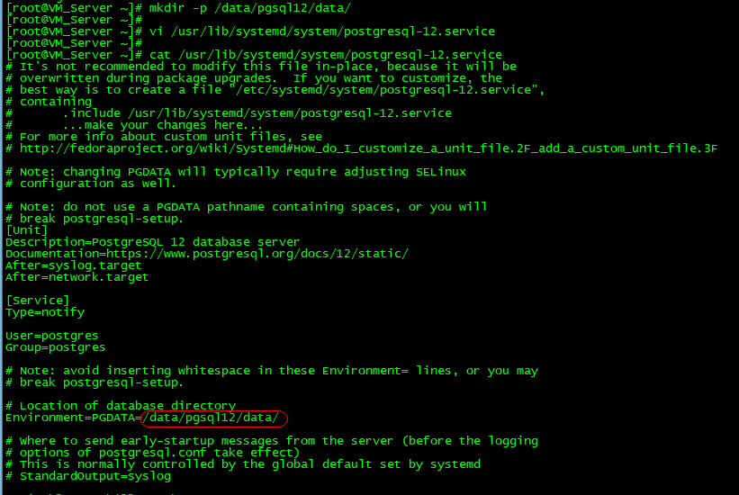

参考链接：https://cloud.tencent.com/developer/article/1546852
1.配置PostgreSQL YUM源
yum install https://download.postgresql.org/pub/repos/yum/reporpms/EL-7-x86_64/pgdg-redhat-repo-latest.noarch.rpm
2.yum install postgresql12-server 安装
安装了服务端会自动安装上client
3.yum install postgresql12
4. 创建 data 目录。 mkdir /data01/pgsql/data
5. 修改后编辑 配置文件： vi /usr/lib/systemd/system/postgresql-12.service

6. 授权（不授权后面 初始化会报错） 
··· 
chown -R postgres.postgres /data01/pgsql/data
chmod 755 /data01/pgsql/data
···
7. 初始化 /usr/pgsql-12/bin/postgresql-12-setup initdb
8. 设置服务开机自启动，并启动postgresql-12服务
systemctl enable postgresql-12
systemctl start postgresql-12
9. 
