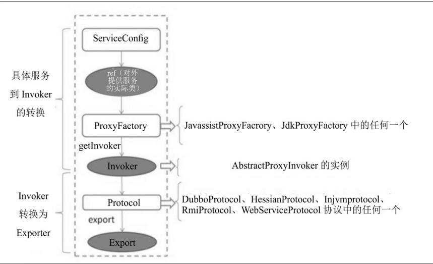
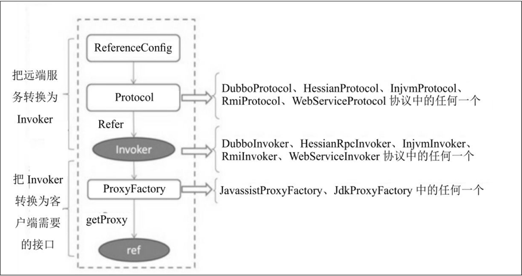
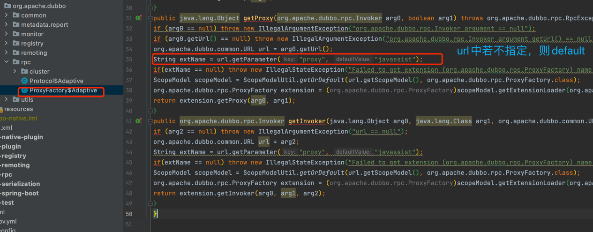
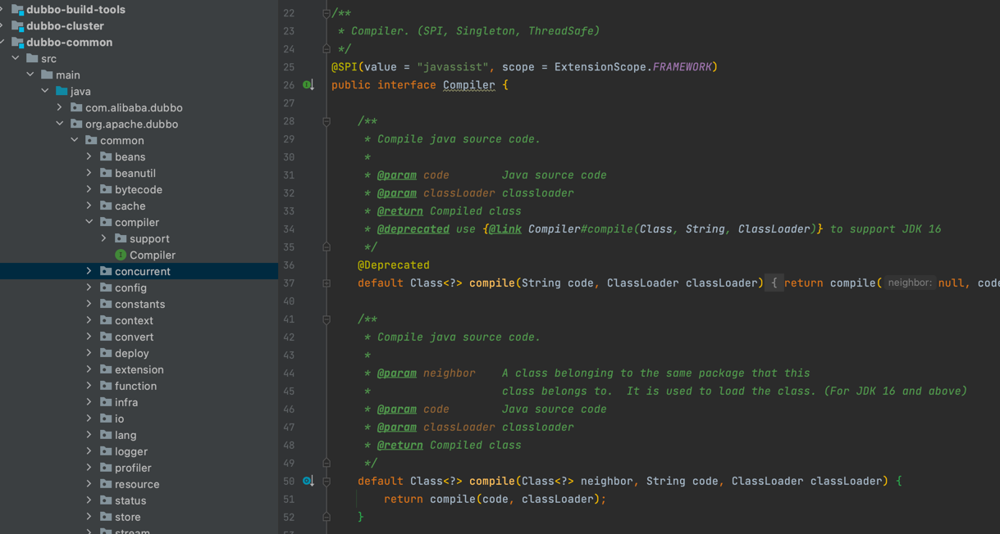
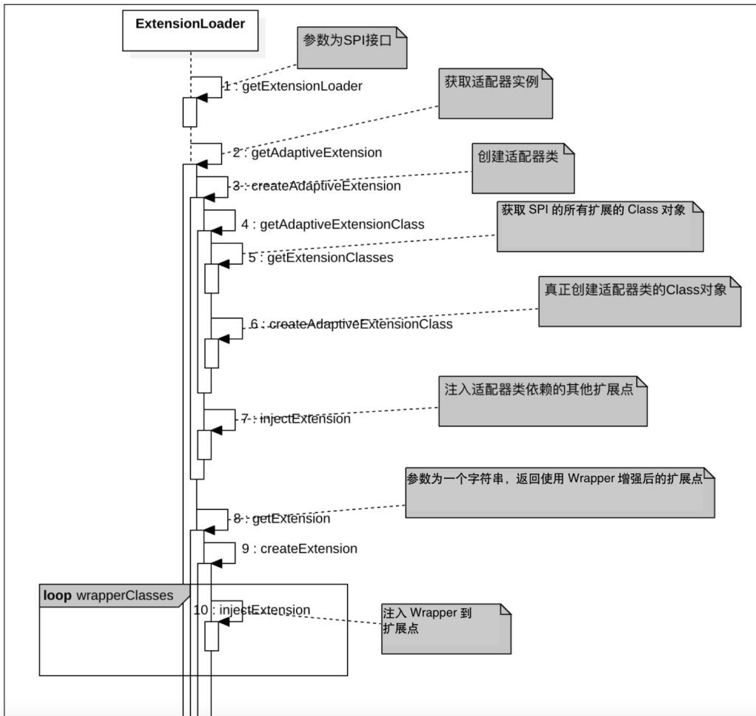

#.初识Dubbo
整体来说，一个公司业务系统的演进流程基本上都是从单体应用到多体应用。
业务系统为单体应用时，不同业务模块的相互调用直接在本地JVM 进程内就可以完成；
而变为多个应用时，相互之间进行通信的方式就不是简单地进行本地调用了，因为不同业务模块部署到了不同的JVM进程里，更常见的情况是部署到了不同的机器中，
这时候，一个高效、稳定的RPC远程调用框架就变得非常重要。

dubbo架构

- Provider为服务提供者集群，服务提供者负责暴露提供的服务，并将服务注册到服务注册中心。
- Consumer为服务消费者集群，服务消费者通过RPC远程调用服务提供者提供的服务。
- Registry负责服务注册与发现。
- Monitor为监控中心，统计服务的调用次数和调用时间。

1. 服务启动时， Provider 会将 自己提供 的服务  注册 到注册中心
2. 服务 消费方，在启动时 会去 服务 注册中心 订阅 自己需要的服务 的 地址列表。 然后 服务 注册中心 异步 把消费方 需要提供的 服务接口 的地址列表 返回给 服务  消费方。
   服务消费方 根据 路由规则 和 负载均衡 选择一个 服务提供者IP 进行 调用。
3. 监控平台主要用来统计服务的调用次数和调用耗时，即服务消费者和提供者在内存中累计调用服务的次数和耗时，并每分钟定时发送一次统计数据到监控中心，监控中心则使用数据绘制图表来显示。监控平台不是分布式系统必需的，但是这些数据有助于系统的运维和调优。服务提供者和消费者可以直接配置监控平台的地址，也可以通过服务注册中心获取。   


#分层架构
从整体上来看Dubbo的分层架构设计， 架构分层 设计是一个 比较经典的模式。比如网络中的7层协议，
每层 执行 特定的功能，上层依赖 下层 提供的功能， 下层的改变 对上层不可见， 并且每层都是 可以替换的。


这个图是 Dubbo官方提供的 Dubbo 整体架构图

- Service 和 Config 层 都是 API 接口层， 是为了 让 Dubbo 使用方  方便地 发布服务 和 引用服务。
   - 对于服务提供方来说， 需要 实现具体的服务接口，然后使用 ServiceConfig 来发布该服务
   - 对于服务消费方来说， 需要使用 ReferenceConfig 对服务进行 接口代理
   - Dubbo 服务发布方 与 服务引用方，可以 直接 初始化 配置类，也可以通过 Spring配置 自动 生成配置类
   
- 其他各层 均为 SPI（ Service Provider Interface，服务提供者接口）层。 SPI 意味 者，下面各层 都是组件化的
   ，是可以被替换的。  这也是 设计 比较好的点。
   - dubbo 增强了 JDK中 提供的 标准 SPI 功能， Dubbo中 除了 Service 和Config 层，其他都是 实现扩展接口 来实现的
   - Dubbo 增强的SPI  增加了 对 Ioc 和 AOP 的支持，一个 扩展点 可以 使用 setter（） 注入其他 扩展点， 并且 不会一次性
      实例化 扩展点 的所有 实现类。  这 也就 避免了 扩展点 实现类 初始化 很耗时，但 当前 还没用上它功能时 仍进行加载实例 这种浪费资源的情况。
   - Dubbo 增加的 SPI 是 具体用到 某个 实现类 的时候，才对 具体实现类 进行实例化。（用时加载）
   

- Proxy服务代理层。
   - 主要 对 服务消费端 使用的接口 进行代理，把 本地透明调用 转化为 远程调用
   - 也对， 服务提供方 提供的 实现类进行代理， 把 服务实现类 转化为 Wrapper类， 这是为了 减少反射调用
   - Proxy层的 SPI 扩展接口为 ProxyFactory， Dubbo的实现类主要有：
      1. JavassistProxyFactory (默认使用)
      2. JdkProxyFactory
      3. 用户可实现 ProxyFactory SPI接口，来 自定义实现  服务代理层。
   
- Rejistry服务注册中心层
   - Provider 启动时 会把 服务  注册到 注册中心，Consumer 启动时，会去注册中心 获取服务提供者 的地址列表
   - Rejistry层 的主要功能是 封装服务地址 的 注册发现 逻辑
   - 扩展接口 RejistryFactory SPI接口的实现有：
      - DubboRegistryFactory
      - RedisRegistryFactory
      - ZookeeperRegistryFactory
   - 另外，该层 还有一个 扩展接口 Directory，实现类有：
      - RejistryDirectory
      - StaticDirectory
      - 作用是： 用来透明地把 Invoker 列表 转化为 一个 Invoker
   
- Cluster 路由层。
   - 封装多个 服务 提供者的路由规则、负载均衡、集群容错的实现，并 桥接 服务注册中心；
   - 扩展接口Cluster 对应的实现有：
      - FailoverCluster 失败重试
      - FailbackCluster 失败自动恢复
      - FailfastCluster 快速失败
      - FailsafeCluster 失败安全
      - ForkingCluster  并行调用
   -  负载均衡 扩展接口 LoadBalance 的实现有：
      - RandomLoadBalance 随机
      - RoundRobinLoadBalance 轮询
      - LeastActiveLoadBalance 最小活跃
      - ConsistHash~  一致性哈希
   
- Monitor监控层： 用来监控 RPC 调用次数 和 调用耗时时间
   - 展接口为MonitorFactory，对应的实现类为DubboMonitorFactroy。
     用户可以实现该层的MonitorFactory扩展接口，实现自定义监控统计策略。

- Protocol远程调用层： 封装 RPC 的 调用逻辑
   - 扩展接口为 Protocol, 实现有：
      - RegistryProtocol
      - DubboProtocol
      - InjvmProtocol
   
- Exchange 信息交换层
   - 封装 请求响应模式， 同步转异步
   - 扩展接口为Exchanger，对应的扩展实现有HeaderExchanger等。
   
- Transport 网络传输层
   - 扩展接口为： Channel ，实现有：
      - NettyChannel （默认）
      - MinaChannel
   
- Serialize数据序列化层：提供一些可复用工具
   - 扩展接口为Serialization，对应的扩展实现有：
      - DubboSerialization
      - FastJsonSerialization
      - Hessian2Serialization
      - JavaSerialization
   - 扩展接口ThreadPool对应的扩展实现有：
      - FixedThreadPool
      - CachedThreadPool
      - LimitedThreadPool


综上可知，Dubbo的分层架构使得Dubbo每层的功能都是可被替换的，这使得Dubbo的扩展性极强


#Provider 暴露服务过程




1. ServiceConfig 引用对外 提供服务 的 实现类ref （如GreetingServiceImpl）
2. 具体服务到Invoker的转化。通过 ProxyFactory 接口实现类 的 getInvoker()方法，使用 ref 生成 一个 AbstractProxyInvoker实例。
3. Invoker -> Exporter . 通过Protocol 的实现类 的 export()方法，这里就是暴露服务的关键
    1. 先启动 Netty Server 监听
    2. 然后将 服务 注册到 注册中心
    
#Consumer 消费服务过程


1. ReferenceConfig 的 init()方法会 生成Invoker 实例，这是 服务消费的关键
    1. init方法中会调用   org.apache.dubbo.config.ReferenceConfig#createProxy 方法
    2. 然后创建远程引用，创建远程引用调用程序 ，去调用 org.apache.dubbo.config.ReferenceConfig#createInvokerForRemote
    3. 然后就会看见 利用 Protocol 接口实现类的 refer() 方法 生成 Invoker实例
        代码.png)
2. 接下来 把 Invoker 转为 客户端 需要的 接口 （如： GreetingService)
    1. Dubbo协议的Invoker转换为客户端需要的接口，发生在ProxyFactory接口的扩展实现类的getProxy()方法。
    2. 它 主要是  使用 代理，把 对 接口的 调用 转换为 对 Invoker 的调用。
    3. 同样在 init 时调用的 org.apache.dubbo.config.ReferenceConfig#createProxy 方法中
    代码调用.png)
# Dubbo的适配器原理
我们知道 Dubbo为每个功能点 都提供了 SPI 扩展接口。Dubbo 框架使用时，是对 接口进行依赖的，而每个
扩展接口 都对应了 一系列的 扩展实现类， 那么 如何 选择具体使用 哪一个 实现呢？  这就是 适配器来做的。

Dubbo会使用我们将要讲解的 动态编译技术 为接口Protocol生成一个适配器类Protocol$Adaptive的对象实例，
在Dubbo框架中需要使用Protocol的实例时，实际上就是使用Protocol$Adaptive的对象实例来获取具体的SPI实现类的

- 需要注意的是，在Dubbo中URL是一个核心概念，Dubbo框架把所需的参数都拼接到了URL对象里
- 适配器类Protocol$Adaptive会根据传递的协议参数的不同，加载不同的Protocol的SPI实现。

##总结
- 在Dubbo框架中，框架会给每个SPI扩展接口动态生成一个对应的适配器类，并根据参数来使用增强SPI以选择不同的SPI实现
- 比如扩展接口ProxyFactory的适配器类为ProxyFactory$Adaptive，其根据参数proxy来选择使用JdkProxyFactory还是使用JavassistProxyFactory做代理工厂



# 动态编译
众所周知，Java程序要想运行首先需要使用javac把源代码编译为class字节码文件，
然后使用JVM把class字节码文件加载到内存创建Class对象后，使用Class对象创建对象实例。

正常情况下我们是把所有源文件静态编译为字节码文件，然后由JVM统一加载，
而动态编译则是 "在JVM进程运行时把源文件编译为字节码文件，然后使用字节码文件创建对象实例。" 

我们提到，在Dubbo框架中框架会给每个SPI扩展接口动态生成一个对应的适配器类，那么如何生成呢？
这里就使用了动态编译技术，在Dubbo中提供了一个Compiler的SPI：


Dubbo提供Compiler的实现有JavassistCompiler（默认实现）和JdkCompiler两种。

 ```
    private Class<?> getAdaptiveExtensionClass() {
        getExtensionClasses();
        if (cachedAdaptiveClass != null) {
        return cachedAdaptiveClass;
        }
        return cachedAdaptiveClass = createAdaptiveExtensionClass();
    } 

    private Class<?> createAdaptiveExtensionClass() {
        // Adaptive Classes' ClassLoader should be the same with Real SPI interface classes' ClassLoader
        ClassLoader classLoader = type.getClassLoader();
        try {
            if (NativeUtils.isNative()) {
                return classLoader.loadClass(type.getName() + "$Adaptive");
            }
        } catch (Throwable ignore) {

        }
        String code = new AdaptiveClassCodeGenerator(type, cachedDefaultName).generate();
        org.apache.dubbo.common.compiler.Compiler compiler = extensionDirector.getExtensionLoader(
            org.apache.dubbo.common.compiler.Compiler.class).getAdaptiveExtension();
        return compiler.compile(type, code, classLoader);
    }
```
总结一下就是，Dubbo框架会为每个扩展接口生成其对应的适配器类的源码，然后选择具体的动态编译类的扩展实现对源码进行编译以生成适配器类的Class对象，
然后就可以调用Class对象的newInstance（）方法生成扩展接口对应的适配器类的实例。


# Dubbo增强SPI
讲一讲 在适配器类中是如何根据参数来装载具体的SPI实现的。

## JDK标准SPI
Dubbo增强的SPI功能是**从JDK标准SPI演化而来的**，所以有必要先讲讲标准SPI的原理。

jdk中的SPI是面向 接口 编程的。 服务提供者 会在JRE 的核心 API里 提供访问接口，而 具体实现 由 其他开发商提供

例如：
> 如果规范制定者在 rt.jar 包里定义了数据库的驱动接口 java.sql.Driver，
> 那么MySQL实现的开发商则会在MySQL的驱动包的META-INF/services文件夹下建立名称为java.sql.Driver的文件，文件内容就是MySQL对java.sql.Driver接口的实现类.


上面讲解了如何使用SPI扩展自定义自己的实现，下面说说SPI的实现原理。
- 我们知道Java核心API（比如rt.jar包）是使用Bootstrap ClassLoader类加载器加载的，而用户提供的Jar包是由AppClassLoader加载的。
- 如果一个类由类加载器加载，那么这个类依赖的类也是由相同的类加载器加载的。

用来搜索开发商提供的SPI 扩展实现类的API 类（ServiceLoader）是使用Bootstrap ClassLoader 加载的，
那么ServiceLoader 里面依赖的类应该也是由Bootstrap ClassLoader加载的

而上面说了用户提供的包含SPI实现类的Jar包是由AppClassLoader加载的，
所以这就***需要一种违反双亲委派模型的方法，线程上下文类加载器ContextClassLoader***就是用来解决这个问题的。

**JDK标准的SPI会同时把SPI接口的所有实现类提前加载好实例**

##增强SPI原理
Dubbo 的扩展点加载机制是基于JDK 标准的SPI 扩展机制增强而来的，Dubbo 解决了JDK标准的SPI的以下问题：
- jdk标准的SPI会一次性 实例化扩展点的 所有实例。如果有些扩展点很耗时，却又不需要使用，那么加载就很浪费资源
- 如果 扩展点 加载失败，是不会有好提示用户具体异常的。
    - 比如：对于JDK 标准的ScriptEngine来说，如果Ruby ScriptEngine因为所依赖的jruby.jar不存在，导致Ruby ScriptEngine 类加载失败，那么这个失败原因就被隐藏了，当用户执行Ruby脚本时，会报空指针异常，而不是报Ruby ScriptEngine不存在。
- 增加了对 扩展点  AOP 和IOC 的支持， 一个 扩展点 可以 使用 setter 注入其他扩展点，也可以 对 扩展点 使用 Wrapper 进行增强


图中步骤对应代码：
1. org.apache.dubbo.config.ServiceConfig#postProcessAfterScopeModelChange
```
 @Override
    protected void postProcessAfterScopeModelChanged(ScopeModel oldScopeModel, ScopeModel newScopeModel) {
        super.postProcessAfterScopeModelChanged(oldScopeModel, newScopeModel);
        //初始化 具体的  Protocol 扩展实现
        protocolSPI = this.getExtensionLoader(Protocol.class).getAdaptiveExtension();
        proxyFactory = this.getExtensionLoader(ProxyFactory.class).getAdaptiveExtension();
    }
    //另外
    getExtensionLoader这里是走了 本地缓存的。最终会走到这样的代码获取
     // 1. find in local cache
        ExtensionLoader<T> loader = (ExtensionLoader<T>) extensionLoadersMap.get(type);

        ExtensionScope scope = extensionScopeMap.get(type);
```
2.org.apache.dubbo.common.extension.ExtensionLoader#getAdaptiveExtension 获取适配器实例
```
 @SuppressWarnings("unchecked")
    public T getAdaptiveExtension() {
        checkDestroyed();
        Object instance = cachedAdaptiveInstance.get();
        if (instance == null) {
            if (createAdaptiveInstanceError != null) {
                throw new IllegalStateException("Failed to create adaptive instance: " +
                    createAdaptiveInstanceError.toString(),
                    createAdaptiveInstanceError);
            }

            synchronized (cachedAdaptiveInstance) {
                instance = cachedAdaptiveInstance.get();
                if (instance == null) {// 双检锁 栈上不需要 volatile
                    try {
                        //创建 适配器实例
                        instance = createAdaptiveExtension();
                        cachedAdaptiveInstance.set(instance);
                    } catch (Throwable t) {
                        createAdaptiveInstanceError = t;
                        throw new IllegalStateException("Failed to create adaptive instance: " + t.toString(), t);
                    }
                }
            }
        }

        return (T) instance;
    }
```

3.createAdaptiveExtension 创建适配器类
```
 private T createAdaptiveExtension() {
        try {
            //这里 反射获取到了 具体 选择的实例
            T instance = (T) getAdaptiveExtensionClass().newInstance();
            instance = postProcessBeforeInitialization(instance, null);
             //注入 适配器类 依赖的 其他 扩展点实现
            instance = injectExtension(instance);
            instance = postProcessAfterInitialization(instance, null);
            initExtension(instance);
            return instance;
        } catch (Exception e) {
            throw new IllegalStateException("Can't create adaptive extension " + type + ", cause: " + e.getMessage(), e);
        }
    }
```

4.getAdaptiveExtensionClass
```
  private Class<?> getAdaptiveExtensionClass() {
        //这里面 会加载所有 实现 Class
        getExtensionClasses();
        if (cachedAdaptiveClass != null) {
            return cachedAdaptiveClass;
        }
        return cachedAdaptiveClass = createAdaptiveExtensionClass();
    }
```
5.getExtensionClasses 获取SPI 扩展的所有 Class对象，放入缓存
```
  private Map<String, Class<?>> getExtensionClasses() {
        Map<String, Class<?>> classes = cachedClasses.get();
        if (classes == null) {
            synchronized (cachedClasses) {
                classes = cachedClasses.get();
                if (classes == null) {
                    classes = loadExtensionClasses();
                    cachedClasses.set(classes);
                }
            }
        }
        return classes;
  }
   /**
     * synchronized in getExtensionClasses
     */
    private Map<String, Class<?>> loadExtensionClasses() {
        checkDestroyed();
        cacheDefaultExtensionName();

        Map<String, Class<?>> extensionClasses = new HashMap<>();

        for (LoadingStrategy strategy : strategies) {
            loadDirectory(extensionClasses, strategy, type.getName());

            // compatible with old ExtensionFactory
            if (this.type == ExtensionInjector.class) {
                loadDirectory(extensionClasses, strategy, ExtensionFactory.class.getName());
            }
        }

        return extensionClasses;
    }
```

6.createAdaptiveExtensionClass 真正创建适配器类的 Class 对象
```
    private Class<?> createAdaptiveExtensionClass() {
        // Adaptive Classes' ClassLoader should be the same with Real SPI interface classes' ClassLoader
        ClassLoader classLoader = type.getClassLoader();
        try {
            if (NativeUtils.isNative()) {
                return classLoader.loadClass(type.getName() + "$Adaptive");
            }
        } catch (Throwable ignore) {

        }
        //生成 适配器 类 源码
        String code = new AdaptiveClassCodeGenerator(type, cachedDefaultName).generate();
        org.apache.dubbo.common.compiler.Compiler compiler = extensionDirector.getExtensionLoader(
            org.apache.dubbo.common.compiler.Compiler.class).getAdaptiveExtension();
        return compiler.compile(type, code, classLoader);//编译生成 适配器类
    }

```

7. injectExtension  注入适配器类 依赖的其他 扩展点。 Ioc功能
```
private T injectExtension(T instance) {

        if (injector == null) {
            return instance;
        }

        try {
            for (Method method : instance.getClass().getMethods()) {
                if (!isSetter(method)) {
                    continue;
                }
                /**
                 * Check {@link DisableInject} to see if we need auto injection for this property
                 */
                if (method.isAnnotationPresent(DisableInject.class)) {
                    continue;
                }
                Class<?> pt = method.getParameterTypes()[0];
                if (ReflectUtils.isPrimitives(pt)) {
                    continue;
                }

                try {
                    String property = getSetterProperty(method);
                    Object object = injector.getInstance(pt, property);
                    if (object != null) {
                        method.invoke(instance, object);
                    }
                } catch (Exception e) {
                    logger.error("Failed to inject via method " + method.getName()
                        + " of interface " + type.getName() + ": " + e.getMessage(), e);
                }

            }
        } catch (Exception e) {
            logger.error(e.getMessage(), e);
        }
        return instance;
    }

```


##扩展点的自动包装
在Spring AOP中，我们可以使用多个切面对指定类的方法进行增强，
在Dubbo中也提供了类似的功能。在Dubbo中你可以指定多个Wrapper类对指定的扩展点的实现类的方法进行增强。

AOP的 功能就是： 不侵入 原有代码，进行增强。

## Dubbo使用JavaAssist减少反射调用开销

- Dubbo会给每个服务提供者的实现类生产一个Wrapper类，这个Wrapper类里面最终调用服务提供者的接口实现类，Wrapper类的存在是为了减少反射的调用
- 当服务提供方收到消费方发来的请求后，需要根据**消费者传递过来的方法名和参数反射调用服务提供者的实现类**，而反射本身是有性能开销的
- Wrapper 类的invokeMethod最终直接调用的是 （如：GreetingServiceImpl 实现类）的具体方法，这就避免了反射开销，而Wrapper1类是在Dubbo服务启动时生成的，所以不会对运行时带来开销。


>Dubbo是在哪里生成Wrapper类的。在Dubbo分层架构概述中，我们讲过Proxy层的SPI扩展接口为ProxyFactory，
> Dubbo 提供的实现主要有JavassistProxyFactory（默认使用）和JdkProxyFactory，
> 其实就是JavassistProxyFactory为每个服务提供者实现类生成了Wrapper类

```
    @Override
    public <T> Invoker<T> getInvoker(T proxy, Class<T> type, URL url) {
        try {
            //生成Wrapper类
            // TODO Wrapper cannot handle this scenario correctly: the classname contains '$'
            final Wrapper wrapper = Wrapper.getWrapper(proxy.getClass().getName().indexOf('$') < 0 ? proxy.getClass() : type);
            return new AbstractProxyInvoker<T>(proxy, type, url) {
                @Override
                protected Object doInvoke(T proxy, String methodName,
                                          Class<?>[] parameterTypes,
                                          Object[] arguments) throws Throwable {
                    return wrapper.invokeMethod(proxy, methodName, parameterTypes, arguments);
                }
            };
        } catch (Throwable fromJavassist) {
            // try fall back to JDK proxy factory
            try {
                Invoker<T> invoker = jdkProxyFactory.getInvoker(proxy, type, url);
                logger.error("Failed to generate proxy by Javassist failed. Fallback to use JDK proxy success. " +
                    "Interfaces: " + type, fromJavassist);
                // log out error
                return invoker;
            } catch (Throwable fromJdk) {
                logger.error("Failed to generate proxy by Javassist failed. Fallback to use JDK proxy is also failed. " +
                    "Interfaces: " + type + " Javassist Error.", fromJavassist);
                logger.error("Failed to generate proxy by Javassist failed. Fallback to use JDK proxy is also failed. " +
                    "Interfaces: " + type + " JDK Error.", fromJdk);
                throw fromJavassist;
            }
        }
    }
```