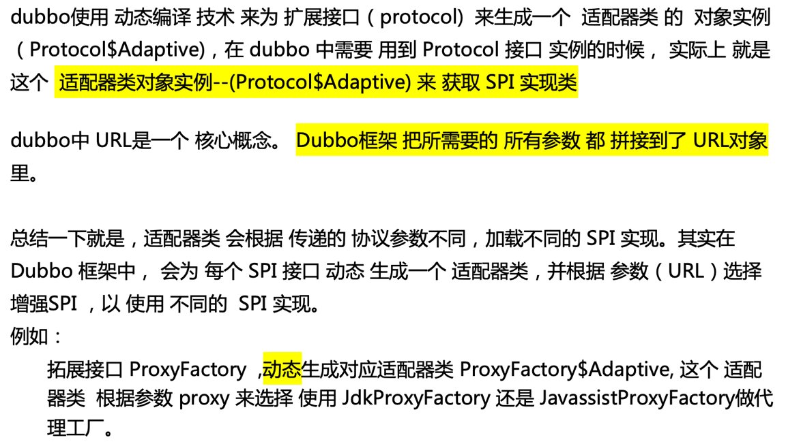

#1.初识Dubbo
整体来说，一个公司业务系统的演进流程基本上都是从单体应用到多体应用。
业务系统为单体应用时，不同业务模块的相互调用直接在本地JVM 进程内就可以完成；
而变为多个应用时，相互之间进行通信的方式就不是简单地进行本地调用了，因为不同业务模块部署到了不同的JVM进程里，更常见的情况是部署到了不同的机器中，
这时候，一个高效、稳定的RPC远程调用框架就变得非常重要。

dubbo架构

- Provider为服务提供者集群，服务提供者负责暴露提供的服务，并将服务注册到服务注册中心。
- Consumer为服务消费者集群，服务消费者通过RPC远程调用服务提供者提供的服务。
- Registry负责服务注册与发现。
- Monitor为监控中心，统计服务的调用次数和调用时间。

1. 服务启动时， Provider 会将 自己提供 的服务  注册 到注册中心
2. 服务 消费方，在启动时 会去 服务 注册中心 订阅 自己需要的服务 的 地址列表。 然后 服务 注册中心 异步 把消费方 需要提供的 服务接口 的地址列表 返回给 服务  消费方。
   服务消费方 根据 路由规则 和 负载均衡 选择一个 服务提供者IP 进行 调用。
3. 监控平台主要用来统计服务的调用次数和调用耗时，即服务消费者和提供者在内存中累计调用服务的次数和耗时，并每分钟定时发送一次统计数据到监控中心，监控中心则使用数据绘制图表来显示。监控平台不是分布式系统必需的，但是这些数据有助于系统的运维和调优。服务提供者和消费者可以直接配置监控平台的地址，也可以通过服务注册中心获取。   

#2.分层架构
从整体上来看