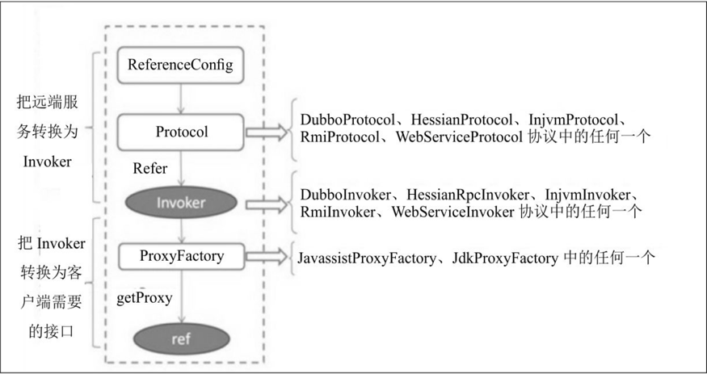

#.初识Dubbo
整体来说，一个公司业务系统的演进流程基本上都是从单体应用到多体应用。
业务系统为单体应用时，不同业务模块的相互调用直接在本地JVM 进程内就可以完成；
而变为多个应用时，相互之间进行通信的方式就不是简单地进行本地调用了，因为不同业务模块部署到了不同的JVM进程里，更常见的情况是部署到了不同的机器中，
这时候，一个高效、稳定的RPC远程调用框架就变得非常重要。

dubbo架构

- Provider为服务提供者集群，服务提供者负责暴露提供的服务，并将服务注册到服务注册中心。
- Consumer为服务消费者集群，服务消费者通过RPC远程调用服务提供者提供的服务。
- Registry负责服务注册与发现。
- Monitor为监控中心，统计服务的调用次数和调用时间。

1. 服务启动时， Provider 会将 自己提供 的服务  注册 到注册中心
2. 服务 消费方，在启动时 会去 服务 注册中心 订阅 自己需要的服务 的 地址列表。 然后 服务 注册中心 异步 把消费方 需要提供的 服务接口 的地址列表 返回给 服务  消费方。
   服务消费方 根据 路由规则 和 负载均衡 选择一个 服务提供者IP 进行 调用。
3. 监控平台主要用来统计服务的调用次数和调用耗时，即服务消费者和提供者在内存中累计调用服务的次数和耗时，并每分钟定时发送一次统计数据到监控中心，监控中心则使用数据绘制图表来显示。监控平台不是分布式系统必需的，但是这些数据有助于系统的运维和调优。服务提供者和消费者可以直接配置监控平台的地址，也可以通过服务注册中心获取。   

#分层架构
从整体上来看Dubbo的分层架构设计， 架构分层 设计是一个 比较经典的模式。比如网络中的7层协议，
每层 执行 特定的功能，上层依赖 下层 提供的功能， 下层的改变 对上层不可见， 并且每层都是 可以替换的。

这个图是 Dubbo官方提供的 Dubbo 整体架构图

- Service 和 Config 层 都是 API 接口层， 是为了 让 Dubbo 使用方  方便地 发布服务 和 引用服务。
   - 对于服务提供方来说， 需要 实现具体的服务接口，然后使用 ServiceConfig 来发布该服务
   - 对于服务消费方来说， 需要使用 ReferenceConfig 对服务进行 接口代理
   - Dubbo 服务发布方 与 服务引用方，可以 直接 初始化 配置类，也可以通过 Spring配置 自动 生成配置类
   
- 其他各层 均为 SPI（ Service Provider Interface，服务提供者接口）层。 SPI 意味 者，下面各层 都是组件化的
   ，是可以被替换的。  这也是 设计 比较好的点。
   - dubbo 增强了 JDK中 提供的 标准 SPI 功能， Dubbo中 除了 Service 和Config 层，其他都是 实现扩展接口 来实现的
   - Dubbo 增强的SPI  增加了 对 Ioc 和 AOP 的支持，一个 扩展点 可以 使用 setter（） 注入其他 扩展点， 并且 不会一次性
      实例化 扩展点 的所有 实现类。  这 也就 避免了 扩展点 实现类 初始化 很耗时，但 当前 还没用上它功能时 仍进行加载实例 这种浪费资源的情况。
   - Dubbo 增加的 SPI 是 具体用到 某个 实现类 的时候，才对 具体实现类 进行实例化。（用时加载）
   

- Proxy服务代理层。
   - 主要 对 服务消费端 使用的接口 进行代理，把 本地透明调用 转化为 远程调用
   - 也对， 服务提供方 提供的 实现类进行代理， 把 服务实现类 转化为 Wrapper类， 这是为了 减少反射调用
   - Proxy层的 SPI 扩展接口为 ProxyFactory， Dubbo的实现类主要有：
      1. JavassistProxyFactory (默认使用)
      2. JdkProxyFactory
      3. 用户可实现 ProxyFactory SPI接口，来 自定义实现  服务代理层。
   
- Rejistry服务注册中心层
   - Provider 启动时 会把 服务  注册到 注册中心，Consumer 启动时，会去注册中心 获取服务提供者 的地址列表
   - Rejistry层 的主要功能是 封装服务地址 的 注册发现 逻辑
   - 扩展接口 RejistryFactory SPI接口的实现有：
      - DubboRegistryFactory
      - RedisRegistryFactory
      - ZookeeperRegistryFactory
   - 另外，该层 还有一个 扩展接口 Directory，实现类有：
      - RejistryDirectory
      - StaticDirectory
      - 作用是： 用来透明地把 Invoker 列表 转化为 一个 Invoker
   
- Cluster 路由层。
   - 封装多个 服务 提供者的路由规则、负载均衡、集群容错的实现，并 桥接 服务注册中心；
   - 扩展接口Cluster 对应的实现有：
      - FailoverCluster 失败重试
      - FailbackCluster 失败自动恢复
      - FailfastCluster 快速失败
      - FailsafeCluster 失败安全
      - ForkingCluster  并行调用
   -  负载均衡 扩展接口 LoadBalance 的实现有：
      - RandomLoadBalance 随机
      - RoundRobinLoadBalance 轮询
      - LeastActiveLoadBalance 最小活跃
      - ConsistHash~  一致性哈希
   
- Monitor监控层： 用来监控 RPC 调用次数 和 调用耗时时间
   - 展接口为MonitorFactory，对应的实现类为DubboMonitorFactroy。
     用户可以实现该层的MonitorFactory扩展接口，实现自定义监控统计策略。

- Protocol远程调用层： 封装 RPC 的 调用逻辑
   - 扩展接口为 Protocol, 实现有：
      - RegistryProtocol
      - DubboProtocol
      - InjvmProtocol
   
- Exchange 信息交换层
   - 封装 请求响应模式， 同步转异步
   - 扩展接口为Exchanger，对应的扩展实现有HeaderExchanger等。
   
- Transport 网络传输层
   - 扩展接口为： Channel ，实现有：
      - NettyChannel （默认）
      - MinaChannel
   
- Serialize数据序列化层：提供一些可复用工具
   - 扩展接口为Serialization，对应的扩展实现有：
      - DubboSerialization
      - FastJsonSerialization
      - Hessian2Serialization
      - JavaSerialization
   - 扩展接口ThreadPool对应的扩展实现有：
      - FixedThreadPool
      - CachedThreadPool
      - LimitedThreadPool

综上可知，Dubbo的分层架构使得Dubbo每层的功能都是可被替换的，这使得Dubbo的扩展性极强

#Provider 暴露服务过程

1. ServiceConfig 引用对外 提供服务 的 实现类ref （如GreetingServiceImpl）
2. 具体服务到Invoker的转化。通过 ProxyFactory 接口实现类 的 getInvoker()方法，使用 ref 生成 一个 AbstractProxyInvoker实例。
3. Invoker -> Exporter . 通过Protocol 的实现类 的 export()方法，这里就是暴露服务的关键
    1. 先启动 Netty Server 监听
    2. 然后将 服务 注册到 注册中心
    
#Consumer 消费服务过程

1. ReferenceConfig 的 init()方法会 生成Invoker 实例，这是 服务消费的关键
    1. init方法中会调用   org.apache.dubbo.config.ReferenceConfig#createProxy 方法
    2. 然后创建远程引用，创建远程引用调用程序 ，去调用 org.apache.dubbo.config.ReferenceConfig#createInvokerForRemote
    3. 然后就会看见 利用 Protocol 接口实现类的 refer() 方法 生成 Invoker实例
        代码.png)
2. 接下来 把 Invoker 转为 客户端 需要的 接口 （如： GreetingService)
    1. Dubbo协议的Invoker转换为客户端需要的接口，发生在ProxyFactory接口的扩展实现类的getProxy()方法。
    2. 它 主要是  使用 代理，把 对 接口的 调用 转换为 对 Invoker 的调用。
    3. 同样在 init 时调用的 org.apache.dubbo.config.ReferenceConfig#createProxy 方法中
    代码调用.png)
       

