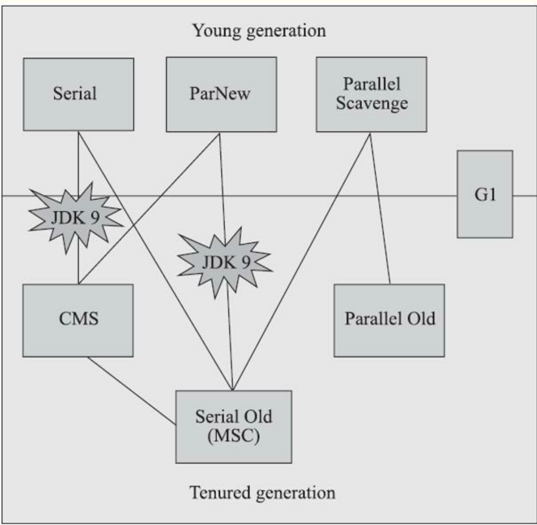
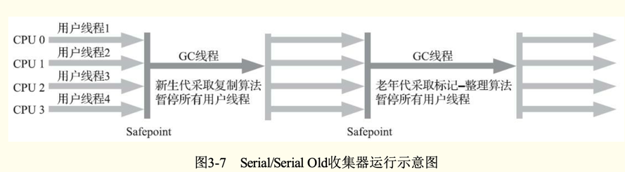
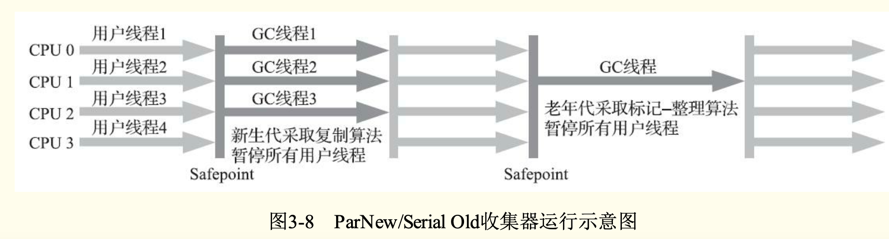
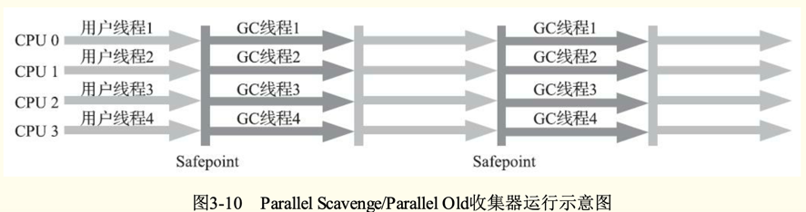
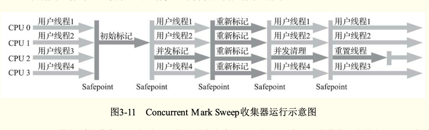
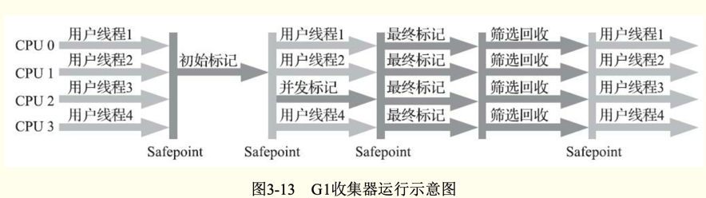

如果说垃圾收集算法是内存回收的方法论，那么垃圾收集器就是内存回收的实践者。
各款经典收集器之间关系如图，存在连线说明可以搭配使用。

没有最好的，万能的收集器，只能根据场景选择最合适的。

# Serial 收集器
Serial是最基础、历史最悠久的收集器。这是一款 单线程 工作的收集器，
单线程 并不仅仅是 说明它只会 使用一个处理器 或者 一个收集器 线程 去进行 GC工作。
更应该强调，它 在 GC工作时， 需要 "Stop The World"。  这项工作时 虚拟机 后台自动发起的，
在用户不可知， 不可控的情况下， 把 用户的工作线程 全部停掉。 这对很多应用来说是不可接受的。

但是对于 Hotspot 的设计者来说，是可以理解"Stop The World"的。你总不能一边清理垃圾，一边又 制造垃圾吧。

但是 都为着 消除或降低 GC时 停顿用户线程的 时间而努力着。

Serial  -》 Parallel -》 CMS 和 G1 -》 Shenandoah 和 ZGC 
一步一步的， 都 没有办法 根除 Stop The world

虽然 Serial 最早，但至今 也是 HopSpot 运行在客户端模式下的 默认  新声代  收集器。
优点就是， 它 简单 高效（对于 其他的 单线程 而比）。
对于内存资源受限的环境，它是 所有 收集器里 额外 消耗内存 最小的；
对于单核处理器或者核心较少的环境来说，Serial由于没有 线程交互的开销，专心GC 自然可以获得 最高的 单线程收集效率。

桌面应用，一般分配给 jvm的内存不会太多， 新生代的内存就更少，一般 几十 或者一两百 MB。 垃圾收集的停顿完全可以控制在 十几、几十毫秒
以内。 只要不是频繁收集， 这个 停顿时间 是完全可以接受的。
所以  Serial 对于 客户端 Jvm来说 是一个 很好的 选择。

# ParNew 收集器
ParNew其实是 Serial的多线程并行版本。除了 同时 使用多条线程进行GC外，其余 都跟 Serial一致。

ParNew 除了 多线程 并行收集之外，对比Serial并没有太多创新。但是在jdk1.7之前，它却是 服务端 Hotspot的首选收集器。
有一个 跟性能无关的  很大原因就是： 除了 Serial ，只有它 能跟  CMS搭配工作。

可以说是CMS的出现才巩固了ParNew 的地位。但成也萧何，败也萧何。随着更先进的G1 (-带着CMS的继承者和替代者的 光环)的出现。
G1由于是一个  面向全堆的 收集器， 不需要 新生代收集器 的配合。
所以 JDK9开始  G1替代 了 ParNew+CMS 。   ParNew+CMS就不再是 官方推荐的服务端模式 解决方案了。

# Parallel Scavenge收集器
这也是一款 新生代收集器。 基于  标记-复制 算法。 能并行收集的 多线程收集器。
这样看起来，跟 ParNew 非常相似。 但它有个 非常显著的特点就是： 
- Parallel Scavenge收集器的目标是：达到一个可控制的吞吐量。更关注 高吞吐。

所谓吞吐量就是：
吞吐量  =   （运行用户代码的时间） / (GC时间 +  运行用户代码时间)

- 停顿时间越短，就适合 需要与用户交互 或者 需要保证 服务响应时间 的程序。
- 高吞吐则适合 最高效的 利用服务器 处理器 资源，尽快完成良好的 运算任务。主要适合 后台运算 而不需要 太多交互的程序。

由于 与吞吐量关系密切，所以 Parallel Scavenge 也经常被称为 ： 吞吐量优先收集器。

存在一个JVM参数：-XX:+UseAdaptiveSizePolicy
这是一个开关参数， 当这个  参数被激活， 就不要人工指定 新生代大小（-Xmm)、Eden区Survivor区的比例（-XX:Survivor Ratio)
以及 晋升老年代对象的大小（-XX:PretenureSizeThreshold)等细节参数了。 
虚拟机 会 自动根据 当前运行 情况手机 性能监控信息，动态调整这些参数 以提供最合适的停顿时间  或者 最大吞吐量。
这种方式 称为 垃圾收集的 自适应调节 策略。

新手手工优化存在困难时，就可以选择 这个策略。 使用 Parallel Scavenge 收集器 配合 自适应调节策略， 把内存管理
的调优任务 交给 虚拟机 完成。  只需要 设置 基础的 内存数据， 如：  -Xmx 最大堆。
然后使用  -XX：MaxGCPauseMillis 参数（更 关注 最大停顿时间）  或  -XX:GCTimeRatio (更关注 吞吐量)  给 自适应策略 一个优化目标

# Serial Old 收集器
一看这名字就知道， 这是 Serial 收集器的 老年代版本。 同样是一个 单线程收集器，使用 标记整理算法。
主要意义同 Serial 一样，也是主要 客户端 模式下的  Hotspot 使用。

两个用户：
1. Jdk5之前 跟 Parallel Scavenge 搭配使用。（其实 在 Parallel Scavenge中 有内置的 PS MarkSweep 来进行老年代收集，但是它跟 Serial Old实现几乎一样）
2. 作为CMS 收集发生失败后 的 后备预案。

# Parallel Old 收集器
这 是 Parallel Scavenge 的老年代版本。 支持 多线程 并发收集，基于 标记-整理。 这个收集器是jdk6才提供的。

在jdk6 Parallel old 还未出现之前。  Parallel Scavenge 一直比较尴尬， 老年代 除了 Serial old 以为 别无选择。
然而 由于 Serial old 在服务端性能上的 拖累， 使用 Parallel Scavenge 也未必 就能 整体上 获得 吞吐量 最大化的效果。

也由于， 单线程的 老年代 收集 中，无法 充分了用 服务器 多核处理器的 并行处理能力。 在 老年代 内存空间很大 而且 硬件规格比较
高级的 老年代 内存中，  这种 组合的 吞吐量  甚至 不一定 比 ParNew + CMS 组合来的 优秀。

知道 Parallel Old 才 算是 有了 名副其实 的 "吞吐量优先收集器" 搭配。
所以， 在 注重 吞吐量 或者 处理器资源 稀缺的 场合 都可以 考虑  Parallel Scavenge + Parallel Old 的组合。

# CMS 收集器
CMS(Concurrent Mark Sweep)收集器 是一种  获取 最短回收停顿时间 为目标的  收集器。
很大一部分 B/S架构应用， 都比较关注 响应速度 ， CMS 就非常适合。

从 CMS 名字 Mark Sweep就知道  CMS 基于 标记-清除  算法实现的。
运作过程：
1. 初始标记 ： 需要Stop The world 。 标记GC Roots， 速度很快
2. 并发标记 ：  根据GC Roots 开始 遍历 整个对象图。  耗时较长，但是 可以 跟 用户线程 并发
3. 重新标记 ： 需要Stop The world。 修正 并发标记 阶段 因为 用户线程继续运行 导致 的 一些 引用变更 带来的 标记错误。采用增量更新。耗时 比初始标记长一点，比并发标记 短
4. 并发清除 ： 清理 前面 标记的 死亡对象，由于 不需要 移动存活对象， 所以 也是能跟 用户线程 并发的。

整个 过程 耗时最长的 是：  并发标记 ， 并发清除。 由于 这连个 阶段 都是可以 跟用户线程并发的。
所以 整体上来说， CMS的 内存回收过程 是 与 用户线程 并发的。

CMS是一款相当优秀的收集器： 并发收集、低停顿。

CMS 是Hotspot 对于 低停顿的 一次成功的尝试，但是 还 远远打不到 完美，至少三个明显缺点：
1. 对处理器资源非常敏感，一般的，并发程序都对处理器资源敏感。并发阶段，虽然不会Stop the  wordld，但是 会占用了更多线程，占用了处理器的计算能力。导致应用程序变慢，降低总吞吐量。
2. 会产生浮动垃圾，因为并发-标记 和 并发-清除 阶段，用户线程 是在运行的，会导致 新的垃圾对象产生。导致cms无法清理这些浮动垃圾，只能下次GC清理。
3. 总体上，由于 GC阶段 用户线程需要运行，所以需要预留 内存给 用户线程，所以 CMS不能 像其他收集器一样，老年代几乎满了 才去收集（这样就没内存给 用户线程用了）。
    3.1 可以通过一个参数，-XX:CMSInitiatingOccu-pancyFraction的值 来提高CMS的触发百分比，降低内存回收频率，获取更好的性能
    3.2 如果 这个参数过大，导致 GC 阶段 用户能使用的内存较少，少到 已经无法满足 用户线程 分配新对象 的需要， 就会出现一次并发失败。
    3.3 并发失败后， 就会 启动 后备预案： 冻结用户线程执行，临时 启用 serial old 来进行 老年代 收集。
4. 有与 cms采用标记-清除， 就会产生 大量内存碎片。会导致，大对象 分配 麻烦，出现老年代还有很多空间（碎片），却无法分配出一个 连续的足够大 的空间。而不得不 提前触发 "full GC"
    4.1 为了解决内存碎片问题，CMS收集器提供了一个-XX:+UseCMS-CompactAtFullCollection开关参数(默认是开启的，此参数从 JDK 9开始废弃
    4.2 这个参数，让 CMS 在 由于内存碎片 导致的 提前Full GC 时， 开启 内存 碎片 整理过程。 由于 内存整理（通过移动 对象），是无法跟 用户线程并发的。就也 导致 停顿时间更长了。
    4.3 于是 就想办法， 让 这个整理过程 频率降低一点， 不是在 每次Full GC 都执行。 指定一定频率执行。-XX:CM SFullGCsBefore- Compaction(此参数从JDK 9开始废弃）默认0
  

" 前面都基于 内存整理-需要移动搞对象， 暂停用户线程，无法 并发执行，导致 增大 停顿。  
在Sh e n a n d o a h 和 Z G C 出现后， 就改变了，能 并发执行。
   

# Garbage First-G1
G1是 垃圾收集器 技术发展 历史 里程碑 式的结果。 它  开创了 收集器 面向 局部收集的 收集思路 和 基于 Region 的内存布局。
JDKUpdate 4 时，G1提供了 并发 的  类卸载功能。之后， G1 才被称为"最全能的垃圾收集器"

G1 也是面向服务端。
Hotspot 对它的目标是 ： 替换 jdk5 中发布的 CMS。  

现在 这个 目标 已经实现 过半了。在 Jdk9 中，  G1 宣布 取代 Parallel Scavenge + Parallel Old组合， 成为
服务端 模式下 的 默认垃圾收集器。

CMS 则  Deprecate 不推荐使用。 如果在 JDK9 Hotspot 中  使用 参数 ：-XX：+UseConcMarkSweepGC 来开启CMS收集器。用户
会 收到一条 警告： 提示 CMS 未来会被放弃。

停顿时间模型： 能 支持 指定一个 长度 M毫秒的时间 片段内， 消耗在垃圾收集上的时间 大概率 不超过  N毫秒的目标。
 这个 模型 已经是   实时Java（RTSJ）的  中软实时垃圾收集器的 特征了。

实现这个目标，需要 思想上的转变。  在G1 出现前，几乎所有的收集器 包括CMS在内， 垃圾收集的目标 要么是 整个新生代，要么就是 整个老年代。
要么就是 整个 JVM堆。

G1跳出这个牢笼，  面对堆内存 任何部分 来进行 垃圾回收（ Collection Set ，CSet） 。 衡量标准 不再是  该内存属于 哪个代。
而是 哪块 内存中  存放的 垃圾数量 最多，回收 效益 最大。 这就是 G1的 Mixed GC 形式。

G1开创的 基于 Region的 堆内存 布局是 它能实现 这个目标的关键。  

虽然 G1 也遵循 分代收集 理论设计的，  但是  堆内存的布局  有明显差异。 G1 不再 坚持 固定大小 以及 固定数量的 分带区域划分。
而是  把  连续的 Java 堆  分成 多个 大小相等的  独立区域（Region）。 每个  Region 都可以 根据 需要 ，扮演 新生代的 Eden , Survivor 和 老年代空间。

收集器 能够  对扮演不同的角色 的 Region采用不同的 策略 去处理， 这样 无论是新创建的 对象，还是已经存活了 一段时间的对象、 熬过多次收集 的 旧对象  都能获取很好的收集。

Region中 还有一类 特殊的区域（ humongous区域）， 专门用来 放 大对象。 G1认为 只要一个 对象 超过了  一个 Region容量的一半 时，即 判断为 大对象。

G1将堆内存 化整为零  ，至少需要解决下面这些问题：

1. 把堆分成 独立的 Region 后， Region里面 存在的 跨 Region 引用对象 如何解决？  
    解决的 思路其实我们已经知道：  就是 前面的  记忆集。 使用记忆集 来避免 全堆作为 GC roots 扫描。但 在 G1 上记忆集的
   应用要复杂 很多。 （一般分代也就Egen ，survivor，老年代 三个区域。 Region多个之后，关系也就复杂很多）。每个 Region 都要
   维护自己的 记忆集， 这些  记忆集 会记录 下 别的 Rejion 指向自己的 指针，并 标记 这些指针 分别在 哪些卡页 范围内。 
   G1的 记忆集 本质上 是 哈希表。  key 是  其他Region的 起始地址，Value 是一个 集合，里面 存的是  卡表的索引号。  这种 双向的卡表结构（卡表 值  我指向谁，这种结构 还记录了 谁指向我）比原来的卡表更复杂
   同时， 因为 Region的数量 比传统的分代 要多的多，  因此 G1 收集器 要相比而言， 有着 更大的 内存负担。 一般来说，需要 消耗 堆的 10%-20% 的额外内存 来维持收集工作
   
2. 并发标记阶段 如何保证 GC 线程 跟 用户线程 互不干扰运行？
    这里首先要解决的就是，GC 并发标记时， 用户线程 改变对象引用关系时，不能打破 原本的 图结构。 这里就有两种解决思路：增量更新（CMS），原始快照（G1）
   此外，GC时，用户线程 进行 新对象 内存分配 也需要解决。 那就是 把  每个 Rejion 都划出 一部分空间 用于 并发回收过程中的  新对象分配。 G1 默认 在  这块区域的 对象 都是 存活的(隐式标记)。
    跟   CMS 相似， 如果 内存 回收的 速度 比不上  内存分配的 速度， G1 也会 被迫 冻结 用户线程，导致 Full GC 产生 长时间的  "Stop The World"
   
3. 怎样建立起 可靠的 停顿预测模型？ 这里面 GC 的实现， 就有点理论太多， 简单来讲 就是 维护了一个 收益值。  通过各项数据， 预测 由哪些 Rejion组成的 回收集 才可以 不超过期望停顿时间内获得最高收益。

G1 收集 过程：

1. 初始标记：  仅仅 只 标记 GC Roots 能直接关联到的 对象。并且 修改 TAMS（Rejion 维护的 用于 并发回收时，分配内存的边界 指针）。停顿很短。
2. 并发标记： 从 GC Roots 开始 可达性分析，递归整个 对象图，找出 需要回收的对象。 耗时 较长， 但是 可 跟用户线程 并行。扫描完成后，还要处理 STAB(原始快照)下 的 并发时 有 引用改变的 对象。
3. 最终标记： 对用户线程 进行 短暂 的 暂停。 用户 处理  并发标记 结束后 仍然 遗留的 那少量 的 STAB记录。
4. 筛选回收：  负责更新 Region的统计数据， 对各个 Rejion 的  回收价值 和 回收成本 进行排序，根据 用户期望的停顿时间 制定回收计划。 自由选择 一个或者 多个 Rejion 构成 回收集合，
        然后 把 决定 回收的 那部分 Rejion 的 存活对象， 复制到  空的Rejion 中， 在 清理 掉 整个 Rejion 空间。 
    这里 设计到 存活对象的 移动，是 必须 暂停 用户线程的，  多条 GC 线程 并行。
   

可以看出，G1 除了并发标记， 其他 阶段 都是要    完全 暂停用户线程的。 它 并非 纯粹的 追求 低延迟， 官方给它的目标也是： 在延迟可控的情况下，获得尽可能高的吞吐量。

官方 也曾经 设想过， 回收阶段 也跟 用户线程 并行。 但 这件事 有点复杂， 考虑到 G1 只是 回收 一部分Rejion ，停顿时间 是用户可控的。所以并不迫切去实现，
而是 把这个 特性 放到了 ZGC。 另外，G1 不仅仅只是 面向 低延迟，还要 保证 吞吐量。 

毫无疑问，可以 让 用户指定 期望的 停顿时间是 G1 的一个很强大的 功能。
设置不同的  期望停顿时间 可以 让G1 在 低延时 和 吞吐量 之间 达到 最佳平衡。
不过 这的 的 低延时 也是有限度的， 默认 200ms。

从G1开始  最先进的 垃圾收集器 都开始 追求  能够 应付应用 内存分配速率， 而不追求 一次能 把整个 java堆 清理干净。
这样，应用 在分配， 同时 垃圾收集器 在收集， 只要 收集的速率能 跟上 分配的速率，那一切 运作 都很完美。

G1 整体上看，是 标记-整理。  单从 两个 Rejion 的复制来看， 又是  标记-复制。  无论 如何，这两种 都以为着 GC 期间 不会产生 内存碎片。

G1 缺点：

1. GC 时， 内存 额外 开销，负载 更高
2.  内存占用来说： G1 和 CMS 都要处理 跨代引用，单是G1 明显更复杂。 CMS只要一份 卡表，只处理 老年代-》新声代 的引用
3. 执行负载上： G1 和 CMS 都用了 写后 屏障来 维护 卡表。 G1 卡表维护更复杂， 此外， G1 还要 维护 STAB（原始快照）

    
