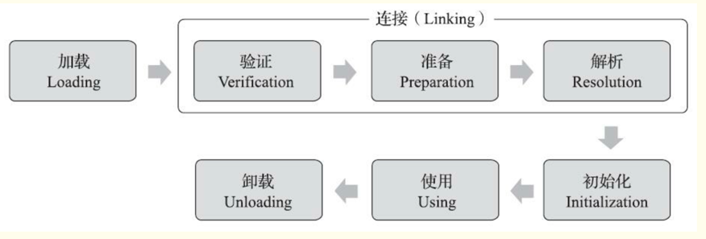

# 类加载机制
Class文件中描述的各类信息，最终都需要加 载到虚拟机中之后才能被运行和使用

Java虚拟机把描述类的数据从Class文件加载到内存，
并对数据进行校验、转换解析和初始化，最 终形成可以被虚拟机直接使用的Java类型，这个过程被称作虚拟机的类加载机制.

与那些在**编译时需 要进行连接**的语言不同，在Java语言里面，**类型的加载、连接和初始化过程都是在程序运行期间完成 的**，
- 这种策略让Java语言进行提前编译会面临额外的困难，也会让类加载时稍微增加一些性能开销
- 但是却为Java应用提供了**极高的扩展性和灵活性**，Java天生可以**动态扩展的语言特性就是依赖运行期动态加载和动态连接这个特点实现**的

## 类加载时期
一个类型从被加载到虚拟机内存中开始，到卸载出内存为止，它的整个生命周期将会经历:
- 加载
- 验证
- 准备
- 解析
- 初始化
- 使用
- 卸载

其中验证、准 备、解 析 三 个 部 分 统 称 为连接(Linking)。
  
你一定认为整个流程一定是按照这个顺序进行的!? 
其实， 
- 解析这个阶段是不一定在这个 位置的。
    - 它在某些情况下可以在初始化阶段之后再开始， 这是为了支持Java语言的运行时绑定特性(也称为动态绑定或晚期绑定)
- 这些阶段通常都 是**互相交叉地混合进行**的，会在一个阶段执行的过程中调用、激活另一个阶段。

关于在什么情况下需要开始类加载过程的第一个阶段“加载”，《Java虚拟机规范》中并没有进行 强制约束，这点可以交给虚拟机的具体实现来自由把握。
但是对于初始化阶段，《Java虚拟机规范》 则是严格规定了**有且只有六种情况必须立即对类进行“初始化”**(而加载、验证、准备自然需要在此之 前开始):
1. 遇到new、getstatic、putstatic或invokestatic这四条字节码指令时，如果类型没有进行过初始 化，则需要先触发其初始化阶段。
   能够生成这四条指令的典型Java代码场景有:
    - 使用new关键字实例化对象的时候。
    - 读取或设置一个类型的静态字段(被final修饰、已在编译期把结果放入常量池的静态字段除外)
      的时候。
    - 调用一个类型的静态方法的时候
2. 使用java.lang.reflect包的方法对类型进行**反射调用**的时候，如果类型没有进行过初始化，则需 要先触发其初始化。
3. 当初始化类的时候，如果发现**其父类还没有进行过初始化，则需要先触发其父类的初始化**。 
4. 当虚拟机启动时，用户需要指定一个要执行的**主类**(包含main()方法的那个类)，虚拟机会先 初始化这个主类。
5. 当使用JDK 7新加入的动态语言支持时，如果一个java.lang.invoke.MethodHandle实例最后的解 析结果为REF_getStatic、REF_putStatic、REF_invokeStatic、REF_newInvokeSp ecial四种类型的方法句 柄，
   并且这个方法句柄对应的类没有进行过初始化，则需要先触发其初始化   
6. 当一个接口中定义了JDK 8新加入的默认方法(**被default关键字修饰的接口方法**)时，如果有 这个接口的实现类发生了初始化，那该接口要在其之前被初始化

对于这六种会触发类型进行初始化的场景，《Java虚拟机规范》中使用了一个非常强烈的限定语 ——“有且只有”，
这六种场景中的行为称为**对一个类型进行主动引用**。除此之外，所有引用类型的方 式都不会触发初始化，称为被动引用。

## 类加载过程
### 加载
“加载”(Loading)阶段是整个“类加载”(Class Loading)过程中的一个阶段。
在加载阶段，Java虚拟机需要完成以下三件事情:
1. 通过一个类的全限定名来获取定义此类的二进制字节流。
2. 将这个字节流所代表的**静态存储结构转化为方法区的运行时数据结构**。
3. 在内存中生成一个代表这个类的java.lang.Class对象，作为方法区这个类的各种数据的访问入 口。

《Java虚拟机规范》对这三点要求其实并不是特别具体，留给虚拟机实现与Java应用的灵活度都是 相当大的。
>通过一个类的全限定名来获取定义此类的二进制字节流”这条规则，
> 它并没有指明二 进制字节流必须得从某个Class文件中获取，确切地说是根本没有指明要从哪里获取、如何获取

仅仅 这一点空隙，Java虚拟机的使用者们就可以在加载阶段搭构建出一个相当开放广阔的舞台，
Java发展历 程中，充满创造力的开发人员则在这个舞台上玩出了各种花样，
许多举足轻重的Java技术都建立在这 一基础之上，例如:
- 从ZIP压缩包中读取，这很常见，最终成为日后**JAR、EAR、WAR格式**的基础。
- 从网络中获取，这种场景最典型的应用就是Web Applet。
- 运行时计算生成，这种场景 使用的最多的就是**动态代理技术**。
  - 在java.lang.reflect.Proxy中，就是 用 ProxyGenerator.generateProxyClass() 来为特定接口生成形式为 "*$Proxy"的 代理类字节流
- 由其他文件生成，典型场景是JSP应用，由JSP文件生成对应的Class文件。
- 从数据库中读取，这种场景相对少见些，例如有些中间件服务器(如SAP Netweaver)可以选择
  把程序安装到数据库中来完成程序代码在集群间的分发
- 可以从加密文件中获取，这是**典型的防Class文件被反编译的保护措施**，通过**加载时解密Class文件来**保障程序运行逻辑不被窥探。

相对于类加载过程的其他阶段，**非数组类型**的加载阶段(准确地说，是加载阶段中获取类的二进 制字节流的动作)是开发人员可控性最强的阶段
>加载阶段既可以使用Java虚拟机里内置的引导类加 载器来完成，也可以由用户自定义的类加载器去完成，
> 开发人员通过定义自己的类加载器去控制字节 流的获取方式(重写一个类加载器的findClass()或loadClass()方法)，
> 实现根据自己的想法来赋予应用 程序获取运行代码的动态性。

- 对于数组类而言，情况就有所不同，**数组类本身不通过类加载器创建，它是由Java虚拟机直接在 内存中动态构造出来**的
