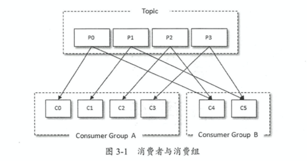
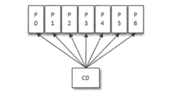
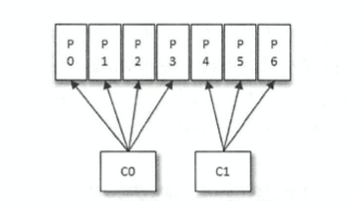
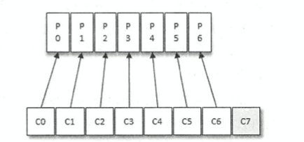
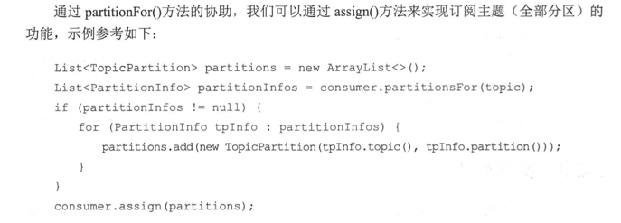
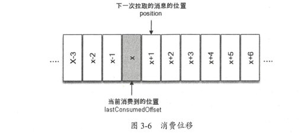
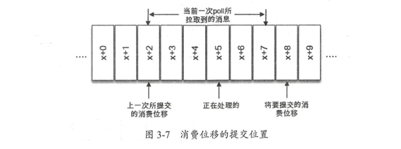
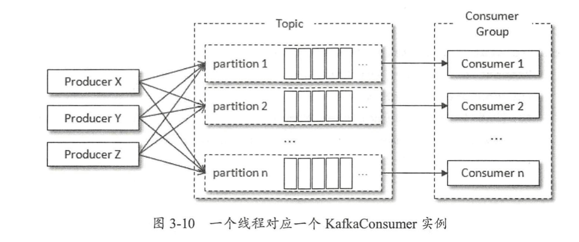
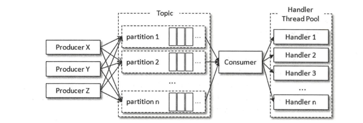

与生产者对应的是消费者，应用程序可以通过KafkaConsumer 来订阅主题，并从订阅的主 题中拉取消息 。 
不过在使用KafkaConsumer 消费消息之前需要先了解消费者和消费组的概念， 否则无法理解如何使用 KafkaConsumer。

# 消费者与消费者组
消费者( Consumer)负责订阅 Kafka 中的主题( Topic)，并且从订阅的主题上拉取消息。 
与其他一些消息中间件不同的是:
- 在 Kafka 的消费理念中还有一层 ***消费组( Consumer Group)*** 的概念，每个消费者都有 一个对应的消费组。
- 当消息发布到主题后，只会被投递给订阅它的每个消费组中的一个消费者。
  - 各个消费者组 消费的数据 是一样的
  - 消费者组中的 每个消费者 消费的数据是不一样的
    

如图 3-1 所示，某个主题中共有 4 个分区( Partition) : P0、 Pl、 P2、 P3。 有两个消费组 A 和 B 都订阅了这个主题，消费组 A 中有 4 个消费者 (C0、 Cl、 C2 和 C3)，消费组 B 中有 2 个消费者 （ C4 和 C5) 。按照 Kafka默认的规则，最后的分配结果是消费组 A 中的每一个消费 者分配到 l 个分区，消费组 B 中的每一个消费者分配到 2个分区，**两个消费组之间互不影响**。 每个消费者只能消费所分配到的分区中的消息。换言之 ，**每一个分区只能被一个消费组中的一 个消费者所消费**
如图 3-1 所示，某个主题中共有 4 个分区( Partition) : PO、 Pl、 P2、 P3。 有两个消费组 A 和 B 都订阅了这个主题，消费组 A 中有 4 个消费者 (CO、 Cl、 C2 和 C3)，消费组 B 中有 2 个消费者 CC4 和 CS) 。按照 Kafka默认的规则，最后的分配结果是消费组 A 中的每一个消费 者分配到 l 个分区，消费组 B 中的每一个消费者分配到 2个分区，两个消费组之间互不影响。 每个消费者只能消费所分配到的分区中的消息。换言之 ，每一个分区只能被一个消费组中的一 个消费者所消费
我们再来看 一 下消费组内的消费者个数变化时所对应的分区分配的演变 。假设目前某消费 组内只有一个消费者 C0，订阅了一个主题，这个主题包含 7 个分区: PO、 Pl、 P2、 P3、 P4、 PS、 P6o 也就是说，这个消费者C0订阅了7个分区

此时消费组 内又加入了一个新的消费者 Cl，按照既定的逻辑，需要将原来消费者 C0 的部 分分区分配给消费者 Cl 消费

紧接着消费组内又加入了 一个新的消费者 C2，消费者 C0、 Cl 和 C2

- 消费者与消费组这种模型可以让整体的消费能力具备横向伸缩性，我们 可以增加(或减少) 消费者的个数来提高 (或降低〕整体的消费能力 。 
- 对于分区数固定的情况， 一昧地增加消费者 并不会让消费能力 一直得到提升，如果消费者过多，出现了消费者的个数大于分区个数的情况， 就会有消费者分配不到任何分区

## 理解：
- 一个主题 有多个分区
- 消费者组 订阅 主题， 多个消费者 组 订阅 同一个 主题， 消费的数据 则 都是一样的
- 消费者 组内 存在的 多个 消费者  需要  消费  主题的多个分区内 的数据。 
  - 所以 需要 消费者 组内的 消费者 把 所有分区都 消费到。
  - 就导致  同一组内的 消费者 消费到不同的 分区， 就 消费到 不同的数据。

对于消息中 间件而 言 ， 一般有两种消息投递模式:
- **点对点 (P2P, Point-to-Point)模式和发 布/订阅( Pub/Sub)模式** 。 
  - 点对点模式是基于队列的，消息生产者发送消息到队列，消息消费 者从队列中接收消息。
- 发布订阅模式定义了如何向 一个内容节点发布和订阅消息，这个内容节 点称为主题( Topic)，
  - 主题可以认为是消息传递的中介，消息发布者将消息发布到某个 主题， 
  - 而消息订阅者从主题中订阅消息。主题使得消息的订阅者和发布者互相保持独立，不需要进行 接触即可保证消息的传递，发布/订阅模式在消息的 一对多广播时采用 。 
    
Kafka 同时 支持两种消 息投递模式，而这正是得益于消费者与消费组模型的契合:

- 如果所有的消费者都隶属于**同 一个消费组**，那么所有的消息都会被均衡地投递给每 一 个消费者，即 **每条消息只会被一个 消费者处 理**，这就相当于点对点模式 的应用
- 如果所有的消费者都隶属于**不同的消费组**，那么所有的消息都会被广播给所有的消费 者，即**每条消息会被所有的消费者处理**，这就相当于发布/订阅模式的应用 。

消费组是一个逻辑上的概念，它将旗下的消费者归为 一类 ，**每一个消费者只隶属于 一个消 费组**。每一个消费组都会有一个固定的名称，消费者在进行消费前需要指定其所属消费组的名 称，这个可以通过消费者客户端参数 group.id来配置，默认值为空宇符串。
消费者并非逻辑上的概念，它是实际的应用实例，它可以是一个钱程，也可以是 一 个进程。 同一个消费组内的消费者既可以部署在同 一 台机器上，也可以部署在不同的机器上。

# 客户端开发
一个正常的消费逻辑需要具备以下几个步骤 :

1. 配置消费者客户端参数及创建相应的消费者实例 。
2. 订阅 主题。
3. 拉取消息并消费 。
4. **提交消费位移**
5. 关闭消费者实例。

## 必要参数配置
创建真正的消费者实例之前需要做相应的参数配置，在 Kafka 消费者客户端 KafkaConsumer 中有 4 个参数是必填 的 。

- bootstrap.servers:该参数的释义和生产者客户端 KafkaProducer 中 的相同，
  - 用 来指定连接 Kafka 集群所需的 broker 地址清单，具体内容形式为 hostl:portl,host2 :port， 
  - 可以设置一个或多个地址，中间用逗号隔开，此参数 的默认值为“”。注意这里并非需要设置集群中全部的 broker地址，
  - 消费者会从现有 的配置中 查找到全部的 Kafka 集群成员 。这里设置两个以上 的 broker 地址信息，当其 中任意一个宕机时，消费者仍然可以连接到 Kafka 集群上
- **group.id**: 消费者隶属的**消费组的名称** ， 默认值为“”。 如果设置为空，则会报出异 常: Exception in thread "main” org.apache.kafka.common.errors.InvalidGroupldException: The configured groupld is invalid。 一般而言，这个参数需要设置成具有一定的业务意义 的名称 。
- key.deserializer 和 value.deserializer: 与生产者客户端 KafkaProducer 中的 key.serializer 和 value.serializer 参数对应。

## 订阅主题与分区
在创建好消费者之后，我们就需要为该消费者订阅相关的主题了。
- 一个消费者可以订阅一 个或多个主题， 可以以 集合 的形式订阅 多 个主题，也可以以正则表达式的形式订阅特定模式的主题

```
public void subscribe(Collection<String> topics);

    /**
     * @see KafkaConsumer#subscribe(Collection, ConsumerRebalanceListener)
     */
    public void subscribe(Collection<String> topics, ConsumerRebalanceListener callback);

    /**
    * @see KafkaConsumer#subscribe(Pattern, ConsumerRebalanceListener)
    */
    public void subscribe(Pattern pattern, ConsumerRebalanceListener callback);

    /**
    * @see KafkaConsumer#subscribe(Pattern)
    */
    public void subscribe(Pattern pattern);
```

对于消费者使用集合的方式( subscribe(Collection))来订阅主题而言，比较容易理解，
订阅 了什么主题就消费什么主题中的消息。如果前后两次订阅了不同的主题，那么消费者以最后一 次的为准。
```
consumer.subscribe(Arrays . asList(topicl )); 
consumer . subscribe(Arrays . asList(topic2));
```

如果消费者采用的是正则表达式的方式( subscribe(Pa忧em))订阅， 在之后的 过程中，如果 有人又创建了新的主题，并且主题的名字与正则表达式相匹配，那么这个消费者就可以消费到 新添加的主题中的消息
发现 subscribe 的重载方法中有 一个参数类型 是 ConsumerRebalance-

Listener，这个是用来设置相应的**再均衡监昕器**的 。

消费者不仅可以通过 KafkaConsumer.subscribe()方法订阅主题，还可以**直接订阅某些主题的 特定分区** ，在 KafkaConsumer 中还提供了 一个 assign()方法来实现这些功能
```java
public class KafkaConsumer<K, V> implements Consumer<K, V> {
  //....
  /**
   * 手动将分区列表分配给此使用者。此接口不允许增量分配，并将替换以前的分配（如果有）。
   * 如果给定的主题分区列表为空，则将其视为与 unsubscribe()相同。
   * 通过此方法手动分配主题不使用使用者的组管理功能。因此，当组成员身份或集群和主题元数据更改时，不会触发重新平衡操作。
   * 请注意，不能同时使用 和 进行手动分区分配，也不能同时使用 进行
   * @param partitions
   */
  @Override
  public void assign(Collection<TopicPartition> partitions) {
    acquireAndEnsureOpen();
    try {
      if (partitions == null) {
        throw new IllegalArgumentException("Topic partition collection to assign to cannot be null");
      } else if (partitions.isEmpty()) {
        this.unsubscribe();
      } else {
        for (TopicPartition tp : partitions) {
          String topic = (tp != null) ? tp.topic() : null;
          if (Utils.isBlank(topic))
            throw new IllegalArgumentException("Topic partitions to assign to cannot have null or empty topic");
        }
        fetcher.clearBufferedDataForUnassignedPartitions(partitions);

        // make sure the offsets of topic partitions the consumer is unsubscribing from
        // are committed since there will be no following rebalance
        if (coordinator != null)
          this.coordinator.maybeAutoCommitOffsetsAsync(time.milliseconds());

        log.info("Assigned to partition(s): {}", Utils.join(partitions, ", "));
        if (this.subscriptions.assignFromUser(new HashSet<>(partitions)))
          metadata.requestUpdateForNewTopics();
      }
    } finally {
      release();
    }
  }

  //....
}
```

这个方法只接受一个参数 partitions，用来指定需要订阅的分 区集合。这里补充说明一 下 TopicPartition类，在 Kafka 的客户端中 ，它用来表示分区
```java
/**
 * 主题名称和分区号
 * A topic name and partition number
 */
public final class TopicPartition implements Serializable {
  private static final long serialVersionUID = -613627415771699627L;

  private int hash = 0;
  //分区号
  private final int partition;
  //主题
  private final String topic;
  //...省略
}

```
## 如果我们事先并不知道主题中有多少个分区怎么办?
KafkaConsumer 中 的 **partitionsFor()方法可以用来查询指定主题的元数据信息**


```java
/**
 * This is used to describe per-partition state in the MetadataResponse.
 * 这用于描述元数据响应中每个分区的状态。
 *   kafka.clients.main
 */
public class PartitionInfo {
  private final String topic;
  private final int partition;
  private final Node leader;
  private final Node[] replicas;
  private final Node[] inSyncReplicas;
  private final Node[] offlineReplicas;
}
```
PartitionInfo 类中的属性 
- topic 表示主题名称，
- partitio口代表分区编号，
- leader 代表 分区的leader副本所在的位置，
- replicas 代表分区的AR集合，
- inSyncReplicas代表分区 的 ISR 集合，
- offlineReplicas 代表分区的 OSR 集合 。



既然有订阅，那么就有取消订阅，可以使用 KafkaConsumer 中的 unsubscribe()方法采取消 主题的订阅。
这个方法既可以取消通过 subscribe(Collection)方式实现的订阅，
也可以取消通过 subscribe(Pattem)方式实现的订阅，
还可以取消通过 assign(Collection)方式实现的订阅

>集合订阅的方式subscribe(Collection)、正则表达式订阅方式 subscribe(Pattern) 、 指定分区订阅方式 assign(Collection partitions)
> 分别代表了 三种不同的 订阅状态
- 集合订阅的方式subscribe(Collection)： AUTO_TOPICS
- 正则表达式订阅方式 subscribe(Pattern): AUTO_PATTERN
- 指定分区订阅方式 assign(Collection partitions) : USER_ASSIGNED
  
这三种方式 是 互斥的， 消费者 只能使用 其中一种
- 如果没有订阅 ： NODE


通过 **subscribe()方法订阅主题**具有**消费者自动再均衡的功能**，
- 在多个消费者的情况下可以 根据**分区分配策略来自动分配各个消费者与分区的关系**。
- 当消费组 内 的消费者增加或减少时， 分区分配关系会 自动调整 ，以实现**消费负载均衡及故障自动转移**。
而通过 assign()方法订阅分区 时， 是不具备消费者自动均衡的功能的，其实这一点从assign()方法的参数中就可以看出端倪， 两种类型的 subscribe()都有 ConsumerRebalanceListener类型参数的方法，而 assign()方法却没有。

## 反序列化
如无特殊需要，还是不建议使用自定义的序列化器或反序列化器，因为这样会增 加生 产者与消费者之 间的耦合度，在系统升级 换代的时候很容易出错 。 自定义的类型有一个不 得不面对的问题就是 KafkaProducer和 KafkaConsumer之间的序列化和反序列化的兼容性。对于 StringSerializer来说， KafkaConsumer 可以顺其自然地采用 StringDeserializer，不过对于 Company 这种专用类型而言，某个上游应用采用 CompanySerializer进行序列化之后，下游应用也必须实 现对应的 CompanyDeserializer。再者，如果上游的 Company类型改变，那么下游也需要跟着重 新实现一个新的 CompanyDeserializer，后面所面临的难题可想而知 。

## 消息消费
Kafka 中的 消费是基于拉模式的。消息的消费一般有两种模式 : **推模式和拉模式**。推模式 是服务端主动将消息推送给消费者，而拉模式是消费者主动向服务端发起请求来拉取消息。
Kafka 中的消息消费是 一个**不断轮询** 的过程，消费者所要做的 就是重复地调用 poll()方法 ， 而 poll()方法返回的是所订阅的主题(分区)上的一组消息。对于 poll()方法而言，如果某些分区中没有可供消费的消息，那么此分区对应的消息拉取的 结果就为空; 如果订阅的所有分区中都没有可供消费的消息，那么 poll()方法返回为空的消息集
```
 /**
     * @see KafkaConsumer#poll(long)
     */
    public ConsumerRecords<K, V> poll(long timeout);
```
注意到 poll()方法里还有一个超时时间参数 timeout，用来控制 **poll()方法的阻塞时间，在 消费者的缓冲区里没有可用数据时会发生阻塞** 。
>注意这里 timeout 的类型是 Duration，它是 JDK8中新增的一个与时间有关的类型。 在Kafka2.0.0之前的版本中， timeout参数的类型为 long
timeout 的设置取决于应用程序对响应速度的要求，比如需要在多长时间内将控制权移交 给执行轮询的应用线程。可以直接将 timeout 设置为 0， 这样 poll()方法会立刻返回，而不管 是否己经拉取到了消息。如果应用线程唯一的工作就是从 Kafka 中拉取并消费消息，则可以将 这个参数设置为最大值 Long.MAX_VALUE。

消费者消费到的每条消息的类型为 ConsumerRecord (注意与 ConsumerRecords 的 区别)， 这个和生产者发送的消息类型 ProducerRecord相对 应，不过 ConsumerRecord 中的内 容更加丰富


```java
/**
 * 要从 Kafka 接收的键/值对。它还包括从中接收记录的主题名称和分区号、指向 Kafka 分区中记录的偏移量以及由相应 ProducerRecord 标记的时间戳。
 */
public class ConsumerRecord<K, V> {
  public static final long NO_TIMESTAMP = RecordBatch.NO_TIMESTAMP;
  public static final int NULL_SIZE = -1;

  /**
   * 此类不再公开校验和，此常量将在 Apache Kafka 4.0 中删除（自 3.0 起已弃用）
   * @deprecated checksums are no longer exposed by this class, this constant will be removed in Apache Kafka 4.0
   *             (deprecated since 3.0).
   */
  @Deprecated
  public static final int NULL_CHECKSUM = -1;

  private final String topic;
  private final int partition;
  /**
   *  这个消息 在 所属分区 的 偏移量
   */
  private final long offset;
  /**
   *  timestamp 表示时间戳，与此对应的 timestampType 表示时间戳的 类型。
   *  timestampType 有两种类型 : CreateTime 和 LogAppendTime
   */
  private final long timestamp;

  /**
   * timestampType 有两种类型 :
   * 1.CreateTime  创建时间
   * 2.LogAppendTime 追加到 日志文件时间
   */
  private final TimestampType timestampType;
  private final int serializedKeySize;
  private final int serializedValueSize;
  /**
   * 消息 头部 内容
   */
  private final Headers headers;
  /**
   * 消息 键
   */
  private final K key;
  /**
   * 消息体  需要读取的就是 这个 value
   * 已经 经过反序列化 
   */
  private final V value;
  private final Optional<Integer> leaderEpoch;
  //...
}
```
- topic 和 partition 这两个字段分别代表消息所属主题的名称和所在分区的编号。 
- offset 表示消息在所属分区的偏移量。
- timestamp 表示时间戳，与此对应的 timestampType 表示时间戳的 类型。
- timestampType 有两种类型 : CreateTime 和 LogAppendTime，分别代表消息创建的时间戳和消息追加到日志的时间戳。
- headers 表示消 息的头部内容。
- key 和 value 分别表示消息的键和消息的值，一般业务应用要读取的就是 value

poll()方法的返回值类型是 ConsumerRecords，它用来表示一次拉取操作所获得的**消息集** ， 内部包含了若干 ConsumerRecord， 它提供了一个 iterator()方法来循环遍历消息集内部的消息

在 ConsumerRecords 类中还提供了几个方法来方便开发人员对消息集进行处理;
- count()方 法用来计算出消息集中的消息个数 ， 返回类型是 int; 
- isEmpty()方法用来判断消息集是否为空， 返回类型是 boolean; 
- empty()方法用来获取一个空的消息集，返回类型是 ConsumerR巳cord<K, V>。

到目前为止，可以简单地认为 poll()方法只是拉取一下消息而己，但就其内部逻辑而言并不 简单:
>它涉及**消费位移、消费者协调器、组协调器、消费者的选举、分区分配的分发、再均衡 的逻辑、心跳**等内容

## 位移提交
对于 Kafka中的分区而言，它的**每条消息都有唯一的 offset，用来表示消息在分区中对应的 位置**。

对于消费者而言， 它也有一个 offset的概念，消费者使用 **offset来表示消费到分区中某个消息所在的位置**
- 对于消息在分区中的位置 ， 我们将 offset 称为“偏移量” ; 
- 对于消费者消费到的位置，将 offset 称为“位移 ”  ，有时候也会更明确地称 之为“消费位移”

每次调用 poll()方法时，它返回的是**还没有被消费过的消息集**(当然这个前提是消息己经 存储在 Kafka 中了，并且暂不考虑异常情况的发生) ， 
- 要做到这一点，就需要**记录上一次消费 时的消费位移** 。 
- 并且这个消费位移必须做**持久化保存**，而不是单单保存在内存中，

如果不持久化消费位移 
-  消费者 重启之后就无法知晓之前的消费位移， 
-  再考虑一种情况，当有新的消费者加入时，那么必然会 有再均衡的动作 ， 
   - 对于 同一分区 而言，它可能 在  再均衡动作之后 分配给新的消费者 ， 如果不持 久化保存消费位移，那么这个新的消费者也无法知晓之前的消费位移 。
  

旧消费者客户端中，消费位移是存储在 ZooKeeper 中的 。 而在新消费者客户端中，消费 位移存储在 **Kafka 内 部的主题 consumer offsets** 中 。 
这里把将消费位移存储起来(持久化)的 动作称为“提交’ ，**消费者在消费完消息之后需要执行消费位移的提交**。


- x 表示一次拉取操作中 此分区的 消息的 最大偏移量 （一次拉取到的 最大的 一个 offset）
- 假设 当前消费者 已经消费了 x 位置的消息， 那么 就可以 说 这个 消费者的 消费位移 为 x， 图中 lastConsumerOffset

注意：
- 当前消费者需要**提交的消费位移并不是 x，而是 x+1**，
- 对于图 中的 position，它表示**下一条需要拉取的消息的位置**。

>在消费者中还有一个 committed offset 的概念，它表示已经提交过的消费位移。

KafkaConsumer 类提供 了 position(TopicPartition)和 committed(TopicPartition)两个方法来分 别获取上面所说的 position 和 committed offset 的值
```
    /**
     * @see KafkaConsumer#position(TopicPartition)
     */
    public long position(TopicPartition partition);

    /**
     * @see KafkaConsumer#committed(TopicPartition)
     */
    public OffsetAndMetadata committed(TopicPartition partition);
```

## 消费位移提交导致的 重复消费和消息丢失
对于位移提交的 具体 时机的把握也很有讲究，有可能会造成 **重复消费 和消息丢失**的现象 。


当前一次 poll()操作所拉取的消息集为[x+2,x+7]。
>说明 上次 提交的 消费位移 是 x+2, 说明已经完成了 x+1 之前（包括 x+1) 的所有 消息 的消费。
> x+5 表示 当前正在处理 的位置

- **拉取到消息之后就提交 消费位移----消息丢失**
    - 如果拉取到消息之后就进行了位移提 交 ，即提交了 x+8，
    - 那么 当 前消费 x+5的时候遇到了异常， 在故障恢复之后，我们重新拉取的消息是从 x+8 开始的。
    - 也就是说， x+5 至 x+7 之间的消息并 未能被消费，如此便发生了消息丢失的现象。
- **消费完消息之后才提交 消费位移----重复消费**
    - 当消费 x+5 的时候遇到了异常，在故障恢复之后，我们重新拉取的消息是从 x+2 开始的。（因为本次消费还没提交 消费位移，使用上次的 消费位移重新拉取）
    - 也就是说， x+2 至 x+4 之间的消息又重新消费了 一遍，故而又发生了重复消费的现象
  
- 而实际情况还会有比这两种更加复杂的情形，比如
  - 第 一 次的位移提交的位置为 x+4。 第二次 位移提交位置为 x+8  
  - 如果 x+4 提交 出现 临时异常（可重试异常） 触发 重试， 这时候 第二次位移位置 x+8  先提交了， x+4由于重试 后提交 

在 Kafka 中默认的消费位移的提交方式是自动提交，
>这个由消费者客户端参数 enable.auto.commit 配置，默认值为 true。
> 当然这个默认的自动提交不是每消费一条消息 就提交一次，而是**定期提交**，这个定期的周期时间由客户端参数
> auto.commit.interval.ms 配置，默认值为 **5 秒**，
> 此参数生效的前提是 enable.auto.commit 参数为 true。

- 在默认方式下， 消费者 每隔 5s 将拉取到的 每个分区中 最大的消息唯一 进行提交
- 自动 位移 提交的 动作是 在 poll()方法内部逻辑 完成的
- 每次 真正 向 服务端 发起 拉取请求 之前， 会检查  是否可以 进行 消费位移提交， 如果可以 就会提交上一次 轮询的 位移

kafka中 消费位移 提交 是一个难点！！！
自动位移提交的方式 非常简单，免去了 复杂的 位移提交逻辑，编码简洁， 随之 带来的 也有 重复消费 和 消息丢失的 问题！

> 假设刚刚 提交了 一次消费位移，然后 拉取了 一批新消息进行消费。 在 **下一次 位移自动提交 之前，消费者挂了**， 
> 那 消费者恢复后，就又从 上次提交的 消费位移 进行消费。 就产生 了 **重复消费** 问题 （再均衡 也会这样）

可以考虑 缩小自动位移提交间隔， 会减少 重复消费数据，但是 并不能避免，且 导致 位移提交更频繁，耗费资源

**思考**
另外的 
是不是 假设本次拉取到的一批数据， 还没有消费完， 但是 刚好到达 5s 自动提交间隔，导致 提交了 本次拉取 的最大消费位移。
然后 消费者 挂了，重启后 从上次拉取的 最大位移 处开始消费， 产生 消息 丢失。 ？？？？？

考虑： 自动提交 是 会检查  是否可以进行消费位移提交 条件是什么？ 
1. 肯定是 必须是 恰好 触发 自动位移间隔
2. 是否会 考虑 本批数据 还没消费完， 不能提交 比 已经处理 消费位移大  的 位移？？？？

不会。 因为  位移提交是 **在poll 时 ，提交 上一批次 的 消费位移**。
也就是 说， 不可能 出现  本轮消费还未完成， 就提交了 本轮的 最大消费位移。

Q:那么是不是 就不会出现 消息丢失的情况呢？
A: 不，还是 会出现消息丢失的。 因为 拉取消息  和 处理消息 是两个不同的线程。：
- 消费者拉取消息（是从 某个broker 的 某个 partition 根据消费位移  拉到 本地缓存）
- 处理消息， 是 从缓存队列中 取出数据 进行处理。
和 commitAsync()两种类型的方法.


## 控制或关闭消费
KafkaConsumer 提供了对消费速度进行控制的方法，在有些应用场景下我们可能需要暂停 某些分区的消费而先消费其他分区，当达到一定条件时再恢复这些分区的消费。
KafkaConsumer 中使用 pause()和 resume()方法来分别实现暂停某些分区在拉取操作时返回数据给客户端和恢复
某些分区向客户端返回数据的操作。这两个方法的具体定义如下 :
```java
@Override
class KafkaConsumer{
    

/**
 *
 org.apache.kafka.clients.consumer.KafkaConsumer<K, V> public void pause(Collection<TopicPartition> partitions)
 暂停从请求的分区进行读取。将来调用 将不会 poll(Duration) 从这些分区返回任何记录，直到使用 恢复 resume(Collection)这些分区。请注意，此方法不会影响分区订阅。特别是，当使用自动分配时，它不会导致组重新平衡。注意：重新平衡不会保留暂停/恢复状态。

 指定者：
 pause 在界面中 Consumer
 参数：
 分区 – 应暂停的分区
 抛出：
 IllegalStateException – 如果当前未将提供的任何分区分配给此使用者
 kafka.clients.main
 * @param partitions
 */
    public void pause(Collection<TopicPartition> partitions) {
        acquireAndEnsureOpen();
        try {
            log.debug("Pausing partitions {}", partitions);
            for (TopicPartition partition: partitions) {
                subscriptions.pause(partition);
            }
        } finally {
            release();
        }
    }


  /**
   org.apache.kafka.clients.consumer.KafkaConsumer<K, V> public void resume(Collection<TopicPartition> partitions)
   恢复已暂停 pause(Collection)的指定分区。新的调用 poll(Duration) 将从这些分区返回记录（如果有要获取的记录）。如果分区之前未暂停，则此方法为无操作。

   指定者：
   resume 在界面中 Consumer
   参数：
   分区 – 应恢复的分区
   抛出：
   IllegalStateException – 如果当前未将提供的任何分区分配给此使用者
   kafka.clients.main
   */
  @Override
  public void resume(Collection<TopicPartition> partitions) {
    acquireAndEnsureOpen();
    try {
      log.debug("Resuming partitions {}", partitions);
      for (TopicPartition partition: partitions) {
        subscriptions.resume(partition);
      }
    } finally {
      release();
    }
  }


}
```


## 指定位移消费
是有了消费位移 的持久化 ，才使消费 者在关闭、崩溃或者在遇到再均衡的时候，可以让接替的消费者能够根据存储的消费位移继续 进行消费。

试想一下，当一个新的消费组建立的时候，它根本没有可以查找的消费位移。
或者消费组 内的一个新消费者订阅了一个新的主题，它也没有可以查找的消费位移。
当 consumer offsets 主题中有关这个消费组的位移信息过期而被删除后， 它也没有可以查找的消费位移。

在 Kafka 中 每当消费者查找不到所记录的消费位移 时， 就会根据消费者客户端参数 auto.offset.reset 的配置来决定从何处开始进行消费，
这个参数的**默认值为“ latest”**，表 示从**分区末尾**开始消费消息，如果配置为**“ earliest”**，那么消费者会从起始处，也就是 0 开始 消费


除了查找不到消费位移，**位移越界**也会触发 auto.offset.reset 参数的执行
auto.offset.reset 参数还有 一 个可配置的 值: **“ none”**，
配置为 此值就 意味着 出现 查到不到消费位移的时候，既不从最新的消 息位置处开始消 费，也不从最早的消息位置处开始 消费，
此时会报出 NoOffsetForPartitionException异常


有些时候，我们 需要一种更细粒度的掌控，可以让我们从**特定的位移处**开始拉 取消息，而 KafkaConsumer 中的 seek()方法正好提供了这个功能，让我们得 以**追前消费或 回溯 消费**。
```
  /**
     * @see KafkaConsumer#seek(TopicPartition, long)
     */
    public void seek(TopicPartition partition, long offset);
```
seek()方法中的参数 partition 表示分区，而 offset 参数用来指定从分区的哪个位置 开始消费。**seek()方法只能重置消费者分配到的分区的消费位置**，而分区的分配是在 poll()方 法的调用过程中实现的 。 
也就是说，在执行 seek()方法之前需要 先执行一次 poll()方法 ， 等到 分配到分区之后才可以重置消费位置

其实 KafkaConsumer 中直接提供了 seekToBeginning() 方法和 seekToEnd()方法来实现从分区 的开头或末尾开始消费

## 再均衡
再均衡是指**分区的所属权从一个消费者转移到另一消费者的行为**，它为消费组具备高可用性和伸缩性提供保障，
使我们可以既方便 又安全地删除消费组内的消费者或往消费组内添加消 费者

不过在**再均衡发生期间，消费组内的消费者是无法读取消息**的。 也就是说，在再均衡发 生期间的这一小段时 间 内，消费组会变得不可用 。
>另外，当 **一个分区被重新分配给另一个消费 者时， 消费者当前的状态也会丢失**。
> 比如消费者消费完某个分区中的一部分消息时还没有来得 及提交消费位移就发生了再均衡操作 ， 
> 之后这个分区又被分配给了消费组 内 的另一个消费者， 原来被消费完的那部分消息又被重新消费一遍，也就是发生了**重复消费**。
> 一般情况下，应尽量 避免不必要的再均衡的发生。

subscribe()方法时提及再均衡监昕器 ConsumerRebalanceListener  用来设定发生 **再 均衡动作前后的 一些准备或收尾的动作**

kafkaConsumer会在 提交完 消费位移 之后 调用 拦截器的 onCommit()方法。
可以使用这个 方法 跟踪 提交的 位移信息。

>比如 使用 commitSync() 时，不知道 提交消费位移的具体细节， 就可以  使用 拦截器


## 多线程

KafkaProducer 是 线程安全的， 而  KafkaConsumer是 线程不安全的


KafkaConsumer 提供了 一个 acquire() 方法 检测 当前 是否只有 一个线程 操作。


>acquire()方法和我们通常所说的锁(synchronized、 Lock等〉 不同，它不会造成阻塞等待， 
> 我们可以将其看作一个轻量级锁，它仅通过线程操作计数标记的方式来检测线程是否发生了并 发操作，以此保证只有一个线程在操作。 
> acquire()方法和 release()方法成对出现，表示相应的加 锁和解锁操作。


KafkaConsumer 虽然是 非线程安全的，  单 并不意味着  我们消费消息的 时候 只能以单线程的方式去 消费

如果 生产者 速度  大于  消费者 处理消息的速度，  那么就会 有 越来越多的消息 得不到及时处理。造成延迟
此外，由于 Kafka保留机制的作用，  有些消息 可能被消费之前 就被清理了，造成 消息丢失


所以 也可以用多线程 实现 消费。  目的是为了 提高 整体 消费能力

最常见的是： 线程封闭。 每个线程 实例化一个 KafkaConsumer 互不干扰。


一个线程拥有一个 KafkaConsumer 实例，可以 把这个线程 叫做 消费线程。
一个消费线程 可以 消费一个 或 多个 分区 的消息， 所有的 消费线程 都属于 一个 消费者组。

这种实现 的 **并发度 受到 主题 的 分区数 限制**。
最多 只能 有 跟 分区数 一样的 有效 并发度， 因为多出来的 消费线程（消费者） 分配不到 分区，就会 一直 空闲
消费者 直接 消费的 数据 不能一样。


还有一种更为高效的方式。 整体消费 的瓶颈 一般在 处理消息 上。
那考虑： 处理消息时  多线程处理， 拉取仍然 单线程。



这种实现方式相比第一种实现方式而言，
- 除了横向扩展的能力，还可以减少 TCP 连接对 系统资源的消耗，
- 不过缺点就是对于消息的顺序处理就比较困难了

消息顺序处理： 维护一个 共享变量 offset 协助提交 消费位移


1. 每一个处理消息的 RecordHandler 在 处理完消息之后 都将对应的消费位移 保存到 共享offset 中
2. KafkaConsumerThread 拉取线程 在每一次 poll 之后，都读取  共享offset的内容，并对其进行 位移提交

注意： 这个共享变量 必须保证线程安全。
- 需要加锁
- 写入offset 时，注意 消息位移覆盖
