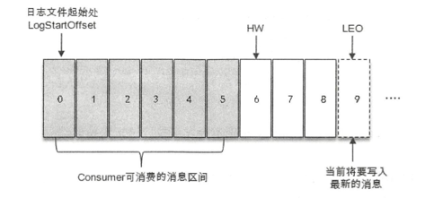

Kafka起初是由 Linkedin公司采用 Scala语言开发的一个多分区、多副本且基于 ZooKeeper 协调的分布式消息系统，现己被捐献给 Apache 基金会 。 目前 Kafka 已经定位为一个分布式流式 处理平台，它以高吞吐、可持久化、可水平扩展、支持流数据处理等多种特性而被广泛使用。
目前越来越多的开源分布式处理系统如 Cloudera、 Storm、 Spark、 Flink 等都支持与 Kafka 集成 

Kafka之所以受到越来越多的青睐，与它所“扮演 ”的三大角色是分不开的 :
- 消息系统: Kafka 和传统的消息系统(也称作消息中间件〉都具备系统解稿、冗余存 储、流量削峰、缓冲、异步通信、扩展性、 可恢复性等功能。
  同时还提供了 其他MQ难以 提供的  **消息顺序性保证（分区有序） 以及 回溯消费**
- 存储系统：kafka 把消息 **持久化到磁盘**，相比于其他基于内存存储的系统而言，有效 地降低了数据丢失的风险 。
  也得益于 kafka **持久化功能 和 多副本 机制**，们可以把 Kafka 作为长期的数据存储系统来使用，只需要把对应的**数据保留策略设置 为“永久”或启用主题的日志压缩功能**即可 。
- 流式处理平台: Kafka 不仅为每个流行的流式处理框架提供了可靠 的数据来源，还 提 供了一个完整的流式处理类库，比如窗口、连接、变换和聚合等各类操作 。

# 基本概念
一个典型的Kafka体系架构，包括  多个Producer ，多个Broker, 多个Consumer，一个zk集群。
zk负责 kafka 元数据的管理、控制器的选举等。

Producer 把 消息发送到 Broker， Broker 负责将收到的消息 持久化到 磁盘， 而 Consumer负责 从
Broker 中订阅消费消息。

- Producer： 生产者。 也就是 发送消息的一方。负责 创建消息，投递到 kafka的 broker中
- Consumer： 消费者。 也就是 接收消息的 一方。 消费者 连接到 kafka 上并 接收消息，进行业务逻辑处理。
- Broker： 服务代理节点。Broker可以看做一个独立的kafka服务节点 或 kafka服务实例。一个 或多个 broker 组成了kafka集群

## 主题和分区
kafka还有两个特别重要的概念。主题（Topic），分区（partition）

- kafka中的消息 都是 以 主题为单位 进行归类。生产者负责将消息发送到 特定的 topic，消费者 订阅topic 并进行消费
- 主题只是一个逻辑上的概念， 它还可以 细分为 多个分区。一个分区 只属于 一个主题。
  - 同一主题下的 不同分区 包含的 消息是不同的
  - 分区 Partition 在 存储层面上 可以看做是 一个  可追加的日志（Log）文件， 
    **消息被追加到 log文件时 都会分配一个 特定的偏移量 offset（offset 是分区 中的唯一标识），kafka利用它保证 消息在分区内的顺序性**。
  - **kafka 只保证 分区有序，不保证 主题有序**
- kafka的 分区 还能分布在 不同的服务器broker上。 也就是说，一个主题 可以横跨多个broker，来提供 比单broker更强大的性能

每一条消息发送到broker 之前， 会先根据 分区规则 选择存储到 那个分区。
分区规则设置合理，那么 所有 消息就 可以 均匀分布到 不同的分区中。

如果一个主题 只对应 一个分区，一个 log文件。那么 这个log文件所在机器 i/o 将会称为这个主题的 性能瓶颈。

- 创建主题的时候，可以通过 指定的参数 来设置分区个数。
- 也可以创建主题之后， 修改分区数量， 通过增加分区数量来实现 水平扩展

## 多副本
Kafka还引入了 多副本（Replica)机制。 同一分区，存在多个副本。
- 通过增加 副本数量 可以提高 容灾能力。
- 同一分区的不同副本，存储的是相同的消息。(但是可能会出现 某个时刻数据不完全一样， 某个副本挂了 或者 follower滞后)
- 副本之间 是 一主多从 关系。leader副本 负责读写，follower 只负责 与 leader的消息同步
- 副本 处于 不同的 broker中，当leader 挂了之后，会从新 从followers 中 选举 新的leader副本对外提供服务
- kafka通过 多副本 是爱你 故障自动转移， 保证 kafka集群的 某个broker 失效 仍能使用

- 分区中的所有副本 称为 AR（Assigned Replicas） 
- 所有 跟 leader 副本保持同步的 副本称为 ISR（In-Sync Replicas），ISR 是AR 的一个子集

消息会先发送到leader副本上，然后follower副本才会 从leader副本中拉取消息进行同步
同步期间， follower 相比与 leader 会有一定程度的滞后。这个 一定程度 是 指**可以忍受的 程度**
这个 ***程度***可以通过参数配置。

- 与leader副本滞后过多的副本称为 OSR（Out-of-Sync Replicas）

由此可见： AR = ISR + OSR
正常情况下 应该所有的副本 都保持一定程度同步。 也就是 OSR 为空。 AR = ISR

Leader副本负责 维护和跟踪 ISR 集合中 所有follower 副本的滞后状态，
当 follower 副本 滞后太多或 失效时，Leader会 把 这个 follower 从 ISR 中 剔出

如果 OSR 中的副本 追上 Leader副本后，那么 leader副本会把它从 OSR集合转移至 ISR集合

默认情况下， 当 leader副 本发生故障时，只有在 ISR集合中的副本才有资格被选举为新的 leader， 
而在 OSR集合中的副 本则没有任何机会(不过这个原则也可以通过修改相应的参数配置来改变) 

ISR与HW也有紧密关系。**HW（High Watermark）高水位。它标识 一个 特定的 消息偏移量（offset),消费者只能拉取这个 offset 之前的消息**。

图示描述的是一个 log文件。
- 这个文件中有 9条消息（0-8）， 第一条消息offseet 为0 （LogStartOffseet）， 最后一条 消息的 offset = 8
- offset 为 9 的 消息 代表 下一条 待写入的 消息 （也是 LEO )
- 日志文件 中的 HW = 6， 表示 消费者 只能 拉取到 offset < 6 的消息。 也就是 0-5 的消息。 offset = 6的消息对 Consumer是不可见的
- **LEO（Last End Offset），标识  当前日志文件中 下一条待写入 消息的 Offset**。 也就是 图中 offset = 9 即 LEO
- 分区 ISR 集合中 每个 副本都会 维护 自身 LEO， 而 ISR集合中 最小的 LEO 就是 HW。

## 梳理关系
这里梳理一下前面概念的关系：
1. 主题Topic 对应着 N个分区， （一般 各个分区 分布在不同 Broker上）
2. 分区有着 多副本 
3. 多副本中 存在 Leader ，Follower， 消息都发往Leader，follower用于同步消息
4. 多副本中 由于Leader，Follower存在， 产生 AR，ISR，OSR
5. 一个副本中 消息存储在Log 文件上。 一个 Log 文件中 存在  LogStartOffset，LEO，
6. 一个分区 的 ISR 集合 ( 也就是 某个分区 的所有ISR副本) 中 最小的 LEO  就是 HW

Q:  一个主题的 分区 一般在 不同 broker， 那么 一个 分区的 多副本 是不是 也应该 在 多个Broker上？
经查ChatGPT: 
>是的，一般来说，一个分区的多个副本应该分布在多个不同的 broker 上。
> 这样做的目的是为了提高数据的可用性和容错性。如果某个 broker 出现故障，其他 broker 上的副本仍然可以提供服务，从而避免了数据的丢失。
> 此外，分布在多个 broker 上的副本也有助于在高负载情况下提高吞吐量。

由于**ISR、LEO、HW的存在， Kafka 实现了  性能和可靠的 有效权衡**。`
因为 Kafka 的复制机制 即不是 完全的同步复制， 也不是 单纯的 异步复制。

事实上：
- 同步复制要求 所有能工作的 follower副本 都 复制了 发给Leader的这条消息，  这条消息才会被 确认为 成功提交。
  - 很明显 性能 很低。
- 异步复制 则 是  **数据只要写入了Leader副本**就被认定为成功提交。 
  - 这种情况下，数据 则不保证可靠性。 
  - 如果 follower 副本 还没有 同步完 leader的数据，Leader 就 宕机，就会导致 数据丢失。
  