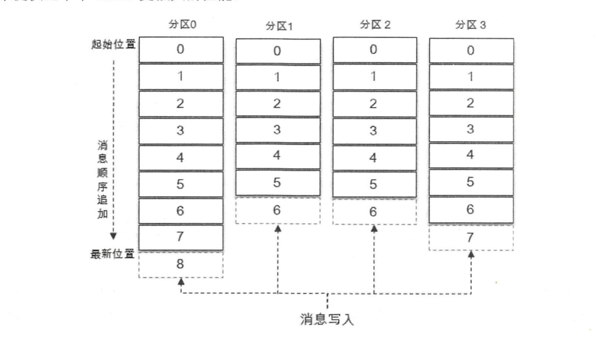

Kafka起初是由 Linkedin公司采用 Scala语言开发的一个多分区、多副本且基于 ZooKeeper 协调的分布式消息系统，现己被捐献给 Apache 基金会 。 目前 Kafka 已经定位为一个分布式流式 处理平台，它以高吞吐、可持久化、可水平扩展、支持流数据处理等多种特性而被广泛使用。
目前越来越多的开源分布式处理系统如 Cloudera、 Storm、 Spark、 Flink 等都支持与 Kafka 集成 

Kafka之所以受到越来越多的青睐，与它所“扮演 ”的三大角色是分不开的 :
- 消息系统: Kafka 和传统的消息系统(也称作消息中间件〉都具备系统解稿、冗余存 储、流量削峰、缓冲、异步通信、扩展性、 可恢复性等功能。
  同时还提供了 其他MQ难以 提供的  **消息顺序性保证（分区有序） 以及 回溯消费**
- 存储系统：kafka 把消息 **持久化到磁盘**，相比于其他基于内存存储的系统而言，有效 地降低了数据丢失的风险 。
  也得益于 kafka **持久化功能 和 多副本 机制**，们可以把 Kafka 作为长期的数据存储系统来使用，只需要把对应的**数据保留策略设置 为“永久”或启用主题的日志压缩功能**即可 。
- 流式处理平台: Kafka 不仅为每个流行的流式处理框架提供了可靠 的数据来源，还 提 供了一个完整的流式处理类库，比如窗口、连接、变换和聚合等各类操作 。

# 基本概念
一个典型的Kafka体系架构，包括  多个Producer ，多个Broker, 多个Consumer，一个zk集群。
zk负责 kafka 元数据的管理、控制器的选举等。

Producer 把 消息发送到 Broker， Broker 负责将收到的消息 持久化到 磁盘， 而 Consumer负责 从
Broker 中订阅消费消息。

- Producer： 生产者。 也就是 发送消息的一方。负责 创建消息，投递到 kafka的 broker中
- Consumer： 消费者。 也就是 接收消息的 一方。 消费者 连接到 kafka 上并 接收消息，进行业务逻辑处理。
- Broker： 服务代理节点。Broker可以看做一个独立的kafka服务节点 或 kafka服务实例。一个 或多个 broker 组成了kafka集群

## 主题和分区
kafka还有两个特别重要的概念。主题（Topic），分区（partition）

- kafka中的消息 都是 以 主题为单位 进行归类。生产者负责将消息发送到 特定的 topic，消费者 订阅topic 并进行消费
- 主题只是一个逻辑上的概念， 它还可以 细分为 多个分区。一个分区 只属于 一个主题。
  - 同一主题下的 不同分区 包含的 消息是不同的
  - 分区 Partition 在 存储层面上 可以看做是 一个  可追加的日志（Log）文件， 
    消息被追加到 log文件时 都会分配一个 特定的偏移量 offset（offset 是分区 中的唯一标识），kafka利用它保证 消息在分区内的顺序性。
  - kafka 只保证 分区有序，不保证 主题有序
- kafka的 分区 还能分布在 不同的服务器broker上。 也就是说，一个主题 可以横跨多个broker，来提供 比单broker更强大的性能

每一条消息发送到broker 之前， 会先根据 分区规则 选择存储到 那个分区。
分区规则设置合理，那么 所有 消息就 可以 均匀分布到 不同的分区中。

如果一个主题 只对应 一个分区，一个 log文件。那么 这个log文件所在机器 i/o 将会称为这个主题的 性能瓶颈。

- 创建主题的时候，可以通过 指定的参数 来设置分区个数。
- 也可以创建主题之后， 修改分区数量， 通过增加分区数量来实现 水平扩展

## 多副本
Kafka还引入了 多副本（Replica)机制。 同一分区，存在多个副本。
- 通过增加 副本数量 可以提高 容灾能力。
- 同一分区的不同副本，存储的是相同的消息。(但是可能会出现 某个时刻数据不完全一样， 某个副本挂了 或者 follower滞后)
- 副本之间 是 一主多从 关系。leader副本 负责读写，follower 只负责 与 leader的消息同步
- 副本 处于 不同的 broker中，当leader 挂了之后，会从新 从followers 中 选举 新的leader副本对外提供服务
- kafka通过 多副本 是爱你 故障自动转移， 保证 kafka集群的 某个broker 失效 仍能使用

