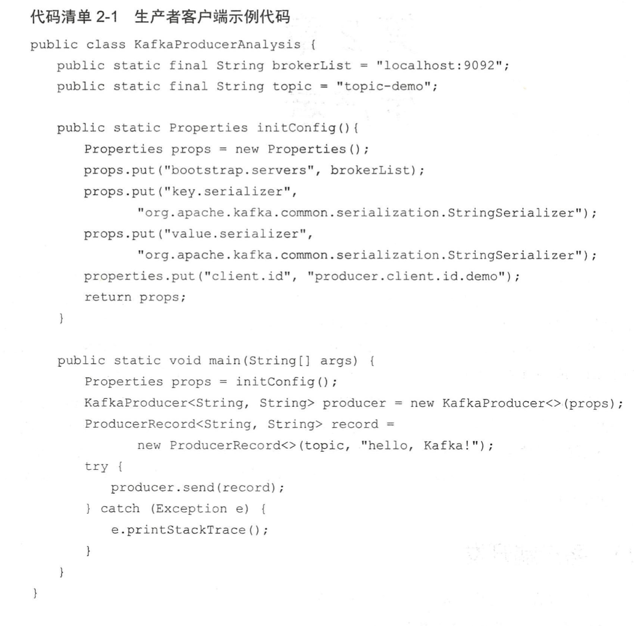
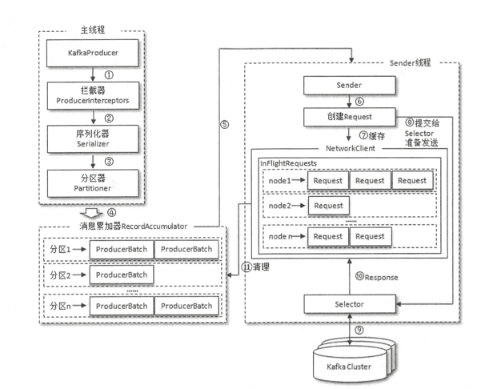
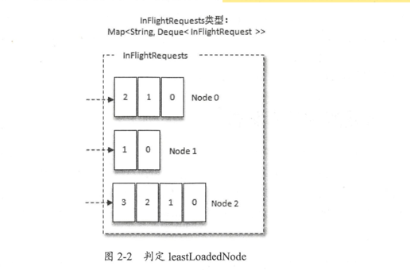

# 概述
从编程的角度而言，**生产者就是负责向 Kafka 发送消息的应用程序**。在 Kafka 的历史变迁 中， 一共有两个大版本的生产者客户端: 第-个是于 Kafka开源之初使用 Scala语言编写的客户 端，我们可以称之为旧生产者客户端(OldProducer)或 Scala版生产者客户端;第二个是从 Kafka 0.9.x 版本开始推出的使用 Java 语言编写的客户端，我们可以称之为新生产者客户端( New Producer)或 Java 版生产者客户端，它弥补了 旧版客户端中存在的诸 多设计缺陷 。
虽然Kafka是用 Java/Scalai吾言编写的，但这并不妨碍它对于多语言的支持，在 Kafka官网中，“CLIENTS”的入口 l提供了一份多语言的支持列表，其中包括常用的CIC++、 Python、 Go等语 言 ，不过这些其他类语 言 的客户端并非由 Kafka社区维护，如果使用则需要另行下载 。

客户端开发			
一个正常的生产逻辑需要具备以下几个步骤 :
1. 配置生产者客户端参数及创建相应的生产者实例。
2. 构建待发送的消息
3. 发送消息。
4. 关闭生产者实例。



## ProducerRecord
```java
public class ProducerRecord<K, V> {
    /**
     * 主题
     */
    private final String topic;
    /**
     * 分区号
     */
    private final Integer partition;
    /**
     * 消息头部
     */
    private final Headers headers;
    /**
     * 用来指定消息的  键
     * 它不仅是 消息的 附加信息，还可以用来 计算 分区号
     *  topic会让消息进行归类，这个 key 可以让  消息 进行 二次 归类
     */
    private final K key;
    /**
     * 消息体
     */
    private final V value;
    /**
     *时间戳
     */
    private final Long timestamp;
    //....省略
}
```

其中 topic 和 partition 字段分别代表消息要发往的主题和分区号。 

headers 字段是 消息的头部， Kafka 0.11.x 版本才引入这个属性，它大多用来设定 一些与 应用相关的信息，如无 需要也可以不用设置。

key：用来指定消息的  键， 
- 它不仅是 消息的 附加信息，还可以用来 计算 分区号。 
- topic会让消息进行归类，这个 key 可以让  消息 进行 二次 归类。
- 同一个 key 会被划分到 同一个 分区中.
- 有key的 消息 还可以 日志压缩。

value：消息体。一般不为空，如果 为空，则表示 特定的 消息---墓碑消息。

Timestamp:   消息的时间戳， 有 createTime （消息创建时间） 和 logAppendTime（消息追加到日志文件的时间） 两个类型

## 必要的参数配置
1. bootstrap.servers:该参数用来指定 **生产者客户端连接 Kafka 集群所需的 broker地址清单**，具体的内容格式为 hostl:portl,host2:port2，可以设置一个或多个 地址，中间以逗号隔开，此 参数 的默认值为“” 。 注意这里并非需要所有的 broker 地 址，因为生产者会从给定的 broker 里查找到其他 broker 的信息 。不过建议至少要设置 两个以上的 broker 地址信息，当其中任意 一个岩机时，生产者仍然可以连接到 Kafka 集群上。
2. key. serializer 和 value . serializer: **broker 端接收的消息必须以字节数组 (byte[])的形式存在**。代码清单 2-1 中生产者使用的 KatkaProducer<Stri吨， String>和 ProducerRecord<String, String>中的泛型 <String， String>对应 的就是消息中 key 和value 的类型，生产者客户端使用这种方式可以让代码具有良好 的可读性 ，不过在发 往 broker之前需要将消息中对应的 key 和 value 做相应的序列化操作来转换成字节 数组。 key . serializer 和 value .serializer 这两个参数分 别用来指定 key 和 value 序列化操作 的序列化器，这两个参数无默认值。注意这里必须填写序列化器的 全限定名 ，如代码清单 2-1 中的 org.apache.kafk- common.serialization.StringSerializer, 单单指定 StringSerializer是错误的，更多有关序列化的内容可以参考 2.1.3节。

可以利用 客户端中的  ProducerConfig 类 来 准确 设置参数。


**KafkfaProducer 是  线程安全**的 ， 可以在多个 线程中 共享单个 KafkaProducer 实例，
也可以将 KafkaProducer 实例进行池化来供其他线程调用。

## 消息的发送
在创建完生产者实例之后，接下来的工作就是构建消息，即创建 ProducerRecord 对象

发送消息有三种模式：

1. 发后即忘  : 只管往kfk发送消息，而不关心消息是否正确到达（发生 不可重试的异常）会造成 消息 丢失，这种 方式 性能最高，可靠性 也最差。
2. 同步 sync， 利用 send 方法 返回的 Future 对象，
3. 异步 async, 一般是在 send()方法里指定一个 Callback 的回调函数，Kafka在返回响应时调用该函数来实现异步的发送确认。

实际上 **send 方法 本身就是 异步**的， send 返回的Future 可以使 调用方稍后 获得发送的结果。 链式调用 .get() 来 阻塞 等待 kfk的 响应。 直到 消息发送成功，或者 发生 异常。

Send 返回的Future  可以获取一个 RecordMetadata 对象，在 这个 对象 里面  包含了 消息的 一些 元数据 信息，
例如：  topic，patrition，offset（分区中的偏移量），时间戳等。  如果 在 应用中 需要获取这些 信息，就可以 send 得到 Future，之后 在 get。 若 不需要，则 链式 调用 get  方法 更省事。

KafkaProducer  中 一般 会发生 两种类型的异常：
1. 可重试的异常：
   - NetworkException(表示网络异常，可能是网络瞬时故障导致，可以通过重试解决）, 
   - LeaderNotAvailiableEp（表示 分区的 Leader 副本 不可用，这个 通常发生在 Leader 副本下线，新的 副本 选举之前，重试之后可以恢复）,  
   - UnknowTopicEp,NotEnoughReplicasEp,NotCoordinatorEp.
2. 不可 重试的 异常 ：  
   - RecordTooLargeEp，暗示 发送的 消息太大，kafkaProducer 不会 进行重试，直接  抛出 异常。

> 对于可重试的异常，如果配置了 retries 参数，那么只要在规定的重试次数内自行恢复 了，就不会抛出异常 ， 
 如果重试 （指定次数）之后 还没有 恢复 仍然会 抛出 异常，  进而 发送  的 外层 逻辑 就要 处理 这些异常了。
同步发送 的方式可靠性高，要么消息被发送成功，要么发生异常。如果发生异常 ，则可以 捕获并进行相应的处理，而不会像“发后即忘”的方式直接造成消息的丢失。不过同步发送的 方式的性能会差很多，需要 阻塞等待一条消息发送完之后才能发送下一条

> 再来了解一下异步发送的方式，一般是在 send()方法里指定一个 Callback 的回调函数，Kafka在返回响应时调用该函数来实现异步的发送确认。  

有人 或许会有疑问， send()方法的返 回值类型就是 Future，而 Future本身就可以用作异步的逻辑处理 。
这样做不是不行，只不过Future 里的 get()方法在何时调用，以及怎么调用都是需要面对的问题，消息不停地发送，那么诸多消息对应的 Future对象的处理难免会引起代码处理逻辑的混乱。

```java
/**
 * A callback interface that the user can implement to allow code to execute when the request is complete. This callback
 * will generally execute in the background I/O thread so it should be fast.
 *
 * 用户可以实现的回调接口，以允许代码在请求完成时执行。此回调通常会在后台 I/O 线程中执行，因此应该很快
 */
public interface Callback {

    /**
     *
     * A callback method the user can implement to provide asynchronous handling of request completion. This method will
     * be called when the record sent to the server has been acknowledged. When exception is not null in the callback,
     * metadata will contain the special -1 value for all fields. If topicPartition cannot be
     * choosen, a -1 value will be assigned.
     *
     * @param metadata The metadata for the record that was sent (i.e. the partition and offset). An empty metadata
     *                 with -1 value for all fields will be returned if an error occurred.
     * @param exception The exception thrown during processing of this record. Null if no error occurred.
     *                  Possible thrown exceptions include:
     *
     *                  Non-Retriable exceptions (fatal, the message will never be sent):
     *
     *                  InvalidTopicException
     *                  OffsetMetadataTooLargeException
     *                  RecordBatchTooLargeException
     *                  RecordTooLargeException
     *                  UnknownServerException
     *                  UnknownProducerIdException
     *                  InvalidProducerEpochException
     *
     *                  Retriable exceptions (transient, may be covered by increasing #.retries):
     *
     *                  CorruptRecordException
     *                  InvalidMetadataException
     *                  NotEnoughReplicasAfterAppendException
     *                  NotEnoughReplicasException
     *                  OffsetOutOfRangeException
     *                  TimeoutException
     *                  UnknownTopicOrPartitionException
     *
     *  用户可以实现的回调方法，用于提供请求完成的异步处理。当发送到服务器的记录被确认时，将调用此方法。当回调中的异常不为 null 时，
     *                  元数据将包含所有字段的特殊 -1 值。如果无法选择 topicPartition，则将分配 -1 值。
     */
    void onCompletion(RecordMetadata metadata, Exception exception);
}
```
使用 Callback的方式非常简洁明了， Kafka 有 响应时就会回调 ， 要么发送成功，要么抛出异常
Callback的  onCompletion()方法的两个参数是互斥的，
- 消息发送成功时， metadata 不为 null 而 exception为 null
- 消息发送异常时， metadata为 null而 exception不为 null

- 对于同一个分区而言，如果消息 record1 于 record2 之前先发送， 那么 KafkaProducer就可以保证对应的 callbackl 在 callback2 之前调用，
  也就是说，因调函数的 调用也可以保证分 区有序。

通常，一个 KafkaProducer 不会只负 责发送单条消息，更多 的是发送多条消息，在发送完这 些消息之后，**需要调用 KafkaProducer 的 close()方法来回收资源**。

close()方法会 **阻塞等待 之前所有的发送请求 完成后** 再关闭 KafkaProducer。与此同时， KafkaProducer 还提供了一个带超时时间的 close()方法
如果调用了带超时时 间 timeout 的 close()方法，那么**只会在等待 timeout 时间** 内来完成所有 尚未完成 的请求 处理 ， 然后**强行退出**。

在实际应用 中 ，**一般使用 的都是无参的 close()方法**。

# 序列化
生产者需要**用序列化器(Serializer)把对象转换成字节数组**才能通过网络发送给 Kafka。
而 在对侧，**消费者需要用反序列化器(Deserializer)把从 Kafka 中收到的字节数组转换成相应的 对象**

除了用于 String类型的序列化器， 还有 ByteArray、 ByteBuffer、 Bytes、 Double、 Integer、 Long这几种类 型，
它们都实现了 org.apache.kafk- common.serialization.Serializer接口
```java

/**
 * An interface for converting objects to bytes.
 *
 * A class that implements this interface is expected to have a constructor with no parameter.
 * <p>
 * Implement {@link org.apache.kafk- common.ClusterResourceListener} to receive cluster metadata once it's available. Please see the class documentation for ClusterResourceListener for more information.
 *
 * @param <T> Type to be serialized from.
 *
 *  用于将对象转换为字节的接口。实现此接口的类应具有不带参数的构造函数
 */
public interface Serializer<T> extends Closeable {

    /**
     * Configure this class.
     * @param configs configs in key/value pairs
     * @param isKey whether is for key or value
     */
    default void configure(Map<String, ?> configs, boolean isKey) {
        // intentionally left blank
    }

    /**
     * Convert {@code data} into a byte array.
     *
     * @param topic topic associated with data
     * @param data typed data
     * @return serialized bytes
     */
    byte[] serialize(String topic, T data);

    /**
     * Convert {@code data} into a byte array.
     *
     * @param topic topic associated with data
     * @param headers headers associated with the record
     * @param data typed data
     * @return serialized bytes
     */
    default byte[] serialize(String topic, Headers headers, T data) {
        return serialize(topic, data);
    }

    /**
     * 关闭此序列化程序。
     * 此方法必须是幂等的，因为它可能会被多次调用
     * Close this serializer.
     * <p>
     * This method must be idempotent as it may be called multiple times.
     */
    @Override
    default void close() {
        // intentionally left blank
    }
}
```

- 生产者 和 消费者 使用的 序列化器 必须 一一对应， 否则 无法 解析出想要的数据

# 分区器
消息在通过 **send()方法发往 broker 的过程 中**， 
有可能需要经过 **拦截器( Interceptor)、序列 化器(Serializer)和分区器(Partitioner)** 的一系列作用之后才能被真正地发往 broker。

- 拦截器 一般不是必需的，而**序列化器是必需的**。消息经过序列 化 之后就需要确 定它发往的分区，
- 如果消息 ProducerRecord 中指定了 partition 字段， 那么就不需要分区器的作用 ，因 为 partition 代表的就是所要发往的分区号。

在默认分区器 DefaultPartitioner 的实现中， close()是空方法，而在 partition()方法中定义了 主要的分区分配逻辑 。
```java
/**
 * 新版本 已经 弃用
 */
@Deprecated
public class DefaultPartitioner implements Partitioner {
    // 省略  
    /**
     * 计算当前 消息record 的 分区号
     * Compute the partition for the given record.
     *
     * @param topic The topic name
     * @param numPartitions The number of partitions of the given {@code topic}
     * @param key The key to partition on (or null if no key)
     * @param keyBytes serialized key to partition on (or null if no key)
     * @param value The value to partition on or null
     * @param valueBytes serialized value to partition on or null
     * @param cluster The current cluster metadata
     */
    public int partition(String topic, Object key, byte[] keyBytes, Object value, byte[] valueBytes, Cluster cluster,
                         int numPartitions) {
        if (keyBytes == null) {
            //这里 会 轮询发送 给所有的 topic 内 所有可用的 partition
            return stickyPartitionCache.partition(topic, cluster);
        }
        //里面会调用一个 hash算法，进行 计算，保证 拥 有相同 key 的消息会被写入同一个分区 
        return BuiltInPartitioner.partitionForKey(keyBytes, numPartitions);
    }
}    
```
- 如果 key 不为 null，那 么默认的分区器会对 key 进行哈 希(采 用 MurmurHash2 算法 ，具备高运算性能及低碰撞率)，最终根据得到 的哈希值来计算分区号， 
  1. 拥 有相同 key 的消息会被写入同一个分区 。 
- 如果 key 为 null，那么消息将会以轮询的方式发往主 题内的各个可用分区。

>注意： 如果key 不为null， 那么 计算得到的 分区号会是 所有分区中的 任意一个，计算出来的不一定 在 ISR  
如果 key 为 null ， 轮询 得到 的 分区号 仅仅只是 可用分区（ISR) 中的 任意 一个


在不改变主题分区数量的情况下  ， key 与分区之间的映射可 以保持不变不过， 一旦主题中增加了分区，那么就难 以保证 key 与分区之间的映射关系了。

除了使用 Kafka 提供的默认分区器进行分区分配，还可以使用自定义的分区器，只需同DefaultPartitioner一样实现 Partitioner接口即可。

默认的分区器在 key为 null时不会选择非可用 的分区，我们可以通过自 定义的分区器 DemoPartitioner来打破这一限制
实现 自定义的 DemoPartitioner 类之后 ， 需要通过配置参数 partitioner. class 来显式 指定 这个分区器

# 生产者拦截器

拦截器 (Interceptor)是早在 Kafka0.10.0.0 中就已经引入的一个功能， Kafka一共有**两种拦 截器 : 生产者拦截器和消费者拦截器**
生产者拦截器既可以用来在**消息发送前做一些准备工作**， 比如按照某个规则过滤不符合要 求的消息、修改消息的内容等， 
也可以用来在**发送回调逻辑前**做一些定制化的需求，比如统计 类工作。
```
    @Override
    public Future<RecordMetadata> send(ProducerRecord<K, V> record, Callback callback) {
        // intercept the record, which can be potentially modified; this method does not throw exceptions
        ProducerRecord<K, V> interceptedRecord = this.interceptors.onSend(record);
        return doSend(interceptedRecord, callback);
    }
    /**
     * 
     * 当客户端将记录发送到 KafkaProducer 时，在键和值被序列化之前，将调用此函数。该方法调用
     */
     public ProducerRecord<K, V> onSend(ProducerRecord<K, V> record) {
        ProducerRecord<K, V> interceptRecord = record;
        //这里 遍历了 所有 生产者拦截器
        for (ProducerInterceptor<K, V> interceptor : this.interceptors) {
            try {
                interceptRecord = interceptor.onSend(interceptRecord);
            } catch (Exception e) {
                // do not propagate interceptor exception, log and continue calling other interceptors
                // be careful not to throw exception from here
                if (record != null)
                    log.warn("Error executing interceptor onSend callback for topic: {}, partition: {}", record.topic(), record.partition(), e);
                else
                    log.warn("Error executing interceptor onSend callback", e);
            }
        }
        return interceptRecord;
    }
```
   
KafkaProducer在将**消息序列化和计算分区之前**会调用生产者拦截器的 onSend()方法来对消 息进行相应 的定制化操作。
一般来说**最好不要修改消息 ProducerRecord 的 topic、 key 和partition** 等信息，如果要修改，则需确保对其有准确的判断，否则会与预想的效果出现偏 差。
>比如修改 key 不仅会影响分区的计算，同样会影响 broker 端日志压缩( Log Compaction) 的功能 。

KafkaProducer 会在**消息被应答( Acknowledgement)之前或消息发送失败时**调用生产者拦 截器的 onAcknowledgement()方法，
- 优先于用户设定的 Callback 之前执行。这个方法运行在 **Producer 的 I/O 线程中**，所以这个方法中实现的代码逻辑越简单越好， 否则会影响消息的发送 速度。

实现自定义的 ProducerInterceptor 之后，需要在 KafkaProducer 的配置参数  Interceptor.classes 中指定这个拦截器，此参数的默认值为“”

KafkaProducer 中不仅可以指定一个拦截器，还可以指定多个拦截器以形成拦截链。
- 拦截链 会按照 interceptor.classes 参数配置的拦截器的顺序来一一执行(配置的时候，各个拦 截器之间使用逗号隔开

# 原理分析
## 整体架构


- 整个生产者客户端由两个线程协调运行，这两个线程分别为 **主线程和 Sender线程 (发送线 程)**。
  - 在主线程中由 KafkaProducer创建消息，然后通过可能的**拦截器、序列化器和分区器的作 用之后缓存到消息累加器( RecordAccumulator，也称为消息收 集器）中**。 
  - Sender 线程负责从 RecordAccumulator中获取消息并将其发送到 Kafka中。
- RecordAccumulator 主要用来缓存消息 以便 Sender 线程可以批量发送，进而减少网络传输 的资源消耗以提升性能 。
  - RecordAccumulator 缓存的大 小可以通过**生产者客户端参数 buffer.memory 配置，默认值为 33554432B，即 321MB**。
  - 如果 生产者发送消息的速度 超过 发送到服务器的速度，则会导致生产者空间不足，这个时候 KafkaProducer的 send()方法调用要么 被阻塞，要么抛出异常，这个取决于参数 max.block.ms 的配置，此参数的默认值为 60000, 即 60 秒
- 主线程中发送过来的消息都会被**迫加到 RecordAccumulator 的某个双端队列( Deque)中**， 
  - 在 RecordAccumulator 的内部为每个分区都维护了 一 个双端队列，队列中的内容就是 ProducerBatch，即 Deque<ProducerBatch>。
  - 消息写入缓存 时，追加到双端队列的尾部:  
 ```java
public class RecordAccumulator {

    private final LogContext logContext;
    private final Logger log;
    private volatile boolean closed;
    private final AtomicInteger flushesInProgress;
    private final AtomicInteger appendsInProgress;
    private final int batchSize;
    private final CompressionType compression;
    private final int lingerMs;
`
    private final long retryBackoffMs;
    private final int deliveryTimeoutMs;
    private final long partitionAvailabilityTimeoutMs;  // latency threshold for marking partition temporary unavailable
    private final boolean enableAdaptivePartitioning;
    /**
     * 是 ByteBuffer 的复用， 
     * 进行网络 传输前  ， byte[] 会先缓存到这
     */
    private final BufferPool free;
    private final Time time;
    private final ApiVersions apiVersions;
    //消息 会累积在这，TopicInfo 里面 维护了 一个  map，key:partition, value: Deque<Batch>
    private final ConcurrentMap<String /*topic*/, TopicInfo> topicInfoMap = new CopyOnWriteMap<>();
    private final ConcurrentMap<Integer /*nodeId*/, NodeLatencyStats> nodeStats = new CopyOnWriteMap<>();
    private final IncompleteBatches incomplete;
    // The following variables are only accessed by the sender thread, so we don't need to protect them.
    private final Set<TopicPartition> muted;
    private final Map<String, Integer> nodesDrainIndex;
    private final TransactionManager transactionManager;
    private long nextBatchExpiryTimeMs = Long.MAX_VALUE; // the earliest time (absolute) a batch will expire.
    
    //.....
}
```   
Sender读取消息时 ，从双端队列的头部读取。
> 注意 ProducerBatch 不是 ProducerRecord, ProducerBatch 中可以包含一至多个 ProducerRecord。 

- 通俗地说， ProducerRecord 是生产者中创建的消息，而 ProducerBatch 是指一个消息批次 
- ProducerRecord 会被包含在 ProducerBatch 中，这样可以使 宇节的使用更加紧凑。 
- 与此同时，将较小的 ProducerRecord 拼凑成一个较大 的 ProducerBatch，也 可以**减少网络请求的次数以提升整体的吞吐量** 
  
ProducerBatch 和消息的具体格式有关。如果生产者客户端需要向很多分区发送消息， 则可以 将buffer.memory 参数适当调大以增加整体的吞吐量

消息在网络上都是以字节 （Byte)的形式传输的，在发送之前需要创建一块内存区域来保存对应的消息 。
- 在 Kafka 生产者客户端中，**通过 jav- io.ByteBuffer 实现消息内存的创建和释放**。 
- 不过频繁的创建和释放是比较耗费资源的，在 RecordAccumulator的内部还有一个 **BufferPool, 它主要用来实现 ByteBuffer 的复用，以实现缓存的高效利用** 。
- 不过 BufferPool 只针对**特定大小 的 ByteBuffer**进行管理，而其他大小的 ByteBuffer不会缓存进 BufferPool 中，这个特定的大小由 batch.size 参数来指定，默认值为 16384B，即 16KB。 
  
我们可以适当地调大 batch.size 参数 以便 多缓存一些消息。
- ProducerBatch 的大小和 batch.size 参数也有着密切的关系。
  1. 当一条消息( ProducerRecord ) 流入 RecordAccumulator 时， 会先寻找与消息分区所对应的双端队列(如果没有则新建)，再从 这个双端队列的尾部获取一个 ProducerBatch (如果没有则新建)
  2. 查看 ProducerBatch 中是否 还可以写入这个 ProducerRecord，如 果可以 则 写入，如果不可 以则 需要 创 建一个新 的 ProducerBatch。
     在新建 ProducerBatch时评估这条消息的大小是否超过 batch.size 参数的大 小，如果不超过，那么就以 batch. size 参数的大小来创建 ProducerBatch，
  3. 这样在使用完这 段内存区域之后，可以通过 BufferPool 的管理来进行复用;如果超过，那么就以评估的大小来 创建 ProducerBatch， 这段内存区域不会被复用。

Sender 从 RecordAccumulator 中 获取缓存的消息之后
- 会进一步将 原本<分区， Deque< ProducerBatch>>的保存形式转变成<Node, List< ProducerBatch>的形式，
  1. 其中 Node 表示 Kafka 集群 的 broker 节点 。 
  2. 对于**网络连接来说，生产者客户端是与具体 的 broker 节点建立 的连接**，也 就是向具体的 broker 节点发送消息，而并不关心消息属于哪一个分区;
  3. 而对于 **KafkaProducer 的应用逻辑而 言 ，我们只 关注向哪个分区中发送哪些消息**，所 以在这里需要做一个应用逻辑层 面到网络 1/0 层面的转换。

在转换成<Node, List<ProducerBatch>>的形式之后， 
- Sender 还 会进一步封装成<Node, Request>的形式，这样就可以将 Request 请求发往各个 Node了， 这里 的 Request 是指 Kafka 的 各种协议请求，对于消息发送而言就是指具体的 ProduceRequest

请求在从 Sender 线程发往 Kafka 之前还会保存到 InFlightRequests 中， InFlightRequests 保 存对象的具体形式为 Map<Nodeld, Deque<Request>>，它的主要作用是缓存 了已经发出去但还 没有收到响应的请求( Nodeld 是一个 String 类型，表示节点的 id 编号)。与此同时， InFlightRequests 还提供了许多管理类 的方法，并且通过配置参数还可 以限制每个连接(也就是 客户端与 Node 之间的连接)最多缓存的请求数。这个配置参数为 max. in . flight.requests . p e r . connection，默认值为 5，即每个连接最多只能缓存 5 个未响应的请求，超过该数值 之后就不能再向这个连接发送更多的请求了，除非有缓存的请求收到了响应( Response)。通 过比较 Deque<Request>的 size 与这个参数的大小来判断对应的 Node 中是否己 经堆积了很多未 响应的消息，如果真是如此，那么说明这个 Node 节点负载较大或网络连接有问题，再继续向 其发送请求会增大请求超时的可能。

## 元数据的更新
上面提及的 InFlightRequests 还可以获得 **leastLoadedNode，即所有 Node 中负载最小的 那一个** 。
> 这里 的负载最小是通过每个 Node 在 InFlightRequests 中还未确认的请求决定的，未确 认的请求越多则认为负载越大 。


如图 的 InFlightRequests 来说，图中展示了 三个节点 NodeO、Node1 和 Node2，很明显 Node1 的 负载最 小 。也就是说， Nodel 为当前的 leastLoadedNode。 

- 选择 leastLoadedNode 发送请求可以使它能够尽快发出，避免因网络拥塞 等异常 而影响整体的进度。 
- leastLoadedNode 的概念可以用于多个应用场合，比如元数据请求、消费者组播协议的交互。


我们只知道主题的名称，对于其他一些必要的信息却一无所知 。 KafkaProducer要将此消息 追加到指定主题的某个分区所对应的 leader 副本之前，
1. 首先需要知道主题的分区数量，然后经 过计算得出(或者直接指定〉目标分区 
2. 之后 KafkaProducer 需要知道目标分区的 leader 副本所 在的 broker 节点的地址、端口等信息才能建立连接，最终才能将消息发送到 Kafka，
   
在这一过 程中 所 需要 的信息都属于**元数据信息**。

>我们了解了 bootstrap.servers 参数只需要配置部分 broker节点的地址即 可，不需要配置所有 broker节点的地址，
> 因为客户端可以自己发现其他 broker节点的地址， 这 一过程也属于元数据相关的更新操作 。与此同时 ，分区数量及 leader 副本的分布都会动态地变 化， 客户端也需要动态地捕捉这些变化

元数据是指 Kafka 集群的元数据，
= 这些元数据具体记录了集群中有哪些主题，这些主题有 哪些分区，每个分区的 leader副本分配在哪个节点上， follower副本分配在哪些节点上，
哪些副 本在 AR、 ISR 等集合中，集群中有哪些节点，控制器节点又是哪一个等信息。

当客户端中没有需要使用的元数据信息时，比如没有指定的主题信息，或者超 过 metadat- max.age.rns 时间没有更新元数据都会引起元数据的更新操作 。
- 客 户端参数 rnetadata .rnax.age.rns 的默认值为 300000，即 5 分钟。
  1. 元数据的更新操作是在客户端 内部 进行的，对客户端的外部使用者不可见。
  2. 当需要更新元数据时，会先挑选出 leastLoadedNode, 然后 向这个 Node发送 MetadataRequest请求来获取具体的元数据信息。
  3. 这个更新操作是由 Sender 线程发起的， 在创建完 MetadataRequest之后同样会存入 InF!ightRequests，之后的步骤就和发送 消息时的类似 。 
     
元数据虽然由 Sender 线程负责更新，但是**主线程也需要读取这些信息，这里的 数据同步通过 synchronized 和 final 关键字来保障**。


# 重要的生产者参数

1. acks
    - 这个参数用来**指定分区中必须要有多少个副本收到这条消息，之后生产者才会认为这条消 息是成功写入**的。 acks 是生产者客户端中一个非常重要 的参数 ，它涉及消息的可靠性和吞吐 量之间的权衡。 acks参数有3种类型的值(都是**字符串类型**)。
        - acks = "1"。默认值即为 1。生产者发送消息之后，***只要分区的 leader副本成功写入消息，那么它就会收到来自服务端的成功响应*** 。 
          - 如果消息无法写入 leader 副本，比如在 leader 副本崩溃、重新选举新的 leader 副本的过程中，那么生产者就会收到一个错误 的响应，为了避免消息丢失，生产者可以选择重发消息 。
          - 如果消息写入 leader 副本并 返回成功响应给生产者，且在被其他 follower 副本拉取之前 leader 副本崩溃，那么此 时消息还是会丢失，因为新选举的 leader 副本中并没有这条对应的消息 。 acks 设置为 1，是消息可 靠性和吞吐量之 间的折中方案。
        - acks = "0"。生产者发送消息之后 ***不需要等待任何服务端的响应( 只要send 出去就行)*** 。
            - 如果在消息从发送到 写入 Kafka 的过程中出现某些异常，导致 Kafka 并没有收到这条消息，那么生产者也 无从得知，消息也就丢失了。 
            - 在其他配置环境相同的情况下， ***acks 设置为 0 可以达 到最大的吞吐量***。
        - acks = "-1" 或 acks = "all"。生产者在消息发送之后，***需要等待 ISR 中的所有副本都成功写入消息之后***才能够收到来自服务端的成功响应。
            - 在其他配置环境相同的情况下， ***acks 设置为 -1 (all)可以达到最强的可靠性***。
            - 但这并不意味着消息就一定可靠，因 为 ISR 中可 能只有 leader 副本，这样就退化成了 acks=1 的情况
    - 注意 acks 参数配置的值是一个字符串类型，而不是整数类型
2. max.request.size
    - 这个参数用来限制**生产者客户端能发送的消息的最大值**，默认值为 1048576B，即 1MB
    - 一般情况下，这个默认值就可以满足大多数的应用场景了。并不建议盲目地增大这个 参数的配置值，尤其是在对 Kafka 整体脉络没有足够把控的时候。
      - 因为这个参数还涉及一些其 他参数 的联动，比如 broker 端的 message.max .bytes 参数，如果配置错误可能会引起一些不 必要的异常
3. retries 和 retry.backoff.ms
   -  retries 参数用来配置 **生产者重试的次数，默认值为 0**，即在发生异常的时候不进行任何 重试动作。
      - 消息在从生产者发出到成功写入服务器之前可能发生一些临时性的异常， 比如网 络 抖动、 leader副本的选举等，这种异常往往是可以自行恢复的，生产者可以通过配置 retries 大于 0 的值，以此通过 内部重试来恢复而不是一昧地将异常抛给生产者的应用程序。 
      - 如果重试 达到设定的 次数 ，那么生产者就会放弃重试并返回异常。不过并不是所有的异常都是可以通过 重试来解决的，比如消息太大，超过 max.request.size 参数配置的值时，这种方式就不可 行了
   -  重试还和另一个参数 retry.backoff.ms 有关，这个参数的默认值为 100， 它用来设定 **两次重试之间的时间间隔**，避免无效的频繁重试。
        - 在配置 retries 和 retry.backoff.ms 之前，最好先估算一下可能的异常恢复时间，这样可以设定总的重试时间大于这个异常恢复时 间，以此来避免生产者过早地放弃重试 。
   - **重试可能引发消息乱序**
        -  Kafka 可以保证同一个分区中的消息是有序的。如果生产者按照一定的顺序发送消息，那 么这些消息也会顺序地写入分区，进而消费者也可以按照同样的顺序消费它们。对于某些应用 来说，顺序性非常重要，比如 MySQL 的 binlog传输，如果出现错误就会造成非常严重的后果。
        -  如 果将 acks 参数配置为非零值，并且 max.in.flight.requests.per.connection 参数 配置为大于 1 的值，那么就会出现错序的现象: 
           - 如果第一批次消息写入失败， 而第二批次消息 写入成功，那么生产者会重试发送第一批次的消息， 此时如果第一批次的消息写入成功，那么 这两个批次的消息就出现了错序 。
           - 一般而言，在需要保证消息顺序的场合建议把参数 max.in.flight . requests .per.connection 配置为 1，而不是把 acks 配置为 0， 不过 这样也会影响整体的吞吐。
4. compression.type
   -  这个参数用来指定**消息的压缩方式，默认值为“ none”**，即默认情况下，消息不会被压缩。
   -  该参数还可以配置为“ gzip” “snappy” 和“ lz4” 。 对消息进行压缩可以极大地减少网络传输 量、降低网络 1/0，从而提高整体的性能。**消息压缩是一种使用时间换空间的优化方式**，如果对 时延有一定的要求，则不推荐对消息进行压缩 。
5. connections.max.idle.ms
   -  这个参数用来指定在多久之后关闭限制的连接，默认值是 540000 (ms) ，即 9 分钟。
6. linger.ms
   -  这个参数用来指定生产者发送 ProducerBatch 之前等待更多消息( ProducerRecord)加入 ProducerBatch 的时间，默认值为 0。
   -  生产者客户端会在 ProducerBatch 被填满或等待时间超过 linger .ms 值时发迭出去。增大这个参数的值会增加消息的延迟，但是同时能提升一定的吞 吐量。 这个linger.ms参数与TCP协议中的Nagle算法有异曲同工之妙。
7. receive.buffer.bytes
   -  这个参数用来设置 Socket 接收消息缓冲区( SO_RECBUF)的大小，默认值为 131072 B ， 即 128KB。如果设置为 -1，则使用操作系统的默认值。如果 Producer与 Kafka处于不同的机房， 则可以 适地调大这个参数值
8. send.buffer.bytes
   -  这个参数用来设置Socket发送消息缓冲区(SO_SNDBUF)的大小，认值为131072  B,即 128KB。与 receive . buffer .bytes 参数一样 ， 如果设置为 -1，则使用操作系统的默认值。
9. request.timeout.ms
   -  配置 Producer等待请求响应的最长时间，默认值为 30000 (ms)。请求超时 之后可以选择进行重试 。注意这个参数需要 比 broker 端参数 replic-  lag . time .max .ms 的 值要大 ，这样 可 以减少因客户端重试而引起的消息重复的概率。
10. 更多查看官网详情。。。。。