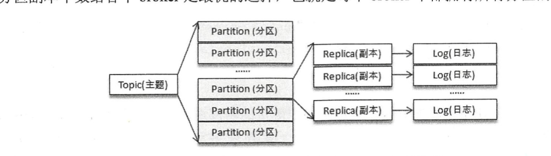

# 概述
主题跟分区都是 Kafka 核心概念。
- 主题作为消息的归类， 可以 细分为 一个或 多个 分区
- 分区可看做是对消息的二次归类。
- 区的划分不仅为 Kafka 提供了可伸缩性、水平扩展的功能， 还通过多副本机制来为 Kafka 提供数据冗余以提高数据可靠性 

从Kafka底层实现来说， 主题 和 分区 都是逻辑上的概念。
分区可以有多个副本， 每个副本 对应 一个 日志文件， 每个 日志文件 对应 多个日志分段（LogSegment).

日志分段 又可以 细分为 **索引文件、日志存储文件、快照文件** 等等。


# 主题的管理
主题的管理包括**创建主题、 查看主题信息、修改主题和删除主题**等操作。
1. 可以通过 Kafka 提供的 kafka-topics.sh 脚本来执行这些操作。这个脚本位于 $KAFKA_HOME/bin/目录下

脚本核心代码仅一行：
```
exec $(dirname $0)/kafka-run-class.sh kafka.admin.TopicCommand "♀@"
```

其实质上是调用了 **kafka.admin.TopicCommand 类**来执行主题管理的操作。

2. 主题的管理并非只有使用 kafka-topics.sh 脚本这一种方式，我们还可以通过
KafkaAdminClient 的 方式实现.
>这种方 式 实质上是通过发送 CreateTopicsRequest 、 DeleteTopicsRequest 等请求来实现的.

3. 甚至我们还可以通过直接操纵日志文件和 ZooKeeper节点来实现。


# 创建主题

- 如果 broker端配置参数 auto.create.topics.enable 设置为 true(默认值就是 true) ,
那么**当生产者向一个尚未创建的主题发送消息时，会自动创建**一个分区数为 num.partitions (默认值为 1)、副本因子为 default.replication.factor (默认值为 1)的主题
  
- **当一个消费者开始从未知主题中读取消息时，或者当任意一个客户端向未知主题发送元数据请求时**，都会按照配置参数 num.partitions 和 default.replication.factor 的 值来创建一个相应的主题

>很多时候，这种自动创建主题的行为都是非预期的。除非有特殊应 用需求，否则不建议将 auto .create.topics. enable 参数设置为 true，这个参数会增加主 题的管理与维护的难度。

***更加推荐也更加通用的方式是通过 kafka-topics.sh 脚本来创建主题***


主题、分区、副本和 Log (日志)的关系如图

tips: 每个log日志 又 可 分为 多个 LogSegment ，LogSegment 又可细分为 索引文件、数据存储、快照文件

- 同一个分区中的多个副本必须分布在不同的 broker 中，这样才能提供有效的数据冗余
- 不仅可以通过日志文件的根目录来查看集群中各个 broker 的分区副本的分配情况，
  还 可以通过 ZooKeeper 客户端来获取
  - 当创建一个主题时会在 **ZooKeeper 的/brokers/topics/**
    目录下创建一个同名的实节点，该节点中记录了该主题的分区副本分配方案
    

# 分区副本的分配

- 生产者的分区分配，是指 给发送的消息 指定要发往的分区（一般是 指定 或者 默认 计算而出）
- 消费者的分区分配，是指 给消费者 指定 可以消费的分区（一般是 subscribe 指定, 或者主题 所有分区）
- 这里可以理解为 Kafka集群的分区分配，指 为集群创建主题时  的分区副本分配方案，即：**在哪个broker创建哪个分区的副本**

- 在创建主题时，如果使用了 replica-assignment 参数 ，那么就按照指定的方案来进行 分区副本的创建;
- 如果没有使用 replica-assignment 参数，那么就需要按照内部的逻辑来 计算分配方案了


# 分区管理

## 优先副本选举
分区使用多副本机制提升可靠性， 但 只有 Leader副本 提供读写服务，而 follower只负责 在内部进行消息的同步。

如果一个分区的Leader 副本不可用，那就意味着 整个分区都不可用， 此时就需要Kafka从剩余的Follower中选出
一个新的副本 作为Leader 重新对外提供读写服务。

>不够严谨的说，broker节点的 Leader副本个数 决定了 这个节点的负载高低。


创建主题时， 该主题的分区 会尽量分布在 多个不同的Broker上，对应的Leader节点副本 也比较均匀。

- 针对同一个分区而言，同一个 broker 节点 不可能出现 该partition的 多个副本。即：**Kafka的一个Broker只能
  拥有一个分区的 一个副本**。
- 一般把 分区的  Leader副本所在 broker节点 称为 该分区的 Leader节点 ，Follower副本所在 broker节点称为 该分区 的follower节点

Kafka集群的 Broker节点 也会不可避免的 遇见 宕机或崩溃 的问题。当分区的leader节点 发生故障时，其中
一个follower节点 就会称为新的leader节点。  
这样就会导致集群的负载不均衡（因为 原来均衡的一个 broker 上 突然有个 follower 副本称为了 leader副本），从而 影响整体的 健壮性和稳健性

> 原来leader节点 恢复后，只能作为follower节点 重新加入集群


为了 **解决 （follower节点选举为新leader节点导致）负载失衡 的情况， Kafka引入了 优先副本概念（preferred replica)**.

- 优先副本是指 **AR集合中的 第一个副本**。理想情况下，优先副本 就是 leader副本
> Kafka要确保所有主题的 优先副本 在集群中 均匀分布， 也就保证 leader副本 均匀分布， 如果leader副本 分布过于
> 集中， 就会造成 集群 负载不均衡

所谓 **优先副本选举** 就是 通过一定方式 促使优先副本 选举为 leader 副本。 以此促进 负载均衡。
这一行为 也叫 **分区平衡**

>注意： 分区平衡 不意味着  Kafka集群的 负载均衡。 因为 还要考虑 **集群中的  分区分配 是否均衡**。
> 更进一步， 还要考虑 **各个分度的leader副本负载是不是均衡**。 因为可能 某个分区的leader副本 负载很高
> 需要 承载 TPS=3000 负荷，有些Leader副本 却只要 TPS = 个位数 负荷。


Kafka中提供 **分区自动平衡** 的功能。 对应的 broker参数为： auto.leader.rebalance.enable, 默认 true 开启。

如果开启：
- Kafka 的控制器 会启动 一个定时任务， 它会轮询 **各个broker 的 分区不平衡率**
  - broker的不平衡率 = （ 非优先副本leader个数 / 分区总数 ）
  - 是否超过 leader.imbalance.per.broker.percentage 参数配置的比值， 默认值为 10%，
    如 果超过设定的比值则会**自动执行优先副本的选举动作以求分区平衡**
  
**理解**：  
> 理解： 优先副本 是被Kafka 均匀分布在 各个broker上的， 一般作为leader副本，如果 leader挂了，
> 其他broker上的 follower副本 会被选举为 leader 副本， 但是 会造成broker 负载失衡，
> 经 控制器的 定时任务 轮询，如果  分区不平衡率 超过 比值， 会 让优先副本 选举重新成为leader， 再次 努力达到 负载均衡。
> 
> 之所以是努力，因为 前面说了， 分区平衡 也不意味着 kafka集群 负载均衡。


tips: 一般生产上，不建议 开启 分区自动平衡。
- 选举leader副本 也会 占用资源， 性能降低， 可能阻塞客户端。
- 执行时间不受控制， 如果在 关键时期 （电商 大促），执行了 优先副本选举， 则可能 阻塞业务
- 分区自动平衡（优先副本选举） ， 也 不能完全 保证 集群的 负载均衡。

所以： 一般建议 在合适的时候 去 分区自动平衡， 也就是 手动执行。
>Kafka中kafka-perferred-replica-election.sh脚本提供了对分区leader副本进行重新平衡的功能.
> 优先副本的选举过程是一个安全的过程， Kafka客户端可以自动感知分区 leader 副本的变更


Leader副本的转移 也是高成本 任务。 如果 要执行的 分区数较多，那么 必然影响 客户端。
如果 集群中有 大量分区， 脚本执行 可能会失效。

优先副本选举中： 具体的元数据信息会被存入 zk的 /admin/preferred_replica_election 节点。
如果这些数据超过了 **ZooKeeper节点所 允许的大小，那么选举就会失败**。默认情况下 Zk 所允许的节点数据大小为 1 MB。


**分批执行**：
>kafka-perferred“replica-election.sh 脚本中还提供了 path-to-json-file 参数来小批量地 对部分分区执行优先副本的选举操作 。
> 通过 path-to-json-file参数来指定一个 JSON文件， 这个 JSON 文件里保存需要执行优 先副本选举 的分 区清单。
  

### 总结
- 在实际生产环境中，一般使用 path-to-json-file 参数来分批、手动地执行优先副本 的选举操作 。 
- 尤其是在应对大规模的 Kafka 集群时，理应杜绝采用非 path-to-json-file 参数的选举操作方式。
- 同时，优先副本的选举操作也要注意避开业务高峰期，以免带来性能方 面的负面影 响 。


## 分区重分配

当集群中的一个节点突然若机下线时：
- 如果节点上的分区是单副本的，那么这些分区就变 得不可用了，在节点恢复前，相应的数据也就处于丢失状态;
- 如果节点上的分区是多副本的， 那么位于这个节点上的 leader 副本的角色会转交到集群的其他 follower 副本 中 

总而言之，这个节点上的分区副本都已经处于**功能失效的状态**， Kafka 并不会将这些失效的分区副本自动 地 迁移到集群中剩余的可用 broker节点上，
如果放任不管，则不仅会影响整个集群的均衡负载， 还会影响整体服务的可用性和可靠性 。

当要对集群中的一个节点进行有计划的下线操作时，为了保证分区及副本的合理分配，我
们 也希望通过某种方式能够将该节点上的分区副本迁移到其他的可用节点上。

> 当集群中新增broker节点时， 只有 新创建的主题分区 才可能被分配的 这个 新broker 上。而 之前的主题分区
并不会 自动分配 到新的节点上， 因为 他们创建时，还没有 这个 broker。
这样 新broker节点的负载 就会 比旧broker节点 小， 出现 负载不均衡

为了 解决 （新增broker 或者 broker宕机 带来的 负载不均衡）， 需要让 就的主题 分区 也能再次 进行合理分配。也就是**分区重分配**

>Kafka 提供了 kafka-reassign-partitions.sh 脚本来执行分区 重分 配的工作，
> 它可以在 集群扩容、broker节点失效 场景下 对分区进行迁移。


### 分区重分配原理
1. 先通过 控制器 为每个 分区添加新副本（增加副本因子)
2. 新产生的副本，将会 从 leader副本 那里 去复制所有数据。根据分区大小不同，复制 消耗 时间也不同，通过网络复制
3. 复制完成后，控制器 将 旧副本 从清单里 移除。 恢复为原先的 副本因子 数
注意： 重分配过程中 需要 确保 有足够的空间。


Q: 为啥  新副本 同步完数据后， 需要 把 旧副本从清单移除？  旧副本集合中 还有正常使用的副本呢？
A: 移除的 旧副本 是指 单个失效的 副本 是吗？  是因为 每个主题 对应分区 的 副本个数  已经决定不能修改吗？


chatGPT:
Kafka 分区重分配的原理如下：

1. 分配计划生成：分配计划（reassignment plan）是指一份描述分区重分配方案的 JSON 文件，其中包含了分区与副本之间的对应关系，以及分区从当前节点移动到目标节点的操作。分配计划可以手动编写，也可以通过 Kafka 提供的工具自动生成。

2. 分配计划执行：分配计划的执行是通过 Kafka 控制器（controller）来实现的。控制器是 Kafka 集群中的一个节点，负责协调各个节点之间的分区重分配操作。控制器会从 ZooKeeper 中获取当前的分配计划，并将其发送给所有的节点。每个节点在收到分配计划后，会执行相应的副本增加、删除或移动操作，并将执行结果报告给控制器。

3. 副本同步：在副本增加、删除或移动的过程中，需要保证副本之间的同步状态，以确保数据不会丢失。Kafka 通过副本同步协议（replication protocol）来实现副本之间的同步。当副本发生变化时，Kafka 会根据同步协议进行同步，直到所有的副本都达到一致状态。

4. Leader 副本选举：在分区重分配过程中，**如果某个分区的 leader 副本发生变化，需要进行新的 leader 副本选举**。新的 leader 副本选举的过程与正常的选举过程相同，即从所有的副本中选择一个副本作为新的 leader 副本来处理该分区的请求。

5. 完成分配：当所有的副本都完成同步并且新的 leader 副本选举完成后，分区重分配过程就完成了。此时，所有的节点都已经完成了新的副本分配，Kafka 集群已经实现了负载均衡、节点故障恢复、集群扩容缩容等目的。


总结
- 分区重分配对集群的性能有很大的影响，需要 占用额外的资源，比如网络和磁盘。
- 在实际 操作中，我们将降低重分配的粒度，分成 多个小批次来执行，以此来将负面的影响降到最低， 这一点和优先副 本的选举有异曲同工之妙。

>如果要将某个 broker 下线，那么在执行分区重分配动作之前最好先关闭 或重启 broker。
> 这样 它就 不再是 任何分区的 leader 节点.
> 它的分区就可以被分配给 集群中的其他 broker。这样可以减少 broker 间的流量复制 ，以此提升重分配的性能，以及减少 对集群的 影 响。


## 复制限流
分区重分配的本质 在于数据复制， 先增加新的副本， 然后进行数据同步， 最后删除旧的副本。

Q：数据复制会占用额外 的资源，如果重分配的量太大 必然会严重影响整体的性能，尤其是处于业务高峰期的时候。
A：减小重分配的粒度， 以小批次的 方式来操作是一种可行的解决思路。

Q: 如果集群中某个主题或某个分区的流量在某段时间内特别 大，那么只靠减小粒度是不足以应对的
A：就需要有一个限流的机制，可以对副本间的**复制流量加以限制**来保证重分配期间整体服务不会受太大的影响。