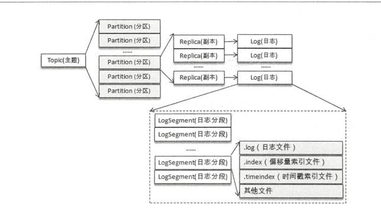
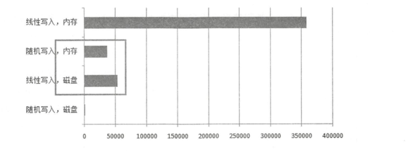
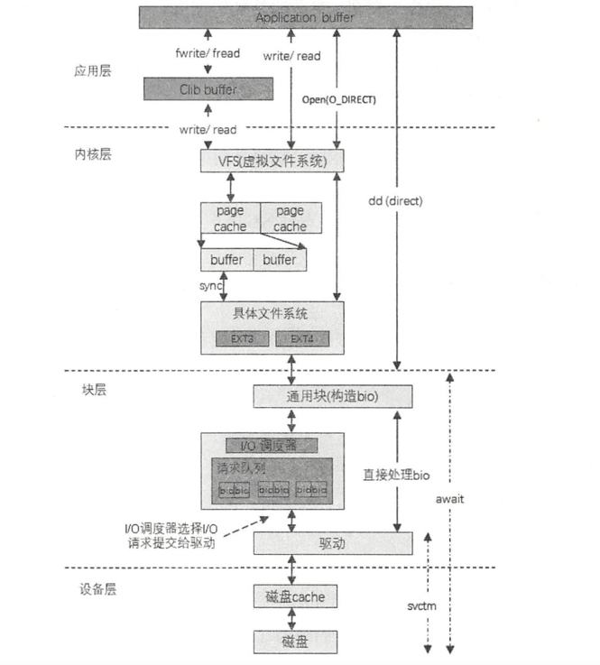

我们知道消息是存在  磁盘上的
kafka中的消息是 根据 topic 为基本单位进行归纳的，
各个 主题 逻辑上 相互独立 每个 主题 又可以 分为 一个 或多个  分区， 
分区的 数量 在 主题创建的 时候指定， 也可以 在 之后修改。
每条消息 在发送的时候 会根据  分区规则（分区器）被 追加到 指定的 分区 中， 
分区中的 每条消息  都会 被分配一个唯一的  序列号，也就是 offset 偏移量。

# 文件目录布局

防止 Log 过大， Kafka 又引入了日志分段( LogSegment)的概念，
将 Log 切分为多个 LogSegment，相当于一个 巨型文件被平均分配为多个相对较小的文件
，这样也便于消息的维护和清理。

>事实上， Log 和 LogSegnient 也不 是纯粹物理意义上的概念， 
> Log 在物理上只以**文件夹的形式存储**，而每个 **LogSegment 对应于磁盘上的一个日志文件和两个索引文件**

- 向 Log 中追加消息时是顺序写入的
- 只有最后 一个 LogSegment 才能执行写入操作，在此 之前所有的 LogSegment 都不能写入数据

为了便于消息的检索，每个 LogSegment 中的日志文件(以“ .log”为文件后缀)都有对应
的两个 索引文件 :
- 偏移量索 引 文件(以“ .index”为文件后缀〉
- 时间 戳索引文 件(以“ .timeindex” 为文件后缀〉

每个 LogSegment 都有一个基准偏移量 baseOffset，用来表示当前 LogSegment 中第一条消息的offset。 
偏移量是一个64位的长整型数，日志文件和两个索引文件都是根据基 准偏移 量( baseOffset)命名的。
名称固定为 20 位数字，没有达到的位数则用 0 填充

>了解到消费者提交的位移是保存在 Kafka 内部的主题 _consumer_offsets 中的，初始情况下这个主题并不存在，当第一次有消费者消费消息时会自动创建这个主题 。

# 日志索引

Kafka用 稀疏索引（sparse index） 方式构造消息的 索引， 它 **并不保证 每个消息 在索引文件中 都有对应的索引项**
>每当写入一定量(由 broker 端参数 log.index. interval.bytes 指定，默认值为 4096，即 4KB)的消息时，
> 偏移量索引文件和时间戳索引 文件分别增加一个偏移量索引项和时间戳索引项，增大或减小 log.index.interval.bytes 的值，**对应地可以增加或缩小索引项的密度**。

- 稀疏索引 通过 MappedByteBuffer 将索引文件 映射到内存， 为了 加快查询速度。
- 由于 偏移量索引 和 时间戳 索引 都是 单调递增的， 所以 可用二分查找
- 索引文件切分的时候， Kafka 会关闭当前正在写入的索 引文件并置为只读模式，同时以可读写的模式创建新的索引文件

# 日志清理
kafka 将消息存储在磁盘中，为了控制磁盘占用空间的不断增加就需要对消息做一定的清 理操作。
Kafka 中每一个分区副本都对应一个 Log，而 Log 又可以分为多个日志分段，这样也 便于日志的清理操作。 

Kafka 提供了两种日志清理策略
- 日志删除： 按照一定保留策略 直接删除 不需要保留的 日志分段LogSegment
- 日志压缩： 针对每个消息 按照key 进行整合，对与 相同key 不同value， 只保留最后一个版本

我们可以通过 broker 端参数 log.cleanup.policy 来设置日志清理策略， 
- 此参数的默认 值为“ delete”，即采用日志删除的清理策略 。 
- 如果要采用日志压缩的清理策略，就需要将 log.cleanup.policy设置为“compact”
- 也 可以 同时支持日志删除和日志压缩两种策略。 设置为 "delete,compact"

 > 日志清理的粒度可以控制到主题级别
 
# 磁盘存储
Kafka 依赖于文件系统(更底层地来说就是磁盘)来存储和缓存消息

- 线性写 速度 远快于  随机写。 （测试数据表名 ： 相差 6000倍）
- 操作系统可对 线性读写 优化
    -  预读： 提前将一块 比较大 的磁盘 读入 内存
    -  后写： 把写入磁盘的数据（小数据量的写操作） 累计合并为 一个 大的物理写
    
- 顺序写磁盘 不仅比 随机写磁盘 快， 还比 随机写内存 快。

  
Kafka采用  文件追加 方式写入消息，属于 典型 线性顺序写。所以 就算kafka采用 磁盘作为存储介质，能承载的吞吐量 也不小。

## 页缓存
页缓存 是操作系统实现的 一种主要的磁盘缓存， 以此来减少 对磁盘的i/o操作.
具体来说就是 把磁盘的数据 缓存在 内存中， 把对磁盘的访问 变为对内存的访问。

当一个进程准备读取磁盘上的 文件 内容时，操作系统会先查看待读取的数据所在的页 (page)是否在页缓存( pagecache)中 ，
- 如果存在(命中〉 则直接返回数据从而避免了对物 理磁盘的 I/O 操作;
- 如果没有命中， 则操作系统  会向 磁盘发起读 请求，并将 读取的数据页 存入 页缓存， 之后再 把数据返回给 进程

同样，如果一个进程需要将数据写入磁盘 ，那么操作系统 也会检测数据对应的页是否在页缓存中，
- 如果不存在，则会 先在 页缓存中 添加相应的页， 然后将 数据写入对应的页（磁盘）
- 如果存在， 则会 直接修改页缓存中 对应页 缓存数据。
    - 被修改过的页， 也就成了 **脏页，因为跟 磁盘中的 数据不一致了**。所以 操作系统会在合适的时间 把脏页的数据 写入磁盘。
    

>另外，对一个 进程 而言， 它会在 进程内部 缓存处理 所需的数据，然而这些数据 还可能缓存在 pageCache。 
> 因此 一份数据 缓存了两次。 除非 使用 Direct I/O 的 方式，否则很难精致 PageCache.
> 
> Java有两点事实：
> 1.对象内存开销非常大 ; 2.Java 垃圾回收随堆越大越慢。基于 这些因素基于这些因素，使用文件系统并依赖于页缓存 的做法明 显要优于维护一 个进程内缓存或其他结构
> ，至少我们可以省去了 一份进程 内部的缓存消耗，同时还可以通过结 构紧凑的字节码来替代使用对象的方式以节省更多的 空 间 。 

***Kafka使用了 大量PageCache， 这是Kafka 实现高吞吐的重要因素之一。***
> 虽然消息都是 先被写入PageCache ，在由 操作系统 刷盘。 但是Kafka 也提供了 同步刷盘 以及 间断性 强制刷盘机制

 同步刷盘 可以提高消息的可靠性， 由于防止机器 拉电 导致的 PageCache 中数据 还没来得及 写入磁盘 带来的 消息丢失

>不建议主动 强制刷盘， 交给操作系统来 调配，  可靠性 可交给 多副本 去保证。

我们知道， Linux 会把 磁盘的一部分 化为 Swap 区域。 
这样进程调度时 就可以 把当前 非活跃的进程 调入 Swap 区， 来 把内存让 给 活跃进程。

对于 大量使用PageCache 的Kafka来说，要 尽量避免 这种 内存交换。
> Kafka 而言，应当尽量避免这种内存的交换，否则会对它各方面的性能 产生 很大的负面影响 。我们可 以通过修改 vm.swappiness 参数 (Linux 系统参数〉来进行调节 。 vm. swappiηess 参数的 上限为 100，它表示积极地使用 swap 分区，并把内存上的数据及时地搬运到 swap 分区中; vm.swappiness 参数的下限为 0，表示在任何情况下都不要发生交换(vm.swappiness=O 的含义在不同版本的 Linux 内核中不太相同，这里采用的是变更后的最新解释) ，这样一来 ， 当内存耗尽时会根据一定的规则突然中止某些进程

# 磁盘I/O流程

从编程角度而言， 一般磁盘I/O的场景有以下四种。
- 