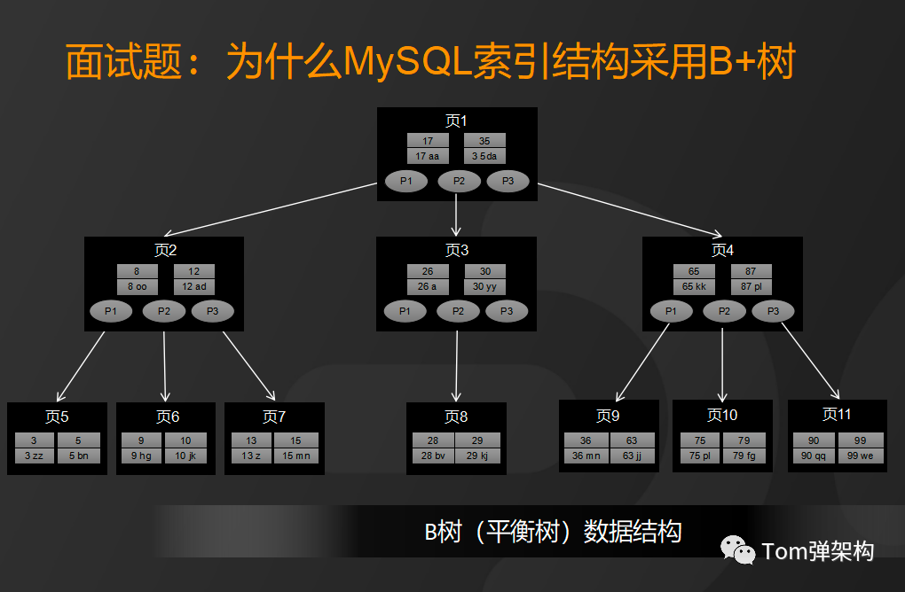

# 1 对比B树

- B树是一种多路平衡树，用这种存储结构来存储大量数据，它的整个高度会相比二叉树来说，会矮很多。
- 而对于数据库而言，所有的数据都将会保存到磁盘上，而磁盘I/O的效率又比较低，特别是在随机磁盘I/O的情况下效率更低。
- 所以 高度决定了磁盘I/O的次数，磁盘I/O次数越少，对于性能的提升就越大，这也是为什么采用B树作为索引存储结构的原因
>因为树是存储在磁盘中的，访问每个节点，都对应一次磁盘I/O 操作，也就是说树的高度就等于每次查询数据时磁盘IO 操作的次数，所以树的高度越高，就会影响查询性能
 
1. 磁盘i/o效率来看
   - 由于 B+ 树非叶子节点才存储数据， B+树的非叶子节点不存储数据，所以树的每一层就能够存储更多的索引数量。
   - 也就是说， 同样层高下， B+ 树存储数据更多。
>也就是，每个页 存储的 数据更多， 查询时 需要 把 页加载到内存。（而且还是 随机io），加载 页的 次数 就更少。

2. 从范围查询效率方面来看
    - 在MySQL中，范围查询是一个比较常用的操作，而B+树的所有存储在叶子节点的数据使用了**双向链表**来关联
    - 所以B+树在查询的时候只需查两个节点进行遍历就行，而B树需要获取所有节点，因此，**B+树在范围查询上效率更高**。
3. 从全表扫描方面来看
   - 因为，B+树的**叶子节点存储所有数据**，所以B+树的全局扫描能力更强一些，因为它只需要扫描叶子节点。而B树需要遍历整个树。
4. 从自增ID方面来看：
   - 基于B+树的这样一种数据结构，如果采用自增的整型数据作为主键，还能更好的避免增加数据的时候，带来叶子节点分裂导致的大量运算的问题
   - 还是因为 **b树 叶子节点 也存数据， 容易 页分裂**。
   

# 对比