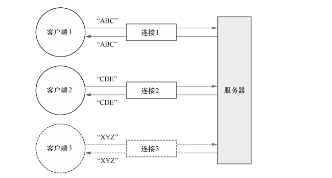

# Netty 客户端/服务器 概览

从高层次上 展示 即将编写的 Echo 客户端 和服务器 应用程序。


该图展示的是多个客户端同时连接到一台服务器。所能 够支持的客户端数量，在理论上，仅受限于系统的可用资源(以及所使用的 JDK 版本可能会施 加的限制)。

Echo 客户端和服务器之间的交互是非常简单的;
在客户端建立一个连接之后，它会向服务 器发送一个或多个消息，反过来，服务器又会将每个消息回送给客户端。
虽然它本身看起来好像 用处不大，但它充分地体现了客户端/服务器系统中典型的请求-响应交互模式。


# 编写 Echo 服务器

所有的 Netty 服务器 都需要 以下两部分：
- 至少一个 ChannelHandler： 实现 服务器 对接收的数据的处理，即它的业务逻辑。
- 引导： 这是配置服务器的启动代码。至少，它会将服务器绑定到它要监听连接请求的端口上。


## ChannelHandler 和业务逻辑

```java

/**
 * @author daifengming
 */
// Marks an ChannelHandler implementation as one whose life cycle is managed by its
@ChannelHandler.Sharable // @sharable 标识 一个 ChanenlHandler 可以被 多个 Channel 安全地共享
public class EchoServerHandler extends ChannelInboundHandlerAdapter {

    @Override
    public void channelRead(ChannelHandlerContext ctx, Object msg) {
        // print to console
        ByteBuf in = (ByteBuf) msg;
        System.out.println("Server received: " + in.toString(CharsetUtil.UTF_8));

        // write to client 接受到的消息 写给 发送者 client
        ctx.write(in);

        //不冲刷出站消息
//        ctx.flush();
    }

    @Override
    public void channelReadComplete(ChannelHandlerContext ctx) {
        //冲刷所有 待审消息 到远程节点。关闭通道后，操作完成
        ctx.writeAndFlush(Unpooled.EMPTY_BUFFER)
                .addListener(ChannelFutureListener.CLOSE);
    }


    /**
     * 异常处理
     */
    @Override
    public void exceptionCaught(ChannelHandlerContext ctx, Throwable cause) {
        // 打印异常栈跟踪
        cause.printStackTrace();
        // 关闭通道
        ctx.close();
    }

}

```
ChannelInboundHandlerAdapter 有一个直观的 API，并且它的每个方法都可以被重写以 挂钩到事件生命周期的恰当点上。因为需要处理所有接收到的数据，所以你重写了 channelRead() 方法。在这个服务器应用程序中，你将数据简单地回送给了远程节点。

重写 exceptionCaught()方法允许你对 Throwable 的任何子类型做出反应，在这里你 记录了异常并关闭了连接。
虽然一个更加完善的应用程序也许会尝试从异常中恢复，但在这个场 景下，只是通过简单地关闭连接来通知远程节点发生了错误。


如果不 捕获异常，会发生什么呢?
每个Channel 都 会 由一个 与之相关联的 ChannelPipeline，其持有一个 ChannelHandler 的 实例链。 在 默认情况下， ChannelHandler 会把对它的方法的调用转发给链中的下一个 ChannelHandler。
因此，如果 exceptionCaught()方法没有被该链中的某处实现，那么所接收的异常将会被 传递到 ChannelPipeline 的尾端并被记录。

所以， 你的应用程序应该提供至少有一个实现了 exceptionCaught()方法的 ChannelHandler。


除了 ChannelInboundHandler ， 还有很多 需要 学习的 ChannelHandler 的 子类型和实现。 
记住下面这些关键点：
- 针对不同类型的事件 来调用 ChannelHandler
- 应用程序通过 实现 或 扩展ChannelHandler 来 挂钩到 事件的生命周期，并且提供自定义的应用程序逻辑
- 在架构上，ChannelHandler 有助于保持业务逻辑与网络处理代码的分离。 简化了 开发过程

## 引导服务器

引导服务器涉及以下内容：
- 绑定到服务器将在其上监听并接受传入连接请求的端口
- 配置 Channel，以将有关的入站消息通知给 EchoServerHandler 实例

 传输
    这是一个术语。 在网络协议的 标准多层 视图中， 传输层提供了 端到端的 或者 主机到主机 的通信服务。
    因特网通信是 建立在 TCP 传输上的。 除了 一些 由 Java NIO 实现提供的 服务端性能增强之外， NIO传输大多数 时候 指的是 TCP传输


```java
package com.dfm.bio.netty;

import io.netty.bootstrap.ServerBootstrap;
import io.netty.channel.ChannelFuture;
import io.netty.channel.ChannelInitializer;
import io.netty.channel.EventLoopGroup;
import io.netty.channel.nio.NioEventLoopGroup;
import io.netty.channel.socket.SocketChannel;
import io.netty.channel.socket.nio.NioServerSocketChannel;

import java.net.InetSocketAddress;

/**
 * @author daifengming
 */
public class EchoServer {
    private final int port;
    
    public EchoServer(int port) {
        this.port = port;
    }

    public static void main(String[] args) throws InterruptedException {
        // Validate syntax
        if ( args.length != 1 ) {
            System.err.println("Usage: " + EchoServer.class.getSimpleName() + " <port>");
            return;
        }
        int port = Integer.parseInt(args[0]);
        new EchoServer(port).start();
    }

    private void start() throws InterruptedException {

        //EchoServerHandler 为 @Sharable，所以我们可以总是使用同样的实例
        final EchoServerHandler echoServerHandler = new EchoServerHandler();
        // 创建  EventLoopGroup
        EventLoopGroup group = new NioEventLoopGroup();
        // 创建 ServerBootstrap
        ServerBootstrap serverBootstrap = new ServerBootstrap();
        serverBootstrap.group(group)
                .channel(NioServerSocketChannel.class) // 指定使用 NIO 的传输 Channel
                .localAddress(new InetSocketAddress(port)) // 设置 socket 地址使用所选的端口
                //当一个新的连接 被接受时，一个新的子 Channel 将会被创建，而 ChannelInitializer 将会把一个 EchoServerHandler 的实例添加到该 Channel 的 ChannelPipeline 中
                .childHandler(new ChannelInitializer<SocketChannel>() { // 添加 EchoServerHandler 到 Channel 的 ChannelPipeline
                    @Override
                    protected void initChannel(SocketChannel ch) throws Exception {
                        ch.pipeline() // 获取 Channel 的 ChannelPipeline
                                .addLast(echoServerHandler); // 添加 EchoServerHandler 到 ChannelPipeline
                    }
                });

        try {
            ChannelFuture future = serverBootstrap.bind().sync();// 异步地绑定服务器；调用 sync() 方法阻塞等待直到绑定完成
            future.channel().closeFuture().sync(); // 获取 Channel 的 CloseFuture，并阻塞当前线程直到它完成
        } catch (InterruptedException e) {
            e.printStackTrace();
        }finally {
            // 关闭 EventLoopGroup，释放所有的资源
            group.shutdownGracefully().sync();
        }
    }
}


```
服务器实现中的重要步骤
- EchoServerHandler  实现了业务逻辑， 被标注为 @Sharable，所以我们可以总是使用同样的实例
- main方法引导了服务器

 引导过程中所需要的步骤：
- 创建 ServerBootstrap 实例来引导服务器并随后绑定 服务器
- 创建并分配一个 NioEventLoopGroup 实例来处理事件的处理，如接受新连接以及读/写数据
- 指定服务器绑定的本地的 InetSocketAddress
- 使用一个 EchoServerHandler 的实例初始化每一个新的 Channel
- 调用 ServerBootstrap.bind()方法来绑定服务器

在这个时候，服务器 已经初始化，并且已经就绪能够被使用了。


# Echo客户端
