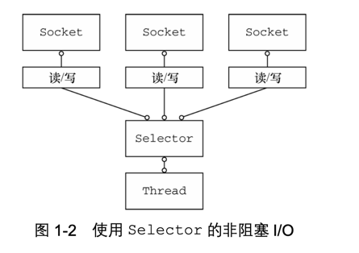
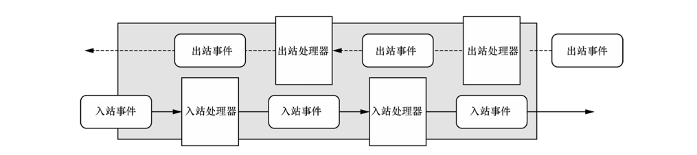

# Netty-异步和事件驱动

## 1.1. Java网络编程
    早期的网络编程开发人员，需要 花费大量的时间去学习复杂的 C 语言套接字库，去处理它们 在不同的操作系统上出现的古怪问题。
虽然最早的Java（1995-2002) 引入了足够多的 面向对象（facade）来隐藏一些棘手的问题，但是创建一个复杂的客户端/服务器协议仍然需要大 量的样板代码(以及相当多的底层研究才能使它整个流畅地运行起来)。

```java
package com.dfm.bio;

import java.io.BufferedReader;
import java.io.IOException;
import java.io.InputStreamReader;
import java.io.PrintWriter;
import java.net.ServerSocket;
import java.net.Socket;

/**
 * @author daifengming
 */
public class BioDemo {
    /**
     * 服务端 阻塞式 io
     * @param args
     * @throws IOException
     */
    public static void main(String[] args) throws IOException {
        ServerSocket serverSocket = new ServerSocket(9999);
        // 阻塞 , 等待客户端连接， 阻塞到有客户端连接
        Socket clientSocket = serverSocket.accept();
        //字符输入流中读取文本
        BufferedReader in =  new BufferedReader(new InputStreamReader(clientSocket.getInputStream()) );
        //打印对象的格式化的表示到文本输出流。
        PrintWriter out = new PrintWriter(clientSocket.getOutputStream(), true);

        String request, response;
        // readLine() 会阻塞。直到读取到换行符或者输入流结束
        while ((request = in.readLine()) != null) {
            if ("Done".equals(request)) {
                break;
            }
            response = processRequest(request);
            out.println(response);
        }
    }

    /**
     * 处理请求
     * @param request
     * @return
     */
    private static String processRequest(String request) {
        System.out.println("服务端接收到请求：" + request);
        return request;
    }
}

```

- ServerSocket 上的 accept()方法将会一直**阻塞到一个连接建立**，随后返回一个 新的 Socket 用于客户端和服务器之间的通信。该 ServerSocket 将继续监听传入的连接。
- BufferedReader 和 PrintWriter 都衍生自 Socket 的输入输出流   。前者从一个字符输入流中读取文本，后者打印对象的格式化的表示到文本输出流。
- **readLine()方法将会阻塞**，直到在 处一个由换行符或者回车符结尾的字符串被读取。
- 客户端的请求已经被处理 。


总结：
    以上代码是一个典型的阻塞式IO。只能同时 处理一个连接，要管理 多个并发客户端，需要为每个客户端socket都创建一个新的线程。这种模型很简单，但是随着线程的增加，系统的性能将急剧下降，因为线程是有开销的。

- 在任何时候 都可能有大量的线程处于 休眠状态，只是等待 输入 or 输出 数据就绪。
- 需要为 每个线程的 调用栈分配内存， 默认 654kb - 1mb，具体取决于操作系统。
- 即使 jvm 在物理上可以支持非常大数量的线程，但是 远 在到达极限 之前， 上下文切换所带来的开销就会带来麻烦。

> 例如：10000个连接。 每秒钟只有 1000个活跃，但是每个线程都需要 1mb的内存，这将需要 10gb的内存，而且上下文切换的开销也会非常大。

### 1.1.1 Java NIO
 Java NIO 是一种替代传统 Java IO API 的 Java API。 NIO 提供了与标准 IO 不同的IO工作方式。   Java 对于非阻塞 I/O 的支持是在 2002 年引入的，位于 JDK 1.4 的 java.nio 包中。

- 可以使用 setsockopt()方法 配置套接字， 以便读/写 调用在没有数据的时候立即返回
- 可以使用操作系统的 事件通知 API注册 一组非阻塞套接字，以 确定 它们中 是否有任何一个已经就绪（有数据可供读写）可以执行 IO 操作。


> 新的还是非阻塞的
> NIO 最开始是新的输入/输出(New Input/Output)的英文缩写，但是，该 Java API 已经出现足够长的时间 了，不再是“新的”了，
> 因此，如今大多数的用户认为 NIO 代表非阻塞 I/O(Non-blocking I/O)，而阻塞 I/O(blocking I/O)是旧的输入/输出(old input/output，OIO)。
> 你也可能遇到它被称为普通 I/O(plain I/O)的时候。

### 1.1.2 选择起Selector


- class java.nio.channels.Selector 是 Java 的非阻塞 I/O 实现的关键
- 它使用了**事件通知 API** 以确定在一组非阻塞套接字中有哪些已经就绪能够进 行 I/O 相关的操作
- Selector 允许单线程处理多个 Channel。如果你的应用打开了多个连接（通道），但每个连接的流量都很低，使用它可以显著地减少资源占用。

总体来看，与阻塞 I/O 模型相比，这种模型提供 了更好的资源管理:
- 一个线程可以管理多个连接。因此减少了内存管理 和 上下文切换带来的开销
- 当没有I/O 需要处理时， 线程也可以被用于其他任务

## 1.2Netty简介
不久以前，我们在一开始所呈现的场景——支持成千上万的并发客户端——还被认定为 是不可能的。
然而今天，作为系统用户，我们将这种能力视为理所当然;同时作为开发人员，我 们期望将水平线提得更高。因为我们知道，总会有更高的吞吐量和可扩展性的要求——在更低 的成本的基础上进行交付

- 直接使用底层的API 暴露了复杂性，并且引入了对往往供不应求的技能的关键性依赖

在网络编程领域，Netty是Java的卓越框架。2它驾驭了Java高级API的能力，并将其隐藏在一 个易于使用的API之后。Netty使你可以专注于自己真正感兴趣的——你的应用程序的独一无二的 价值。

markdown格式的 表格demo

| 分类| Netty的特性  |
| --- | --- | 
| 设计 |1.统一的API，支持多种传输类型，阻塞的和非阻塞的 2. 简单而强大的线程模型 3. 真正的无连接数据报套接字支持 4. 连接逻辑组件以支持复用 |
| 易于使用| 详实的Javadoc和大量的示例集不需要超过JDK 1.6+3的依赖。(一些可选的特性可能需要Java 1.7+和/或额外的依赖)|
| 性能| 1.比Java的核心API更好的吞吐量，延迟和资源消耗 2.最小的内存复制 3.得益于池化和复用，拥有更低的资源消耗  |
| 健壮性|不会因为慢速、快速或者超载的连接而导致 OutOfMemoryError 消除在高速网络中 NIO 应用程序常见的不公平读/写比率｜
| 安全 | 完整的 SSL/TLS 和 StartTLS 支持 |
| 社区 | 发布快速而且频繁 |

### 1.2.1 异步和事件驱动
 本质上，一个既是 异步 又是 事件驱动的系统  会表现出一种特殊的、对我们来说机具价值的行为： 它可以任意的顺序相应在任意时间点产生的事件。

这种能力 对于实现最高级别的可伸缩性 至关重要。定义为：一种系统、网络或者进程在需要处理的工作量增加时，可以通过某种可行的方式或者扩大它的处理能力来应对该增长的能力。


异步和可伸缩性之间的联系又是什么呢？
- **非阻塞网络调用**使得我们可以不必等待一个操作完成。完全异步的 I/O 正式基于这个特性构建的。并且更进一步：异步方法会立即返回，并且在它完成时，会直接或者在稍后的某个时间点通知用户
- **选择器** 使得我们能够通过较少的线程 便 可以监视 许多连接上的事件。

> 这些元素结合在一起，与使用阻塞 I/O 来处理大量事件相比，使用非阻塞 I/O 来处理更快
  速、更经济。从网络编程的角度来看，这是构建我们理想系统的关键，而且你会看到，这也是 Netty 的设计底蕴的关键。


## 1.3 Netty的核心组件
netty的主要构件块：
- Channel
- 回调
- Future
- 事件和ChannelHandler

> 这些构建块代表了不同类型的构造:资源、逻辑以及通知。你的应用程序将使用它们来访问 网络以及流经网络的数据。

### 1.3.1 Channel
 
Channel 是Java NIO 的一个 基本构造。
> 它代表一个到实体(如一个硬件设备、一个文件、一个网络套接字或者一个能够执行一个或者多个不同的 I/O 操作的程序组件)的开放连接，如读操作和写操作。

 目前可以把Channel 看做是 传入（入站） 或者 传出（出站） 数据的载体。 因此，它可以被打开或者被关闭，连接或者断开连接。

### 1.3.2 回调

回调是一个方法，一个指向已经被提供给另外一个方法的方法引用。这使得后者可以在适当的时候调用前者。**回调方法经常用于处理异步操作中的 状态 和 结果**。

 netty 内部使用了**回调来处理事件**； 当一个回调被触发， **相关的事件可以被一个 Interface-ChannelHandler 的实现处理**。
 > 这是一个非常强大的概念，因为它将应用程序从底层的 I/O 代码中解耦出来，允许开发人员只关注于应用程序的逻辑。

```java
/**
 * @author daifengming
 */
public class ConnectHandler extends ChannelInboundHandlerAdapter {
    /**
     *  当一个连接已经建立时，channelActive(ChannelHandlerContext)将会被调用
     * @param ctx
     * @throws Exception
     */
    @Override
    public void channelActive(ChannelHandlerContext ctx) throws Exception {
        System.out.println("Client " + ctx.channel().remoteAddress() + " connected");
        super.channelActive(ctx);
    }
}

```

### 1.3.3 Future

 Future 提供了 另一种 在操作完成时**通知应用程序**的方式，这个对象可以看做是 **一个异步操作的 结果的 占位符**，它将在**未来的某个时刻完成**，并提供对其结果的访问。
 
Jdk 预置了 java.util.concurrent.Future 接口，但是其所提供的实现，只允许手动检查操作是否已经完成 或者 一直阻塞直到它完成。 
由于 jdk 内置 Future 实现的  繁琐，Netty 提供了自己的实现 （ ChannelFuture）， 用于在异步操作的时候使用

 ChannelFuture提供了几种额外的方法，这些方法使得我们可以注册一个或者多个 ChannelFutureListener 实例。
 监听器的**回调方法 operationComplete() 将会在对应的操作完成时被调用**。  因此，监听器 就可以 判断 该操作是 成功地完成了 还是 出错了。 如果是后者，我们可以检索产生的 Throwable。
 
> 简而言之，由ChannelFutureListener提供的通知机制，消除了手动检查对应的操作是否完成的必要，这样就不会阻塞当前的线程或者消耗 CPU 周期来等待结果的到来。

 每个 Netty 的出站 I/O 操作都将返回一个 ChannelFuture。 也就是说，它们都不会阻塞， 是完全 异步 和事件驱动的。
 但是，**不同于 jdk 的 Future，这个实现非常强大**。 它的可扩展性是通过将 ChannelFutureListener 添加到 ChannelFuture 来实现的
 ```java
   /**
     * 异步地建立连接
     */
    public void asyncConnect() {
        Channel channel = null;
        // Does not block
        ChannelFuture connect = channel.connect(new InetSocketAddress("192.168.10.76", 25));
    }
```

回调实战代码
```java
/**
 * @author daifengming
 */
public class NettyDemo {

    /**
     * 异步地建立连接
     */
    public void asyncConnect() {
        Channel channel = null;
        // Does not block
        ChannelFuture connectFuture = channel.connect(new InetSocketAddress("192.168.10.76", 25));
        
        // Register a listener to be notified when the operation completes or fails
        connectFuture.addListener((ChannelFuture future) -> {
            if (future.isSuccess()) {
                System.out.println("Connection established");
                 // Do something else
                
                // 使用 该 buffer 来持有数据
                ByteBuf buffer = Unpooled.copiedBuffer("Hello", Charset.defaultCharset());
                
                // 异步地发送数据
                ChannelFuture wf = future.channel().writeAndFlush(buffer);

            } else {
                // 发生错误，访问 Throwable 对象
                System.err.println("Connection attempt failed");
                future.cause().printStackTrace();
            }
        });
    }
}

```

> 需要注意的是， 对错误的处理 完全 up tu you ！ 假如： 如果连接失败，可以尝试重新连接，或者 建立一个 到另一个 远程节点的 连接。

 如果你把 **ChannelFutureListener 看做是 回调的 一个更加精细的版**本， you are right！， in fact ， 回调 和 Future 是相互补充的机制， 它们相互结合， 构成了 Netty本身的 关键构建块之一。
 

### 1.3.4 事件和 ChannelHandler
 
 Netty 使用不同的事件，通知我们状态的改变或者是操作的状态。 这使得用户可以基于已经发生的事件来触发适当的动作。这些动作可能是：
 - 记录日志
 - 数据转换
 - 流控制
 - 应用程序逻辑

netty 是一个 网络编程框架， 所以**事件是按照 它们 与 入站or出站 数据流的相关性进行分类**的。 因此，我们可以区分为：
 可能由  **入站数据 或者 相关的状态更改** 而 触发的事件包括：
- 连接已经被激活 或者 连接 失活
- 数据读取
- 用户事件
- 错误事件

出站事件 是未来将会 出发的 某个动作的操作的结果。 这些事件包括：
- 打开或者关闭到远程节点的连接
- 将数据写到或者冲刷到套接字

每个事件都可以 被分发给 ChannelHandler 类中的 某个用户实现的 方法。 这回事一个 很好的 事件驱动范式 -> 应用程序 的列子。


 **目前： 可以简单理解为 ChannelHandler 的 实例 都 类似于 为了相应特定事件 而被执行的回调**

> Netty 提供了大量预定义的可以开箱即用的 ChannelHandler 实现，包括用于各种协议 (如 HTTP 和 SSL/TLS)的 ChannelHandler。在内部，ChannelHandler 自己也使用了事件
和 Future，使得它们也成为了你的应用程序将使用的相同抽象的消费者


### 1.3.5 放在一起

1. **Future、回调 和 ChannelHandler**
   Netty 的异步编程模型是建立在 Future 和 回调之上的，而这些又是构建于 ChannelHandler 和 事件之上的。 结合在 一起，这些元素就提供 了一个处理环境，使你的 应用程序逻辑
可以 独立于 任何网络操作相关的 顾虑而独立演变。  这也是 Netty 的设计方式的 一个关键目标

拦截操作以及高速地转换入站数据和出站数据，都只需要**你提供回调或者利用操作所返回的 Future**。这使得链接操作变得既简单又高效，并且促进了可重用的通用代码的编写。


2. 选择器、事件和 EventLoop

 Netty 通过 触发 事件将 Selector 从应用程序中抽象出来，从而消除了所谓的 “烦人的” 选择器轮询代码。 在 内部 将会 为 每个Channel 分配一个 EventLoop，用以处理所有的事件。
 包括：
 - 注册感兴趣的 事件；
 - 将事件派发给 ChannelHandler；
 - 安排 进一步 的动作。

EventLoop 本身 只由  一个线程驱动， 它会处理 一个 Channel 的 所有 I/O 事件， 并且该 EventLoop 会在该 Channel 的整个生命周期内一直使用。
因此，**一个 Channel 的所有 I/O 事件都将在它专有的 EventLoop 中被处理**。 


## 小结

- 了解了 网络编程api 演变过程， bio -> nio -> netty， 异步I/O 在 高容量、高性能的网络编程 中的优势
- 了解了 netty 的核心组件， Channel、回调、Future、事件和 ChannelHandler


