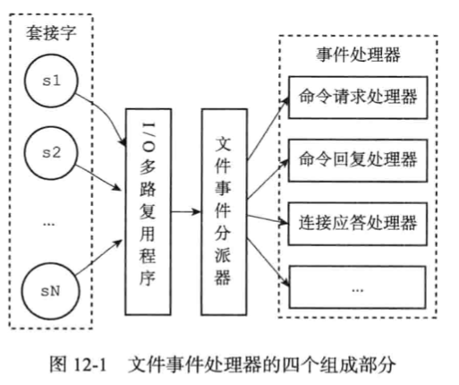
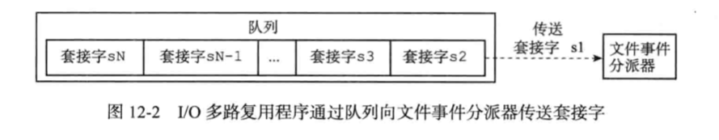

Redis服务器是一个 事件驱动 程序。 服务器x需要处理两类事件：
- 文件事件（ file event) : Redis 服务器通过 socket 与 其他 客户端（或者 其他Redis 服务器）进行 连接，而 文件 事件就是 服务器 对套接字 操作的抽象
    - 服务器 与 客户端 （或者其他服务器）的通信 会产生 相应的 文件事件，而 服务器 通过监听 并 处理 这些 事件 来完成 一些列 网络操作。
- 事件事件（ time event) : edis 服务器中的 一些 操作 （比如 serverCron）需要在 给定的 时间点 执行，而 时间 事件 就是 服务器 对这类定时操作的抽象
  

# 文件事件
Redis 基于 Reactor 模式 开发了自己的网络事件处理器： 这个处理器称为 文件事件处理器（file event handler）
- 文件事件处理器 使用 I/O 多路复用程序来 同时监听多个 socket，并 根据 当前 socket 执行的 任务 来 为 socket 关联 不同的  事件处理器
- 当被 监听的 socket 准备好 执行 连接 应答（accept)、读取（read）、写入（write）、关闭（close） 等操作时，  与 操作 相对应的 文件事件 就会产生，这时 文件处理器 就 会 调用 soket之前 关联好的  handler 来处理

虽然 **文件事件 是单线程运行， 但 通过 多路复用程序 来监听 多个socket**， 文件事件处理器 既 实现 了 高性能 的网络 通信模型， 
又 很好 地 与服务器中 其他同样 以单线程 方式 运行 的模块 进行 对接， 这 保持了 Redis 内部单线程 设计的 简单性

- 因为一个 服务器 通常 会连接多个  socket，所以 多个 文件 事件 可能会 并发地出现。
- 多路复用程序 负责 监听 多个 socket， 并向 文件事件分派器  传送 哪些 产生了 事件的  socket

>尽管多个文件事件可能会并发出现，但是 I /O 多路复用程序 总是 将所有产生 事件的 socket  都放到 一个 队列里面，
> 然后 通过这个 队列  有序，同步 每次一个 socket 的方式 向  分派器 传送 socket。 当一个 socket  产生的 事件 被处理完毕 之后，
> I /O 多路复用 程序 才会 继续向 文件事件分派器  传送 下一个 socket

文件事件分派器 接收 到 多路复用 程序 传送的 socket， 并根据 socket 产生的事件的 类型， 调用 相应的 事件处理器

服务器 根据 执行 不同的 事件处理器，  这些 处理器 是一个个 函数，他们 定义了 某个事件 发生时，服务器 应该 执行的 操作

# I/O多路复用程序的 实现

Redis 的 I/O多路复用 是通过  包装 **常见的  select，epoll，evpor 和 kqueue**这些 I/O 多路复用函数库来实现的。

