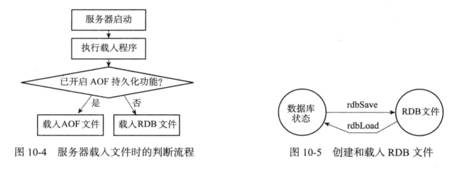
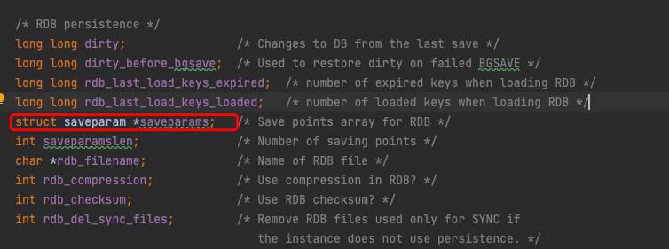
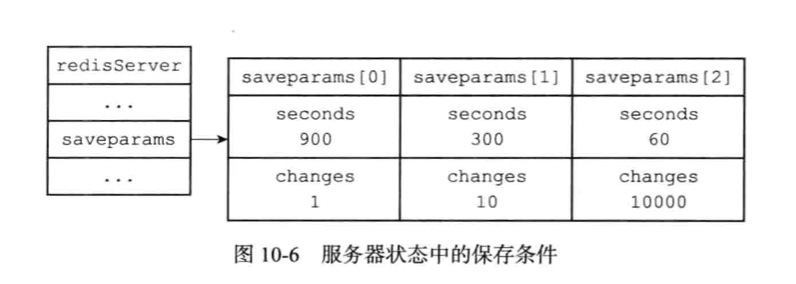
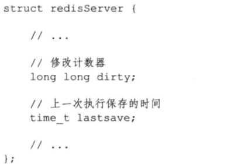
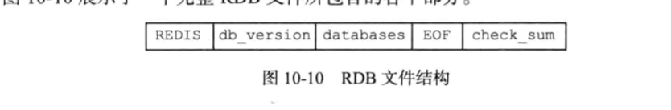
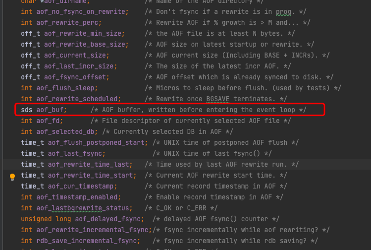
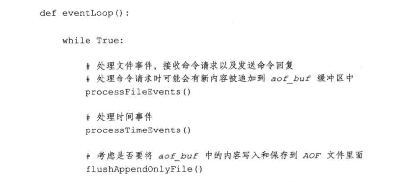
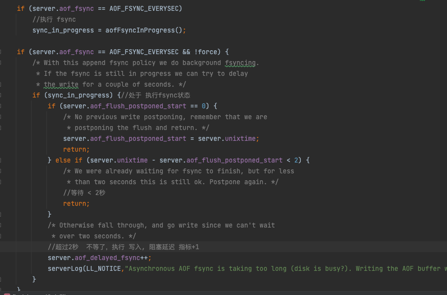
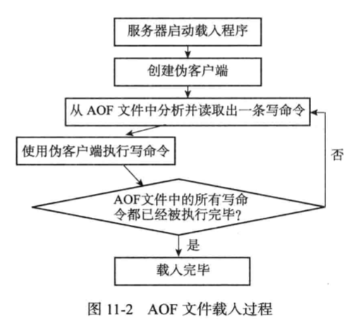
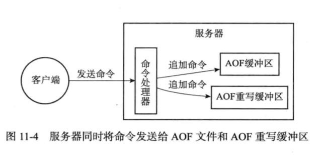

因为Redis是内存数据库，它将自己的 **数据库 状态存储在内存里面**，所以如果 不想办法 将存储在内存中的  数据库 状态 保存到 磁盘里，那么一旦服务器 进程退出，服务器中的 数据库状态 也会消失不见。

为了解决这个问题，Redis提供了 **RDB的 持久化 功能**，这个 功能可以将 Redis 在内存中的 **数据库状态 保存在 磁盘里面，避免 数据 意外丢失**。

- RDB持久化 可以 手动执行  
- 也可以 配置 服务器 定期执行。 
  这个功能 可以 将 **某一个 时间点上 的数据库 状态（快照） 保存到一个 RDB 文件中**。
  
>这个RDB文件 是一个 二进制 文件， 通过 该文件 可以还原 成  生成RDB文件 时的状态。

# RDB文件的创建 与 载入

有两个 命令 可以用生成 RDB文件，一个是 SAVE ，一个是 BGSAVE

- SAVE **会阻塞 Redis服务器进程，直到 RDB 创建完成为止。 在进程阻塞期间，不能处理任何命令**
- BGSAVE 不同，会**派生 一个 子进程**，然后 由 这个 子进程 来负责 创建RDB文件，服务器进程（父进程）继续 处理命令


创建RDB文件实际工作 由 RDB.C/rdbSave函数 完成，SAVE 和 BGSAVE是用两种 不同的方式 去调用这个函数。

RDB文件的载入工作  是服务器 启动的时候自动执行的。所以 Redis没有 专门用于 载入 RDB 文件的 命令，  只要 Redis 启动时 检测到 RDB文件的 存在  就会 自动载入 RDB文件。

tips：  因为 AOF文件的 更新频率 通常 比RDB 文件的 更新 频率更高，所以
- 如果服务器开启了 AOF 持久化功能，那么 服务器 会优先使用AOF来还原
- 只有AOF持久化功能 处于关闭状态时，服务器才会使用RDB


载入RDB文件的 工作 由 rdb.c/rdb.rdbLoad函数完成。



SAVE命令执行时，会阻塞，不会执行其他命令
BGSAVE 执行时，由于 fork 子进程，不会阻塞，可以继续执行其他命令，但是  ：
这时候 发送 SAVE 会被拒绝， **服务器 禁止  SAVE 和 BGSAVE 同时执行**，是为了 避免父进程（服务器进程) 和 子进程 同时 执行 reb.save调用，防止竞争

同理，执行BGSAVE时，其他 BGSAVE 这时候 也不能执行。


BGREWRITEAOF 和 BGSAVE 两个命令不能同时执行：

1. BGSAVE 正在 执行，则 BGREWRITEAOF会 被延迟到 BGSAVE  执行完成之后
2. 如果 REWRITEAOF 正执行， 你们 再 发送 BGSAVE 会被拒绝。

因为 这两个命令 **其实都是 fork 子进程执行， 不能同时 执行 是为了 性能考虑**。
>理解：并发 产生两个子进程，而且 这两个子进程 都同时 执行 大量的 数据磁盘写入，肯定不会是好事


**服务器 载入 RDB文件的 时候，会阻塞**。


#  自动 间隔性保存

由于 BGSAVE 不会阻塞 服务器进程， 所以 Redis 允许 用户 通过 配置 redis.conf的 save  参数  来 让 服务器 每隔一段时间  自动执行 一次 BGSAVE

save可以 配置多个条件，只要满足 任意一个就可以 执行BGSAVE
eg：

save 900 1 （900秒内 ，对数据至少进行了 1次修改）
save 300 10
save 600 1000

## SaveParams

当用户没有 设置 save 参数时，服务器 也会 默认设置（如上 eg).

接着 服务器会根据 save，设置 服务器状态 （redisServer)结构 的 （saveparams）属性：
```
struct saveparam {
    time_t seconds;
    int changes;
};
```

Saveparams 其实 是 一个 数组，数组中的 每一个 元素都是 一个 saveparam 结构，
每个 saveparams 都保存了 一个 save 设置保存条件。





## dirty计数器 和 lastsave属性

除了saveparams数组之外，服务器状态 还维持这 一个 dirty计数器，以及 一个 lastsave属性。

- dirty计数器 记录距离上一次 成功 执行SAVE 命令  或者 BGSAVE命令之后，**服务器对数据库（服务器中的 所有数据库） 进行 多少次 修改（写入，删除，更新）**
- Lastsave 属性 是一个 UNIX 时间戳，记录了 **服务器 上一次 成功 执行** SAVE 命令 或者 BGSAVE 命令的 时间



## 检查保存条件是否满足

Redis的周期性操作函数 serverCron 默认每隔 100 毫秒 就会执行一次，该函数 用于 对正在 运行 的服务器 进行维护，
它  的 其中 一项 工作就是检查 save 保存 条件 是否满足， 如果 已经 满足 ，就执行 BGSAVE

## RDB文件结构


全大写 为 常量， 全小写 变量。注意 这是 二进制数据


1. REDIS 部分，5 字节， 保存的是 ”REDIS" 五个字符。 载入时，可以快速检测 是否为 RDB文件（类比 java 的 开头 魔数）
2.  db_version  ,4 字节，字符串表示的 整数，记录 RDB文件的版本号。
3.  data_base， 包含0个 或任意个 数据库，以及 数据库里的 键值对 数据
4. EOF，1字节，标志 RDB 文件 正文 内容 结束
5. check_sum ，8字节 无符号整数，校验和。 这个 **校验和 是 通过对  前面四个 部分 内容 计算得出的**。
   - 服务器 载入RDB文件时，会 将 载入数据 所计算的 校验和 与 check_sum 进行比对， 检查 RDB 文件是否 出错 或者 损坏。

# AOF持久化


AOF（Append Only File) ，**aof是通过保存 Redis服务器 的 写命令 来记录数据库状态**。是记录 命令，不是文件 内容。

## AOF持久化 实现

功能实现可以分为 ：
1.命令追加（append）
2.文件写入
3.文件同步（sync)

### 命令追加

服务器 执行完 一个 写命令 之后， 会以 协议格式  间 被执行的 命令 追加到 服务器状态 的   **aof_buff 缓冲区** 的 末尾。



## AOF文件的写入与同步
Redis服务器进程 就是一个 事件循环（loop），这循环中的
- **文件事件 负责 接收客户端 的命令 请求，以及 客户端发送 命令 回复**。 
- 而 时间事件 则负责 执行 像 serverCron 函数 这样 需要定时 运行 的函数。

服务器 处理 文件事件，可能会 执行 写命令， 这样 就会  把写命令 追加到 aof_buf 缓冲区里面，
所以服务器 每次 结束 一个 事件循环之前，它 都会 调用  **flushAppendOnlyFile 函数 来 考虑 是否 需要 将  aof_buf 中的 内容写入 到  aof 文件**


flushAppenOnlyFile 函数的 行为 由 服务器 配置的 appendfsync参数值 来决定，
可配置 的值：
1. Always.  ： 将 aof_buf 中的所有内容 写入 并同步到 AOF文件
2. Everysec ：  将aof_buf 所有内容写入到 AOF文件， 如果上次 同步 AOF 文件的时间 距离超过 1秒钟， 那么再次 进行 AOF文件 同步，并且这个 同步操作 是一个 线程 专门负责 执行的
3. No  :  将 aof_buf 所有内容 写入 AOF文件，但 并不对 AOF文件 进行同步，何时同步由 操作系统 决定

如果 用户没有 配置 appendfsync，  那么**默认  everysec**


文件写入和同步：
>为了提高文件 写入效率，现代 操作系统 中，当用户 调用 write 函数，将一些 数据 写入到文件的 时候，操作系统 通常  将 写入数据 暂时 保存到  一个 内存缓冲区里面，等到 缓冲区 空间被 填满的时候，或者 超过指定时限 之后，才 真正的 将缓冲区里的 数据 写入磁盘里面
>这样虽然 提高了效率，但 也为 写入数据 带来了 安全问题。如果 计算机 宕机，内存 缓冲区里面 还有 数据 没有 写入 文件，那么 写入 缓冲区的数据 就相当于 丢失。

为此，操作系统 提供了 **fsync 和 fdatasync 两个 同步函数**，他们可以 **强制 让 操作系统  ，立即 将 缓冲区的 数据 写入 到 磁盘**，保证 数据安全性。





AOF 持久化的 效率和 安全性

- 服务器配置appendfsync选项的值直接决定AOF持久化功能的效率和安全性。
  - 当appendfsync的值为always时，服务器在每个事件循环都要将aofbuf缓冲区中的所有内容写入到AOF文件，并且同步AOF文件，所以always的效率是 appendfsync选项三个值当中最慢的一个，
  - 但从安全性来说，always也是最安全的，因为即使出现故障停机，AOF持久化也只会丢失一个事件循环中所产生的命令数据。
-  当appendfsync的值为everysec时，服务器在每个事件循环都要将aofbuf 缓冲区中的所有内容写入到AOF文件，并且每隔一秒就要在子线程中对AOF文件进行一次同步。
   - 从效率上来讲，everysec模式足够快，并且就算出现故障停机，数据库也只丢失一秒钟的命令数据。-----**磁盘压力大时，fsync慢，2秒**
- 当appendfsync的值为no时，服务器在每个事件循环都要将aofbuf缓冲区中的所有内容写入到AOF文件，至于何时对AOF文件进行同步，则由操作系统控制。
  - 因为处于no模式下的flushAppendOnlyFile调用无须执行同步操作，所以**该模式下的AOF文件写入速度总是最快的**。不过因为这种模式会在系统缓存中积累一段时间的写入数据，所以该模式的单次同步时长通常是三种模式中时间最长的。 
  - 从平摊操作的角度来看，no模式和everysec模式的效率类似，当出现故障停机时，使用no模式的服务器将丢失上次同步AOF文件之后的所有写命令数据。


# AOF文件载入与数据还原



## AOF 重写

随着时间流逝，AOF文件中的内容会越来越多，如果 不加以控制，过大的AOF文件 可能 对Redis 服务器，甚至 整个 宿主计算机 造成影响，并且 AOF越大， 恢复数据 耗费时间 也更多。
为了**解决 AOF文件 膨胀问题，Redis提供了 重写（Rewrite)**. 通过 该功能，可以 创建 一个 新的 AOF 来替代 现有的 AOF文件。 新旧AOF文件保存的 数据库状态相同，但是  新AOF文件 不会 包含任何浪费 空间的 冗余命令，所以 新 AOF 文件 通常 要比 旧文件 小很多。

**新AOF文件 则是 尽量少的命令 来记录 服务器状态**。那么 最简单高效的方法不是 读取 和 分析 现有的 AOF文件，而是  直接 从数据库 读取 值，然后 用一条 写入 命令 来代替 旧文件的 多条命令。

当然，为了 避免 恢复时，大量数据写入 aof_buf,   重写（rewrite）AOF时， 会 检查  键 包含的 元素 个数， 如果 **超过了  特定的 值，那么 就会 使用 多条命令记录**。


上面的aof重写程序 （aof_rewrite), 可以很好完成 新创建一个AOF文件的任务，
但是  这个函数 会有**大量的 写入操作**，所以 调用这个函数的 线程 会被长时间 阻塞， 

因为 Redis 使用 单线程 来处理 命令 请求，如果  服务器 **直接调用  aof_rewrite 则会 无法处理 其他 命令请求**。

**所以，redis 吧 aof_rewrite 放入到了 子进程 里面**。这样可以：
1. 重写期间，服务器 也可以继续处理命令请求
2. 子进程 带有 服务器进程（父进程）的 数据副本，使用 子进程， 而不是 线程，可以 避免使用 锁的 情况下，保证 数据安全性


不过使用 子进程 也有一个问题， **子进程 重写期间， 父进程 还需要 继续处理命令，这些 新的 命令 就有可能 修改数据库状态**， 从而使得 服务器状态 和 重写 后的 AOF文件 保存的 数据库 状态 不一致。

为了 解决这个问题，Redis设置 了一个 **AOF 重写 缓冲区**，这个 缓冲区 在 服务器 创建 重写 子进程之后 开始使用， 当 Redis 执行完 一个 写命令 后，它 会同时 将 这个 写 命令 发送 给 aof_buf  和  重写缓冲区。


当子进程完成AOF重写之后，会发送一个信号，父进程 接收到 信号之后，会调用一个 信号处理函数，并 执行以下工作：
1. 将**AOF缓冲区中的所有内容写入到新的 AOF文件中**，这时新的AOF文件所保存的状态将和数据库服务器状态保持一致
2. 对新的AOF文件进行改名，**原子 地覆盖 现有 AOF文件，完成 新旧AOF文件的替换**


这个信号处理函数 执行完，父进程 就可以继续 像往常一样 接受 命令请求。

在整个 AOF重写 过程中，只有 **信号处理函数 执行时，才会 阻塞 父进程**。 这样就将 AOF重写 对服务器 性能 造成的 影响 降到了 最低。
