Redis 为什么那么快？

除了它是内存数据库，使得所有的操作都在内存上进行之外，
还有一个重要因素，**它实现的数据结构，使得我们对数据进行增删查改操作时，Redis 能高效的处理**。

>注意，Redis 数据结构并不是指 
> String（字符串）对象、List（列表）对象、Hash（哈希）对象、Set（集合）对象和 Zset（有序集合）对象
> ，因为这些是 Redis 键值对中值的数据类型，也就是数据的保存形式，这些对象的底层实现的方式就用到了数据结构。

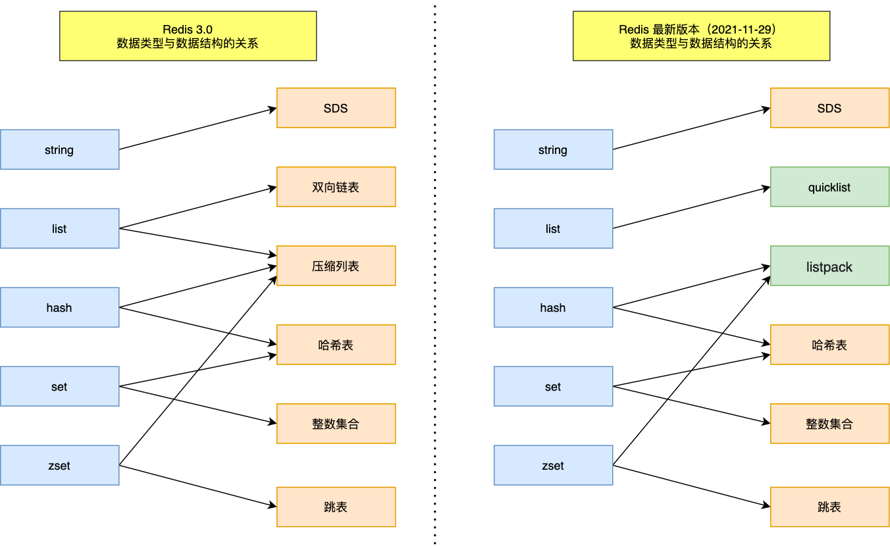
左边是 Redis 3.0版本的，也就是《Redis 设计与实现》这本书讲解的版本，现在看还是有点过时了，右边是现在 Github 最新的 Redis 代码的（还未发布正式版本）。

可以看到，Redis 数据类型的底层数据结构随着版本的更新也有所不同，比如：
- 在 Redis 3.0 版本中 List 对象的底层数据结构由「双向链表」或「压缩表列表」实现，但是在 3.2 版本之后，List 数据类型底层数据结构是由 quicklist 实现的；
- 在最新的 Redis 代码（还未发布正式版本）中，压缩列表数据结构已经废弃了，交由 listpack 数据结构来实现了

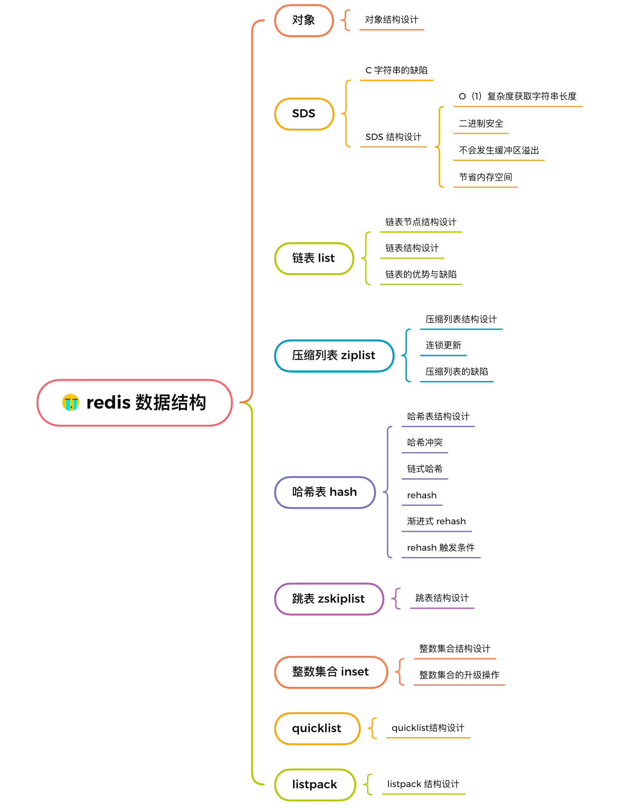

我们都知道redis是一个 k-v 数据库。
Redis 的键值对中的 key 就是字符串对象，而 value 可以是字符串对象，也可以是集合数据类型的对象，比如 List 对象、Hash 对象、Set 对象和 Zset 对象。

Q:这些键值对是如何保存在 Redis 中的呢？
A: redis 采用了一个 **【hash表】** 来保存所有键值对，最大好处就是可以 O(1) 来快速查找键值对。

哈希表 其实是一个 数组，数组中的元素 是 哈希桶。

那么 redis中的 哈希桶 是怎么保存数据的呢？
如图：
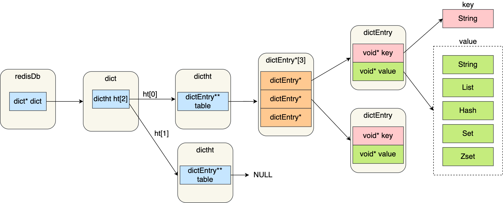

- redisDb结构。 表示 redis 数据库的结构。 结构体 里面包含了一个 指向dict 的指针。
- dict结构， 结构体里 存放了  2个 哈希表。 （hash表 就是 dicht 结构）
    - 正常情况都是 用 ht[0] （第一个哈希表）， ht[1]（第二个哈希表）在 rehash 的时候才会使用到。
- ditcht结构， 也就是 存储键值对的 哈希表。结构包含指向 一个哈希表数组 的指针。
- dictEntry机构，表示 hash表 节点的机构。存放的就是 key，value 的指针。 
    - key 指向的是 String 对象
    - 而 value 则可以指向 String 对象，也可以指向集合类型的对象，比如 List 对象、Hash 对象、Set 对象和 Zset 对象。


特别说明下，void *key 和 void *value 指针指向的是 Redis 对象，Redis 中的每个对象都由 **redisObject 结构**表示，如下图： 
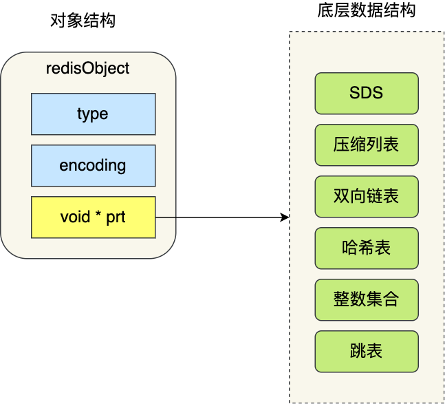

对象结构里包含的成员变量：
- type，标识该对象是什么类型的对象（String 对象、 List 对象、Hash 对象、Set 对象和 Zset 对象）；
- encoding，标识该对象使用了哪种底层的数据结构；
- ptr，指向底层数据结构的指针

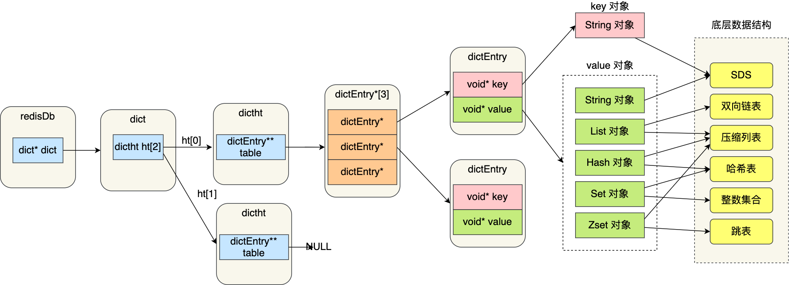


# SDS
字符串在 Redis 中是很常用的，键值对中的键是字符串类型，值有时也是字符串类型。

Redis 是用 C 语言实现的，但是它没有直接使用 C 语言的 char* 字符数组来实现字符串，而是自己封装了一个名为简单动态字符串（simple dynamic string，SDS） 的数据结构来表示字符串，
也就是 **Redis 的 String 数据类型的底层数据结构是 SDS**

既然 Redis 设计了 SDS 结构来表示字符串，肯定是 C 语言的 char* 字符数组存在一些缺陷。
要了解这一点，得先来看看 char* 字符数组的结构。

## C语言字符串缺陷

- 获取字符串长度 需要 时间复杂度O(N)
- 不能记录"\0"字符，因为 以 "\0"表示字符串结尾。 所以也就不能保持 二进制数据。
- 字符串操作 不高效 且不安全。有缓冲区溢出风险


```C
//将 src 字符串拼接到 dest 字符串后面
char *strcat(char *dest, const char* src);
```
>C 语言的字符串是不会记录自身的缓冲区大小的，所以 strcat 函数假定程序员在执行这个函数时，已经为 dest 分配了足够多的内存，
> 可以容纳 src 字符串中的所有内容，而一旦这个假定不成立，就会发生缓冲区溢出将可能会造成程序运行终止


## SDS结构设计
```c
struct __attribute__ ((__packed__)) sdshdr64 {
    uint64_t len; /* used */
    uint64_t alloc; /* excluding the header and null terminator */
    unsigned char flags; /* 3 lsb of type, 5 unused bits */
    char buf[];
};
```
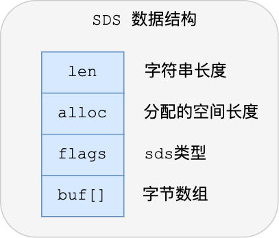
- len 记录字符串长度。这样获取字符串长度的时候，只需要返回这个成员变量值就行，时间复杂度只需要 O（1）
- alloc 分配给 buf数组的空间长度。
  - 这样连接或者修改 字符串的 时候，就能 通过 free = alloc - len 得出剩余空间，来判断是否需要扩容
  - 所以使用 SDS 既不需要手动修改 SDS 的空间大小，也不会出现前面所说的缓冲区溢出的问题。
- flags 用来标识不同类型的 SDS。分别是： sdshdr5、sdshdr8、sdshdr16、sdshdr32 和 sdshdr64
- buf[] 字符数组，用来报存实际的数据。 不仅可以 字符串， 也可以  存 二进制数据

> 因为SDS 有len来记录长度，不需要 使用 '\0' 标记字字符串结束，可以存储 '\0' 。所以 可以存储 二进制数据
> 但是 为了 兼容 c语言 标准库的函数， sds 也会在字符串尾部加上 '\0' 。

因为 SDS是能存储 二进制数据的，所以 SDS 的 API 都是以处理二进制的方式来处理 SDS 存放在 buf[] 里的数据，
程序不会对其中的数据做任何限制，数据写入的时候时什么样的，它被读取时就是什么样的。


SDS扩容：
```
hisds hi_sdsMakeRoomFor(hisds s, size_t addlen)
{
    ... ...
    // s目前的剩余空间已足够，无需扩展，直接返回
    if (avail >= addlen)
        return s;
    //获取目前s的长度
    len = hi_sdslen(s);
    sh = (char *)s - hi_sdsHdrSize(oldtype);
    //扩展之后 s 至少需要的长度
    newlen = (len + addlen);
    //根据新长度，为s分配新空间所需要的大小
    if (newlen < HI_SDS_MAX_PREALLOC)
        //新长度<HI_SDS_MAX_PREALLOC 则分配所需空间*2的空间
        newlen *= 2;
    else
        //否则，分配长度为目前长度+1MB
        newlen += HI_SDS_MAX_PREALLOC;
       ...
}
```


- 如果所需要的 sds 长度 小于 1m， 那么 就按照 新字符串长度 * 2 来扩容
- 如果需要的 sdsc长度 大于 1m， 那么就 在 新字符串长度 + 1M 扩容

扩容前 会先检查 未使用 空间是否足够，b不够的话 ，不仅 会分配 足够的空间，还会 为 sds 分配 额外的  未使用空间。
这样 就 减少 了  内存分配 次数

## 节省内存空间

SDS 结构中有个 flags 成员变量，表示的是 SDS 类型。

Redis 一共设计了 5 种类型，分别是 sdshdr5、sdshdr8、sdshdr16、sdshdr32 和 sdshdr64。

这 5 种类型的主要区别就在于，它们数据结构中的 len 和 alloc 成员变量的数据类型不同
例如：
```
struct __attribute__ ((__packed__)) sdshdr16 {
    uint16_t len;
    uint16_t alloc; 
    unsigned char flags; 
    char buf[];
};


struct __attribute__ ((__packed__)) sdshdr32 {
    uint32_t len;
    uint32_t alloc; 
    unsigned char flags;
    char buf[];
};
```

- sdshdr16 类型的 len 和 alloc 的数据类型都是 uint16_t，表示字符数组长度和分配空间大小不能超过 2 的 16 次方。
- sdshdr32 则都是 uint32_t，表示表示字符数组长度和分配空间大小不能超过 2 的 32 次方。


除了设计不同类型的结构体，Redis 在编程上还使用了专门的编译优化来节省内存空间，
即在 **struct 声明了 __attribute__ ((packed)) ，它的作用是：告诉编译器取消结构体在编译过程中的优化对齐，按照实际占用字节数进行对齐**。


# 链表
Redis 中的List类型 就是由链表构成。、
redis-list 结构：
```c
typedef struct list {
    //链表头节点
    listNode *head;
    //链表尾节点
    listNode *tail;
    //节点值复制函数
    void *(*dup)(void *ptr);
    //节点值释放函数
    void (*free)(void *ptr);
    //节点值比较函数
    int (*match)(void *ptr, void *key);
    //链表节点数量
    unsigned long len;
} list;
```

在看看 listNode 节点结构：
```
typedef struct listNode {
    //前置节点
    struct listNode *prev;
    //后置节点
    struct listNode *next;
    //节点的值
    void *value;
} listNode;
```

可以看出 这是一个 双向链表。


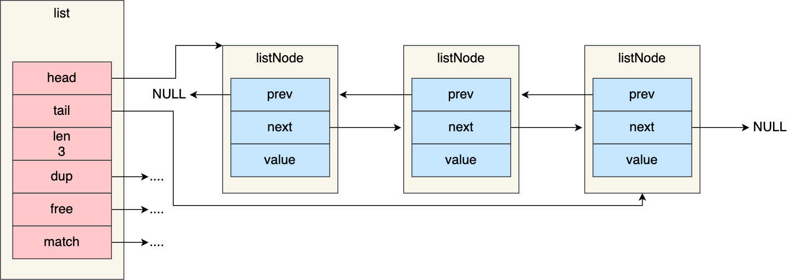

## 链表的优势与缺陷
链表优势：
- listNode 链表节点的结构里带有 prev 和 next 指针
    - 获取某个节点的前置节点或后置节点的时间复杂度只需O(1)
    - 而且这两个指针都可以指向 NULL,所以链表是无环链表；
- list 结构因为提供了表头指针 head 和表尾节点 tail
    - 所以获取链表的表头节点和表尾节点的时间复杂度只需O(1)
    - 因为 head.next = null ， prev.next = null 。对链表的访问 以null结束，所以是 **无环**的
- list 结构因为提供了链表节点数量 len，
    - 所以获取链表中的节点数量的时间复杂度只需O(1)；  
- listNode 链表节使用 void* 指针保存节点值，
    - 并且 可以通过 list 结构的 dup、free、match 函数指针为节点设置该节点类型特定的函数
    - 因此链表节点可以保存各种不同类型的值；  

链表缺陷：
- 链表每个节点在内存的存储是不连续的
    - 表面无法 很好利用 CPU缓存
    - 能很好利用 CPU 缓存的数据结构就是数组，**因为数组的内存是连续的，这样就可以充分利用 CPU 缓存来加速访问**。
- 还有一点，保存一个链表节点的值都需要一个**链表节点结构头的分配，内存开销较大**。  

因此，redis3.0 中的 list对象 在数据量比较少的情况下， 会采用【压缩链表】作为底层数据结构的实现。
它的 优势 是节省内存空间，并且 是 内存紧凑型 的数据结构。

不过，由于 【压缩链表】 也存在一些 性能问题（后续介绍），所以 **Redis 在3.2版本就 将list 的底层数据结构
改为【quickList 专门设计出来解决 压缩链表 性能问题】**。

然后 在 Redis5.0 中设计了新的数据结构【listpack】,沿用了 压缩链表紧凑型内存布局，最终在新的redis版本中
将 Hash 和 Zset 的底层数据结构 实现 之一的 【压缩链表】，替换为 【listpack】

>总结，由于【压缩链表】 性能问题， 
> 本来数据量少时，采用【压缩链表】实现的list ，改为 【quicklist】实现。
>  Hash 和 Zset 也把 实现之一 的【压缩链表】 替换为 【listppack】

# 压缩链表
压缩链表 最大的 特点就是 被设计为**内存紧凑 型的数据结构**。占用 一段连续的内存，不就可以利用
cpu缓存， 而且 会 针对 不同的长度的数据 进行 相应编码， 这种方法 可以 **有效 节省内存**。

压缩链表缺陷：
- 不能保存过多元素，否则 查询效率 会降低
- 新增或修改 某个元素时，压缩链表占用的 内存空间需要重新分配，甚至可能引发连锁更新
因此，Redis对象（list，hash，zset)包含的元素 较少时， 或者 元素值（占用空间长度）较小的情况下，
才会使用 【压缩链表】来实现。
>元素值较小 一般指的是  小整数 和 长度较小的字符串 

## 压缩链表结构设计

压缩列表是 Redis 为了节约内存而开发的，它是由连续内存块组成的顺序型数据结构，有点类似于数组。

压缩列表在表头有三个字段：
- zlibbytes, 记录整个 压缩链表 占用内存的字节数
- zlttail, 记录 尾部节点 距离 起始地址 多少字节， 也就是 尾部的 offset
- zllen， 记录 压缩链表 节点的数量
- zlend，  标识这  一个 压缩链表的 结束。固定值 0xFF（十进制255）。对比 java魔数。

>可以发现  在压缩链表中 找第一个元素 和 最后一个 元素都比较方便，复杂度 O(1).
> 但是 如果 查找 其他元素 就没有这么方便了， 只能逐个查找，此时 复杂度就是 O(N)了，
> 所以  压缩链表 不适合放 过多元素

压缩链表中 一个 节点 entry 的结构：


压缩列表节点包含三部分内容：
- prevlen, 记录 上一个 节点 的长度， 目的实现 从后往前遍历。 也就是 前驱指针
- encoding， 记录当前节点 的实际数据 类型 和长度。 类型主要由：字符串 和 整数
- data， 记录当前 节点的 实际数据， 类型 和 长度 由 encoding 决定

当我们往 压缩链表中 插入数据时， 压缩 链表 就会根据 插入数据类型 和 数据大小， 来设置 encoding 。
并根据前一个节点长度 来给 prevlen 分配空间，并设置 z值 。 **这种根据数据类型和大小 进行不同的空间大小分配的思想**， 也就是压缩链表为了节省内存设计的。


## 连锁更新
压缩链表除了 查询时间复杂度高以外还有 一个问题。
> 如果向 压缩链表  插入了 一个 较大的数据， 就可能 导致空间不够，
> 就导致 压缩链表占用的内存空间 需要重新分配， 并且会导致 后续元素的prevlen
> 的空间 不够存储  本次新插入的 长度，  就会导致 后续的 prevlen 需要重新分配空间，
> 从而 引起 连锁更新。 导致 性能 下降

压缩列表节点的 prevlen 属性会根据前一个节点的长度进行不同的空间大小分配：
- 如果前一个节点长度 < 254 字节，那么 prevlen 就需要 1 字节的空间 来保存这个 长度
- 如果 前一个节点长度 >= 254 字节， 那么 prevlen 就需要 5 字节空间 来保存这个 长度


## 压缩链表缺点

连锁更新 导致的 压缩列表 占用空间 要多次重分配， 直接影响 压缩列表访问 性能。

所以 虽然 【压缩链表】紧凑性内存布局 能节省内存开销， 但是 如果 保存
的元素 数量增加 或是 元素变大 ， 回导致 重分配， 更糟糕会 连锁更新。

因此， 压缩链表 适用于  元素个数较少，元素数据空间较小的 场景。


由于压缩链表设计上的不足， 后来的版本中 新增了 quicklist（3.2引入） 和 listpack（5.0引入）。
这两种数据结构 的目的就是：  即保留节省内存优势，又 解决 连锁更新 问题。

# 哈希表
- 哈希表是一种保存键值对（key-value）的数据结构。
- 哈希表中的每一个 key 都是独一无二的，程序可以根据 key 查找到与之关联的 value，或者通过 key 来更新 value，又或者根据 key 来删除整个 key-value等等。

前面压缩链表提到：Hash 对象的底层实现之一是压缩列表（最新 Redis 代码已将压缩列表替换成 listpack）
**另一个 底层实现 就是 哈希表**。

Q:哈希表优点在于，它能以 O(1) 的复杂度快速查询数据。怎么做到的呢？
A:将 key 通过 Hash 函数的计算，就能定位数据在表中的位置，因为哈希表实际上是数组，所以可以通过索引值快速查询到数据。

但是存在的风险也是有，在哈希表大小固定的情况下，随着数据不断增多，那么**哈希冲突的可能性也会越高**。
Redis 采用了「链式哈希」来解决哈希冲突.

## 哈希表结构设计
```c
typedef struct dictht {
    //哈希表数组
    dictEntry **table;
    //哈希表大小
    unsigned long size;  
    //哈希表大小掩码，用于计算索引值
    unsigned long sizemask;
    //该哈希表已有的节点数量
    unsigned long used;
} dictht;
```

可以看到，哈希表是一个数组（dictEntry **table）
，数组的每个元素是一个指向「哈希表节点（dictEntry）」的指针。
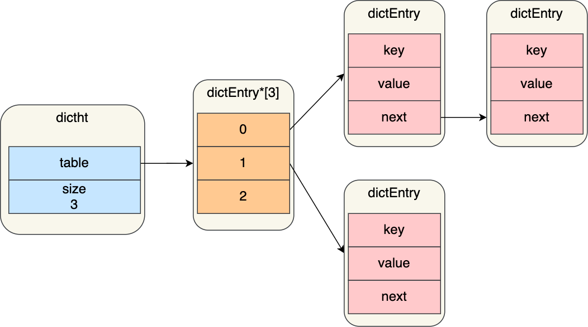

哈希表节点的结构如下：
```
ypedef struct dictEntry {
    //键值对中的键
    void *key;
  
    //键值对中的值
    union {
        void *val;
        uint64_t u64;
        int64_t s64;
        double d;
    } v;
    //指向下一个哈希表节点，形成链表
    struct dictEntry *next;
} dictEntry;
```

>dictEntry 结构里键值对中的值是一个「联合体 v」定义的，
> 因此，键值对中的值可以是一个指向实际值的指针，或者是一个无符号的 64 位整数 或有符号的 64 位整数或double 类的值。
> 这么做的好处是可以节省内存空间，因为当「值」是整数或浮点数时，
> 就可以将值的数据内嵌在 dictEntry 结构里，无需再用一个指针指向实际的值，从而节省了内存空间。


这个 next指针就是 解决 哈希冲突时， 拉链法。 
不过 这样也有局限， 就是 随着 哈希冲突 加剧， 同一个 index 对应的 链表长度 
越来越长， 查询这一 （index)位置的 数据 耗时就会 增加。

## rehash
还记得 前面说 redis整个 存储结构时，dict 结构存放了 两个哈希表。
```
typedef struct dict {
    …
    //两个Hash表，交替使用，用于rehash操作
    dictht ht[2]; 
    …
} dict;
```
之所以是两个，就是 因为 rehash 的时候 需要用上 2个哈希表。
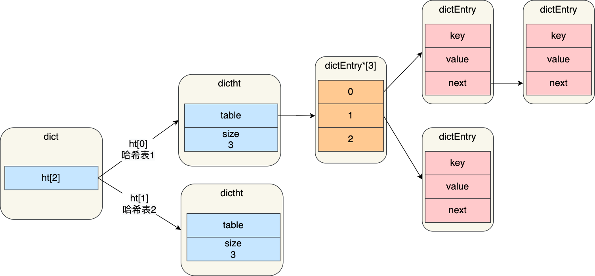

在正常服务请求阶段，插入的数据，都会写入到「哈希表 1」，此时的「哈希表 2 」 并没有被分配空间。
> ht[0] 即 【哈希表1】， ht[1] 即【哈希表2】

随着数据逐步增多，触发了 rehash 操作，这个过程分为三步：
- 给 【哈希表2】 分配空间， 一般比 【哈希表1】 大两倍
- 将 【哈希表1】 的数据 迁移 到 【哈希表2】
- 迁移完成后，【哈希表1】 的空间会被释放， 并把  【哈希表2】 设为 【哈希表1】，然后 创建空的 【哈希表2】为下次 rehash 做准备

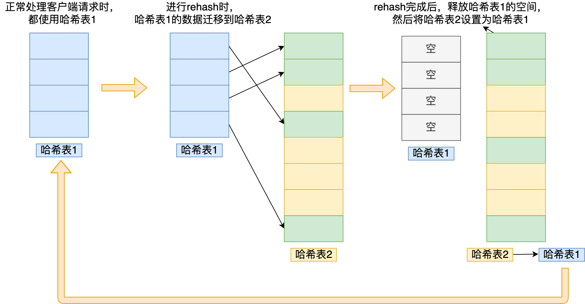

这个过程看起来简单，但是其实第二步很有问题，
如果「哈希表 1 」的数据量非常大，那么在迁移至「哈希表 2 」的时候，**因为会涉及大量的数据拷贝，此时可能会对 Redis 造成阻塞，无法服务其他请求**。

## 渐进式rehash
为了 避免 rehashs时， 拷贝数据过多 耗时长，阻塞服务，影响redis性能的情况， 所以redis采用了
**渐进式rehash ， 也就是 将 数据迁移工作分批完成**。

渐进式 rehash 步骤如下：
- 给「哈希表 2」 分配空间；
- 每次哈希表元素进行新增、删除、查找或者更新操作时，Redis 除了会执行对应的操作之外，还会顺序将「哈希表 1 」中索引位置上的所有 key-value 迁移到「哈希表 2」 上；
- 随着处理客户端发起的哈希表操作请求数量越多，最终在某个时间点会把「哈希表 1 」的所有 key-value 迁移到「哈希表 2」，从而完成 rehash 操作。

这样就巧妙地把一次性大量数据迁移工作的开销，分摊到了多次处理请求的过程中，避免了一次性 rehash 的耗时操作。

在进行渐进式 rehash 的过程中，会有两个哈希表，所以在**渐进式 rehash 进行期间，哈希表元素的删除、查找、更新等操作都会在这两个哈希表进行**。

比如，查找一个 key 的值的话，**先会在「哈希表 1」 里面进行查找，如果没找到，就会继续到哈希表 2 里面进行 查找**。

另外，在渐进式 rehash 进行期间，新增一个 key-value 时，会被保存到「哈希表 2 」里面，而「哈希表 1」 则不再进行任何添加操作，这样保证了「哈希表 1 」的 key-value 数量只会减少，随着 rehash 操作的完成，最终「哈希表 1 」就会变成空表。

## rehash 触发条件
rehash 的触发条件跟**负载因子（load factor）有关系**。
负载因子可以通过下面这个公式计算：
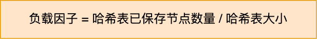

触发rehash的条件：
- 当负载因子大于等于 1 ，并且 Redis 没有在执行 bgsave 命令或者 bgrewiteaof 命令，
  也就是没有执行 RDB 快照或没有进行 AOF 重写的时候，就会进行 rehash 操作  
- 当负载因子大于等于 5 时，此时说明哈希冲突非常严重了，不管有没有有在执行 RDB 快照或 AOF 重写，都会强制进行 rehash 操作。


# 整数集合
整数集合是**Set的底层实现之一**。 当一个 **Set对象 只包含 整数值 元素，并且元素数量不大时**，
就会使用 整数集合 这个数据结构。

## 整数集合数据结构设计
```
typedef struct intset {
    //编码方式
    uint32_t encoding;
    //集合包含的元素数量
    uint32_t length;
    //保存元素的数组
    int8_t contents[];
} intset;
```

可以看到，保存元素的容器是一个 contents 数组，虽然 contents 被声明为 int8_t 类型的数组，但是实际上 contents 数组并不保存任何 int8_t 类型的元素，
**contents 数组的真正类型取决于 intset 结构体里的 encoding 属性的值**。比如：

- 如果 encoding 属性值为 INTSET_ENC_INT16，那么 contents 就是一个 int16_t 类型的数组，数组中每一个元素的类型都是 int16_t；
- 如果 encoding 属性值为 INTSET_ENC_INT32，那么 contents 就是一个 int32_t 类型的数组，数组中每一个元素的类型都是 int32_t；
- 如果 encoding 属性值为 INTSET_ENC_INT64，那么 contents 就是一个 int64_t 类型的数组，数组中每一个元素的类型都是 int64_t；
不同类型的 contents 数组，意味着数组的大小也会不同。
  
## 整数集合的升级操作
整数集合 有一个升级规则。
>就是当我们将一个新元素加入到整数集合里面，如果新元素的类型（int32_t）比整数集合现有所有元素的类型（int16_t）都要长时，整数集合需要先进行升级，
> 也就是按新元素的类型（int32_t）扩展 contents 数组的空间大小，然后才能将新元素加入到整数集合里，当然升级的过程中，也要维持整数集合的有序性。
> 明显的， 整数集合申请的空间不够 放入新元素， 只有 把元素空间 扩大才行。 


整数集合升级的过程不会重新分配一个新类型的数组，而是在**原本的数组上扩展空间，然后在将每个元素按间隔类型大小分割**，
如果 encoding 属性值为 INTSET_ENC_INT16，则每个元素的间隔就是 16 位。

例如：
假设有一个整数集合里有 3 个类型为 int16_t 的元素。
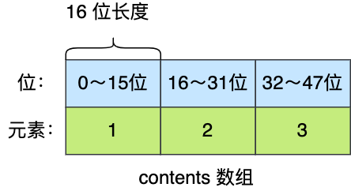

现在，往这个整数集合中加入一个新元素 65535，这个新元素需要用 int32_t 类型来保存，
所以整数集合要进行升级操作，**首先需要为 contents 数组扩容**，在原本空间的大小之上再扩容多 80 位（4x32-3x16=80），
这样就能保存下 4 个类型为 int32_t 的元素。
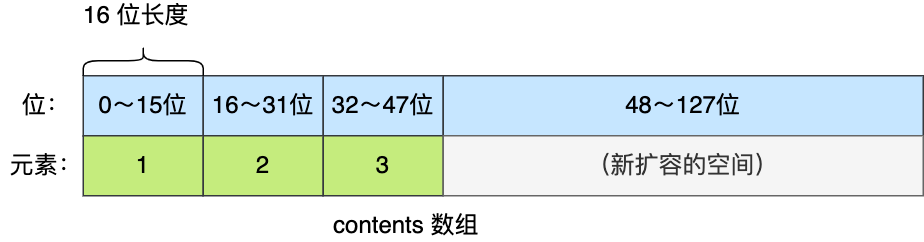

扩容完 contents 数组空间大小后，**需要将之前的三个元素转换为 int32_t 类型，并将转换后的元素放置到正确的位上面，并且需要维持底层数组的有序性不变**，整个转换过程如下：
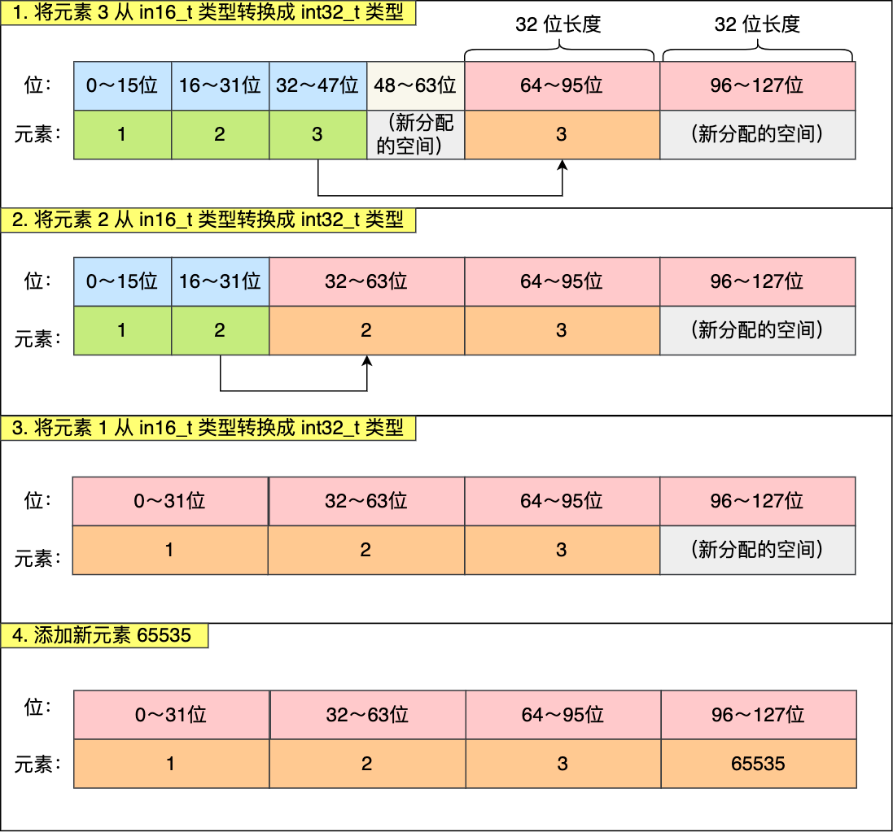


Q: 整数升级好处？
A: 节省内存资源。当放入一个 需要空间较大 元素时，才扩容。若 一开始就初始化较大元素空间，一直放入较小空间元素，则造成内存浪费
Q： 那 支持 降级吗？
A: 不支持降级。 一旦 升级， 就会一直保持 升级之后的状态。
> 例如： int16 升级为了 int32， 就会一直 保持 int32。 就算删除了 那个需要int32 的元素-65535 ，也不回降级


# 跳表
Redis中 只有**Zset 底层使用到了 跳表**， 跳表的优势是 能支持平均 O(logN)复杂度 查找。

zset 结构体里有两个数据结构：一个是跳表，一个是哈希表。这样的好处是**既能进行高效的范围查询（跳表），也能进行高效单点查询(哈希表）**。
```c
typedef struct zset {
    dict *dict;
    zskiplist *zsl;
} zset;
```

Zset在插入数据的时候，会 依次在跳表 和 哈希表 中插入或更新 相应的数据。从而保证了跳表和哈希表中记录
的信息一致

- Zset能支持 范围查询（ZrangeScope),是因为使用了 跳表。
- Zset又能 以常数级别 时间复杂度 获取 元素权重， 是因为同时 采用了 哈希表 进行索引。

Q: 为什么 一般说 Zset 的底层结构是 压缩链表 或 跳表 呢？ 不谈及 哈希表.
A: 因为 哈希表 是辅助 跳表获取 元素权重使用的。大部分操作 都是 跳表实现的。


## 跳表设计结构
我们知道，链表 查找效率是比较低的，是O(N)。 于是就出线了 跳表。

跳表是在 链表基础上 改进的， 是 一种 多层的  有序链表， 这样的好处是 能快速定位。
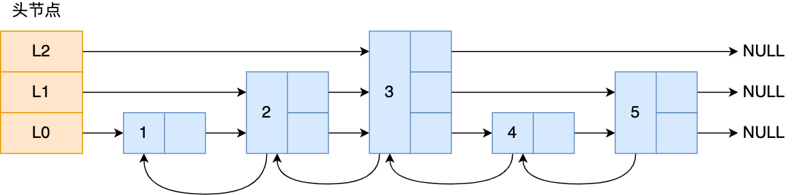

跳表节点数据结构：
```c
typedef struct zskiplistNode {
    //Zset 对象的元素值
    sds ele;
    //元素权重值
    double score;
    //后向指针
    struct zskiplistNode *backward;
  
    //节点的level数组，保存每层上的前向指针和跨度
    struct zskiplistLevel {
        struct zskiplistNode *forward;
        unsigned long span;
    } level[];
} zskiplistNode;
```

tips: 每个跳表节点都有一个后向指针（struct zskiplistNode *backward），指向前一个节点，
目的是为了方便从跳表的尾节点开始访问节点，这样倒序查找时很方便。

Q:指向 前一个 节点 一般不是 应该叫 pre 吗？ 这个 back 是不是应该 是 指向 下一个 后继节点？
A: ...


跳表是一个带有层级关系的链表，而且每一层级可以包含多个节点，每一个节点通过指针连接起来，
实现这一特性就是靠跳表节点结构体中的zskiplistLevel 结构体类型的 level 数组。

>level 数组中的每一个元素代表跳表的一层，也就是由 zskiplistLevel 结构体表示，
> 比如 leve[0] 就表示第一层，leve[1] 就表示第二层。
> zskiplistLevel 结构体里定义了「指向下一个跳表节点的指针」和「跨度」，跨度时用来记录两个节点之间的距离。

跳表结构体：
```
typedef struct zskiplist {
    struct zskiplistNode *header, *tail;
    unsigned long length;
    int level;
} zskiplist;
```

跳表结构里包含了：

- 跳表的头尾节点，便于在O(1)时间复杂度内访问跳表的头节点和尾节点；
- 跳表的长度，便于在O(1)时间复杂度获取跳表节点的数量；
- 跳表的最大层数，便于在O(1)时间复杂度获取跳表中层高最大的那个节点的层数量；

## 跳表的查询过程

查找一个跳表节点的过程时， 跳表会从 头结点的 最高层开始， 逐一遍历每一层。
比较时， 会利用到 节点中的 SDS类型元素 和 元素的权重 来进行判断。
- 若当前节点的权重 < target 权重时， 继续访问 本层 下一个节点
- 若当前节点权重 = target 权重时，比较 SDS 元素， SDS 元素 < target时， 也继续 访问本层 下一个节点。

如果两个条件都不满足，或者 下一个节点为空， 则会 访问 当前跳表节点的 下一层。在下一层继续遍历。


## 跳表节点层数的设置

跳表相邻两层节点数量的比例会影响 跳表的查询性能。
比如：
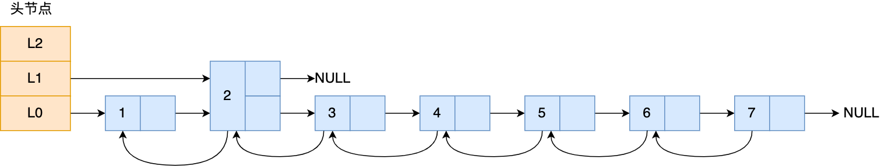

如果想要查询节点 6，那基本就跟链表的查询复杂度一样，就需要在第一层的节点中依次顺序查找，复杂度就是 O(N) 了

所以，为了 降低 时间复杂度，  就需要维持 相邻节点数 直接的关系

**相邻两层的节点数量最理想的比例是 2:1, 查询复杂度可以降到 O(logN)**
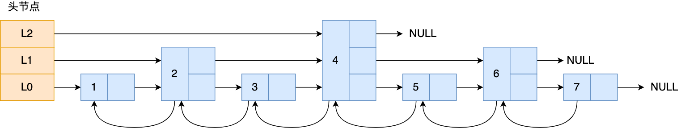


Q：那怎样 维持相邻两层 节点数量 2：1 呢？
A: Redis采用了一种 巧妙的做法。 在创建节点的时候， 随机生成每个节点的层数。并没有严格维持相邻两层 2：1

> 具体做法是， 跳表在创建节点的时候， 生成范围为 [0-1]的随机数。
> 如果这个 随机数 < 0.25 （相当于 概率是 25%），那么 这个层数就增加 1层， 然后继续生成 下一个 随机数
> 直到这个 随机数 > 0.25, 就最终 确定 最终层数。

这样的做法，相当于每增加一层的概率不超过 25%，层数越高，概率越低，层高最大限制是 64。

**如果层高最大限制是 64，那么在创建跳表「头节点」的时候，就会直接创建 64 层高的头节点**。
```
/* Create a new skiplist. */
zskiplist *zslCreate(void) {
    int j;
    zskiplist *zsl;

    zsl = zmalloc(sizeof(*zsl));
    zsl->level = 1;
    zsl->length = 0;
    zsl->header = zslCreateNode(ZSKIPLIST_MAXLEVEL,0,NULL);
    for (j = 0; j < ZSKIPLIST_MAXLEVEL; j++) {
        zsl->header->level[j].forward = NULL;
        zsl->header->level[j].span = 0;
    }
    zsl->header->backward = NULL;
    zsl->tail = NULL;
    return zsl;
}
```
>其中，ZSKIPLIST_MAXLEVEL 定义的是最高的层数，Redis 7.0 定义为 32，Redis 5.0 定义为 64，Redis 3.0 定义为 32

Q: 为什么用 跳表 不用 平衡数 （AVL, 红黑树等）？
Redis的作者 @antirez 是怎么说的：
主要是从内存占用、对范围查找的支持、实现难易程度这三方面总结的原因：
- 它们不是非常内存密集型的。基本上由你决定。改变关于节点具有给定级别数的概率的参数将使其比 btree 占用更少的内存。
- Zset 经常需要执行 ZRANGE 或 ZREVRANGE 的命令，即作为链表遍历跳表。通过此操作，跳表的缓存局部性至少与其他类型的平衡树一样好。
- 它们更易于实现、调试等。例如，由于跳表的简单性，我收到了一个补丁（已经在Redis master中），其中扩展了跳表，在 O(log(N) 中实现了 ZRANK。它只需要对代码进行少量修改

xiaolin补充：
- 从内存占用上来比较，跳表比平衡树更灵活一些。
  - 平衡树每个节点包含 2 个指针（分别指向左右子树），而跳表每个节点包含的指针数目平均为 1/(1-p)
  - 具体取决于参数 p 的大小。如果像 Redis里的实现一样，取 p=1/4，那么平均每个节点包含 1.33 个指针，比平衡树更有优势。
- 在做范围查找的时候，跳表比平衡树操作要简单。
  - 在平衡树上，我们找到指定范围的小值之后，还需要以中序遍历的顺序继续寻找其它不超过大值的节点。如果不对平衡树进行一定的改造，这里的中序遍历并不容易实现。
  - 而在跳表上进行范围查找就非常简单，只需要在找到小值之后，对第 1 层链表进行若干步的遍历就可以实现。
- 从算法实现难度上来比较，跳表比平衡树要简单得多。平衡树的插入和删除操作可能引发子树的调整，逻辑复杂，而跳表的插入和删除只需要修改相邻节点的指针，操作简单又快速。

  


# quicklist

# listpack


内容参考：https://xiaolincoding.com/redis