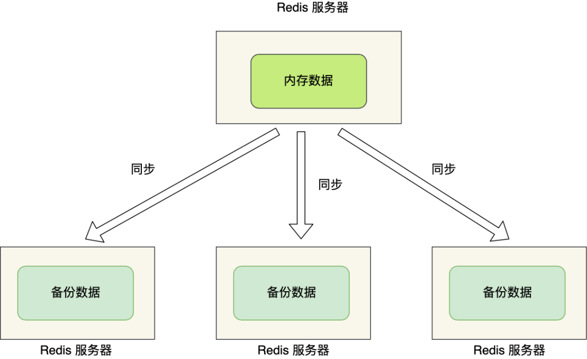
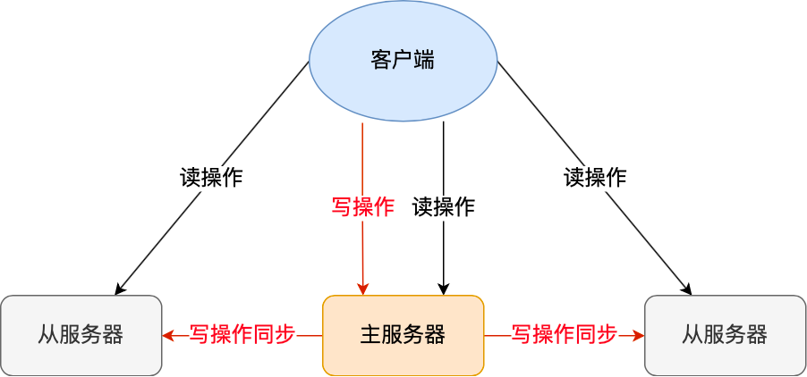
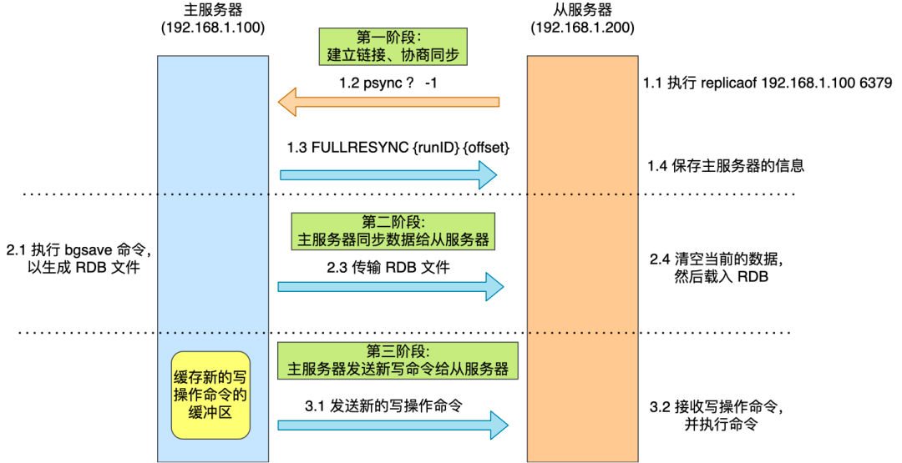
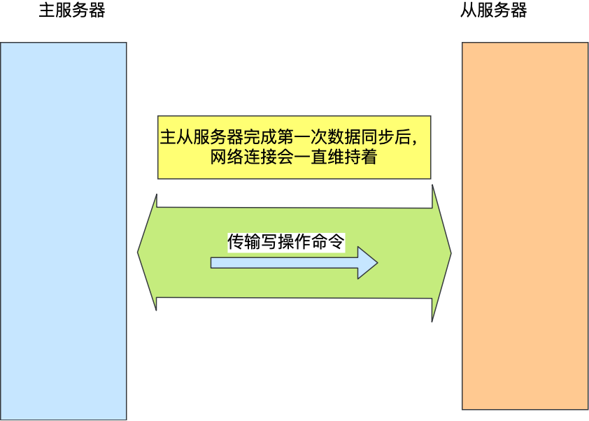
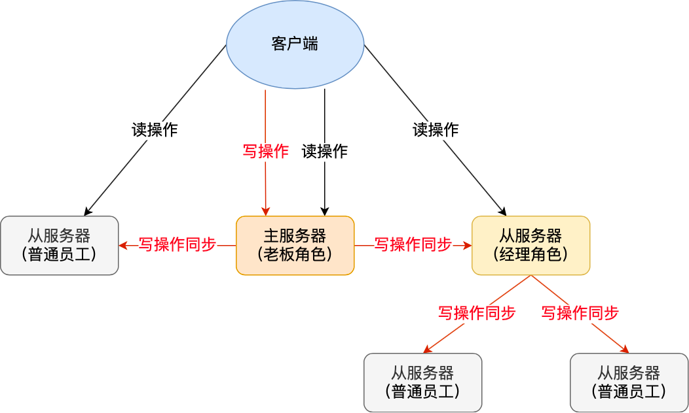
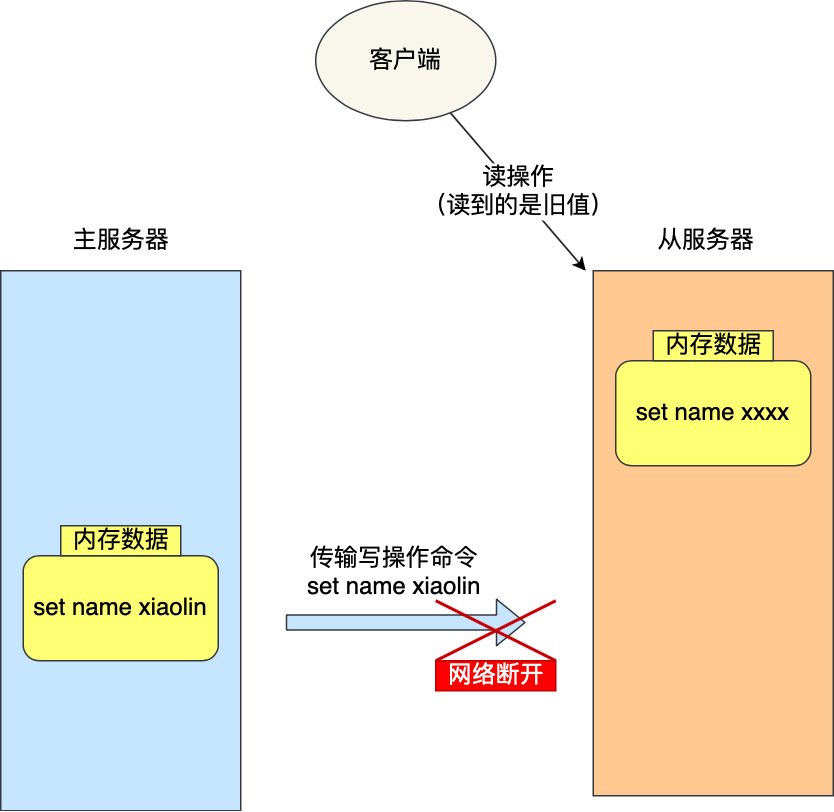
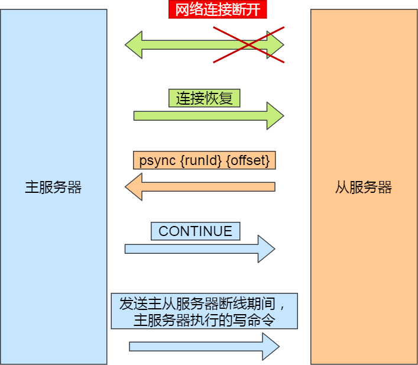
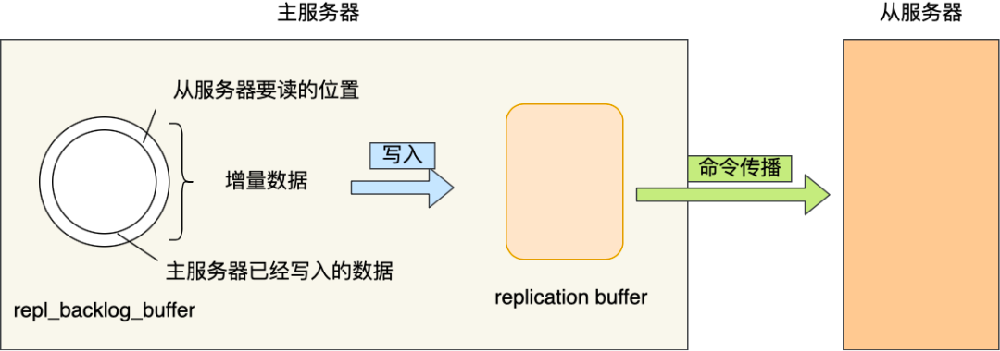

# 主从复制
AOF 和 RDB，这两个持久化技术保证了即使在服务器重启的情况下也不会丢失数据（或少量损失）。

不过，由于数据都是存储在一台服务器上，如果出事就完犊子了，比如：
- 如果服务器发生了宕机，由于数据恢复是需要点时间，那么这个期间是无法服务新的请求的；
- 如果这台服务器的硬盘出现了故障，可能数据就都丢失了。

要避免这种单点故障，最好的办法是将数据备份到其他服务器上，让这些服务器也可以对外提供服务，这样即使有一台服务器出现了故障，其他服务器依然可以继续提供服务。



多台服务器要保存同一份数据，这里问题就来了。
- 这些服务器之间的数据如何保持一致性呢？
- 是否每台服务器都可以处理 读写请求呢？

Redis 提供了**主从复制模式**，来避免上述的问题。
这个模式可以保证**多台服务器的数据一致性，且主从服务器之间采用的是「读写分离」的方式**。
>即： 主服务器可以进行读写操作，当发生写操作时自动将写操作 同步给 其他 从服务器，
> 而 从服务器 一般 只读， 并 接收 主服务器 同步过来的 写操作命令，然后执行。




也就是说， 所有的数据修改 只在主服务器上进行，然后将 最新的数据同步给 从服务器， 这样就
使得 主从服务器 数据是一致的。 

Q: 只有一个 主节点， 那怎么解决 单点问题呢？ 若 同步过程 主节点 宕机， 从节点 没有同步完数据， 会丢失数据 呀？

带着问题 来看看 同步过程。

## 第一次同步

Q: 多台服务器 之间要通过什么方式 来确定谁是 主服务器， 或者 谁是从服务器呢？
A:  我们可以使用 replicaof(redis 5.0 之前 使用 slaveof) 命令 形成 主从关系。

例如：
现在有服务器 A 和 服务器 B，我们在服务器 B 上执行下面这条命令：
```
# 服务器 B 执行这条命令
replicaof <服务器 A 的 IP 地址> <服务器 A 的 Redis 端口号>
```
接着 服务器 B 就会称为 服务器 A的 从服务器。然后 执行 第一次 同步：
主从之间的 第一次同步 分为三个阶段：
1. 建立链接，协商同步
2. 主服务器 同步数据 给 从服务器
3. 主服务器 发送 新的 写操作命令 给 从服务器



### 第一阶段：建立链接，协商同步
执行了 replicaof 命令后， 从服务器 （ 谁执行 命令，谁就是 丛机  ）就会执行 psync 命令， 表示 我要进行 数据同步。
psync 命令 包含两个参数：
- runID， 每个Redis服务器在启动时 都会生成一个 随机的ID来唯一标识自己。
    - 当 从服务器 和 主服务器 去进行 第一次同步时， 由于不知道 主服务 是谁， 就设置为 "？"
- offset， 表示 复制的进度（即：数据复制完成度），第一次同步时， 设为 "-1" 


>主服务器收到 psync 命令时，会 用 FULLRESYNC 作为 响应命令 返回给 对方。
>并且 响应命令 会带上 这两个参数 的值。 主服务的 runID 和 主服务器目前的复制进度，
> 从服务器收到响应后， 会报存 上面两个参数。


FULLRESYNC 命令的意图是  采用全量复制的 方式， 也就是 说 ：主服务器会把所有数据 都同步给 从服务器
所以， 第一阶段的 工作是 为了 全量复制 做准备。

### 第二阶段： 主服务器 同步数据 给从服务器

接着， 主服务器 会 执行 bgsave 命令  来生成 RDB 文件， 然后 把这个文件 传输 给 从服务器。
从服务器 收到 来自主服务器的 RDB文件后  ， 会 先清空当前数据，然后 载入 RDB 文件。

> 注意： 主服务器 生成RDB文件 是用的 bgsave ，用的子进程 生成，不会 阻塞 主服务器 主线程的。
> 但是 在 子进程 生成RDB文件 的这段时间，  主线程 执行的写命令 是没有 记录到 刚刚 生成的 rdb文件中的。
> 这时，主从数据就不一致了

那么 为了  保证 主从服务器 的数据一致性。 主服务器 在下面的 三个间隙 中 会
将 收到的 写操作 命令 写入到 replication buffer 缓冲区 中。
- 主服务器 生成 RDB 文件期间
- 主服务 发送 RDB 文件给 从服务器 期间
- 从服务器 加载 RDB 文件期间

### 第三阶段： 主服务器 发送 新的写操作命令给 从服务器
主服务器 发送 RDB 文件完成后， 从服务器 收到 RDB 文件后， 会 丢弃所有 旧数据.
将 RDB 文件 载入内存后， 会 给 主服务器 一个 ack 确认消息。

主服务 收到 ack 确认后， 将 replication buffer 中的记录的 写操作命令 也发送给 从服务器，
这时候， 从服务器执行来自主服务器 replication buffer 缓冲区里发来的命令，这时主从服务器的数据就一致了。

## 命令传播
主从服务器 完成第一次 同步后， 会维护 一个 TCP 连接



后续主服务器可以通过这个连接继续将写操作命令传播给从服务器，然后从服务器执行该命令，使得与主服务器的数据库状态相同。

而且这个连接是**长连接的，目的是避免频繁的 TCP 连接和断开带来的性能开销**。

上面的这个过程被称为**基于长连接的命令传播，通过这种方式来保证第一次同步后的主从服务器的数据一致性**。

## 分摊主服务器压力
我们知道 主从第一次同步过程中，有两个耗时操作：
- 生成RDB文件。
    - 生成RDB 执行的是 bgsave， 主进程 会 fork 子进程来创建RDB文件
    - fork 子进程是  写时复制， 如果 内存数据 过大，那么 fork 时 是会阻塞 主进程的。从而使得 redis 无法正常处理请求
- 传输RDB文件
    - 传输RDB文件 会占用 主服务器 的网络带宽，会对主服务器响应命令请求产生影响。
    
为了解决这个问题，从服务器可以有自己的从服务器，我们可以把拥有从服务器的从服务器当作经理角色，
它不仅可以接收主服务器的同步数据，自己也可以同时作为主服务器的形式将数据同步给从服务器，组织形式如下图：



通过这种方式，主服务器生成 RDB 和传输 RDB 的压力可以分摊到充当经理角色的从服务器。

此时如果目标服务器本身也是「从服务器」，那么该目标服务器就会成为「经理」的角色，不仅可以接受主服务器同步的数据，也会把数据同步给自己旗下的从服务器，从而减轻主服务器的负担。

# 增量复制
主从服务器 在完成第一次同步后，就会基于 长连接 进行命令传播。

但是，网络总是 不那么可靠， 很可能出现 网络异常情况。
如果 主从服务器 之间网络连接断开了， 那么就 无法进行命令传播了。
这就会导致， 从服务器 的数据 就落后 与 主服务器。 客户端 就可能 在 从服务器 中 读到旧的数据。



那么 再考虑，如果 网络恢复后，该怎么办呢？
>很明显， 这是 从服务器的数据 已经落后 主服务器了。 是不是要考虑 把落后的部分 给补上呢？
> 或者 直接全部 替换，从新 同步一次 呢？


>在 Redis 2.8 之前，如果主从服务器在命令同步时出现了网络断开又恢复的情况，
> 从服务器就会和主服务器重新进行一次全量复制，很明显这样的开销太大了，必须要改进一波。


很明显，只 复制 落后的部分数据会 开销小很多 ，那就是 增量复制。也就是 把网络断开 期间
主服务器接收到的 写操作命令同步给 从服务器。



主要由三个步骤：
1. 从服务器网络恢复后，会发送 psync命令给 主服务器， 此时的 psync命令的 offset 不为 -1
2. 主服务器收到 psync 命令后，返回 CONTINUE 命令。 告诉 从服务器 接下来采用增量复制方式同步数据
  - 怎么知道不是 第一次同步呢？ offset 不为 -1 就代表 是 网络恢复 请求的 增量复制
3.然后主服务将主从服务器断线期间，所执行的写命令发送给从服务器，然后从服务器执行这些命令。
    
Q： 主服务器 怎么知道 那些是 网络断开 期间 的 增量数据呢？
A: redis **使用 repl_backlog_buffer 和  replication_offset** 来解决 这个问题

在主服务器进行命令传播时，**不仅会将写命令发送给从服务器，
还会将写命令写入到 repl_backlog_buffer 缓冲区里**，因此 这个缓冲区里会保存着最近传播的写命令。
> 有没有 想到前面， 同步复制时， 也会 把写命令 写到一个  replication buffer 中。

- repl_backlog_buffer 是一个 环形 缓冲区，用于 主从服务器 断连后， 从中 找到 差异数据（增量数据）
- replication_offset , 标记 repl_backlog_buffer 缓冲区的 同步进度， 主从服务器都有各自的 偏移量，
  - 主服务器 使用 master_repl_offset 来记录 自己 写 的位置
  - 从服务器 使用 slave_repl_offset 来记录 自己 读 到的位置

有了上面的 缓冲区 和 偏移量 后.
网络 断开 恢复时， 从服务器 会 通过 psync 命令 把自己的  复制偏移量 也就是（slave_repl_offset)发送给
主服务器。
主服务器根据自己的 master_repl_offset 和 slave_repl_offset 之间的差距，然后来决定对从服务器执行哪种同步操作：
- 如果判断出**从服务器要读取的数据还在 repl_backlog_buffer 缓冲区**里，那么主服务器将采用**增量同步**的方式；
- 相反，如果判断出**从服务器要读取的数据已经不存在 repl_backlog_buffer 缓冲区**里，那么主服务器将采用**全量同步**的方式。

当 主服务器 在 repl_backlog_buffer 中找到主从服务器差异（增量）的数据后，
就会 将 增量数据 写入 replication buffer  .
>这个缓冲区我们前面也提到过，它是缓存将要传播给从服务器的命令。



repl_backlog_buffer 缓行缓冲区的默认大小是 1M，并且由于它是一个环形缓冲区，所以当**缓冲区写满后，主服务器继续写入的话，就会覆盖之前的数据**。

因此，当主服务器的写入速度远超于从服务器的读取速度，缓冲区的数据一下就会被覆盖。

那么在网络恢复时，如果从服务器想读的数据已经被覆盖了，主服务器就会采用全量同步，这个方式比增量同步的性能损耗要大很多。

因此，为了避免在网络恢复时，主服务器频繁地使用全量同步的方式，我们应该调整下 repl_backlog_buffer 缓冲区大小，尽可能的大一些，减少出现从服务器要读取的数据被覆盖的概率，从而使得主服务器采用增量同步的方式。


## 总结
主从复制共有三种模式：全量复制、基于长连接的命令传播、增量复制。

主从服务器第一次同步的时候，就是采用全量复制，此时主服务器会两个耗时的地方，
分别是生成 RDB 文件和传输 RDB 文件。为了避免过多的从服务器和主服务器进行全量复制，
可以把一部分从服务器升级为「经理角色」，让它也有自己的从服务器，通过这样可以分摊主服务器的压力。

第一次同步完成后，主从服务器都会维护着一个长连接，主服务器在接收到写操作命令后，就会通过这个连接将写命令传播给从服务器，来保证主从服务器的数据一致性。

如果遇到网络断开，增量复制就可以上场了，不过这个还跟 repl_backlog_size 这个大小有关系。

如果它配置的过小，主从服务器网络恢复时，可能发生「从服务器」想读的数据已经被覆盖了，那么这时就会导致主服务器采用全量复制的方式。所以为了避免这种情况的频繁发生，要调大这个参数的值，以降低主从服务器断开后全量同步的概率。


Q: 怎么判定 节点 是否 正常工作？
A:Redis 判断节点是否正常工作，基本都是通过互相的 **ping-pong 心跳检测机制**，如果有**一半以上的节点去 ping 一个节点的时候没有 pong 回应，集群就会认为这个节点挂掉了**，会断开与这个节点的连接。

Redis 主从节点发送的心态间隔是不一样的，而且作用也有一点区别：
- Redis 主节点默认每隔 10 秒对从节点发送 ping 命令，判断从节点的存活性和连接状态
  - 可通过参数repl-ping-slave-period控制发送频率。
- Redis 从节点每隔 1 秒发送 replconf ack{offset} 命令，给主节点上报自身当前的复制偏移量，目的是为了：
  - 实时监测主从节点网络状态；
  - 上报自身复制偏移量， 检查复制数据是否丢失， 如果从节点数据丢失， 再从主节点的复制缓冲区中拉取丢失数据。

Q: 主从复制架构中，过期key如何处理？
A：DEL 解决。
>主节点处理了一个key或者通过淘汰算法淘汰了一个key，这个时间主节点模拟一条del命令发送给从节点，从节点收到该命令后，就进行删除key的操作。

Q: Redis 是同步复制还是异步复制？
A: 异步。Redis 主节点每次收到写命令之后，先写到内部的缓冲区，然后异步发送给从节点。

Q:主从复制中两个 Buffer(replication buffer 、repl_backlog_buffer)有什么区别？

出现的阶段不一样：
- repl_backlog_buffer 是在增量复制阶段出现，一个主节点只分配一个 repl_backlog_buffer；
- replication buffer 是在**全量复制阶段和增量复制**阶段都会出现，
  - 主节点会给每个新连接的从节点，分配一个 replication buffer；
这两个 Buffer 都有大小限制的，当缓冲区满了之后，发生的事情不一样：
- 当 repl_backlog_buffer 满了，因为是环形结构，会直接覆盖起始位置数据;
- 当 replication buffer 满了，会导致**连接断开，删除缓存，从节点重新连接，重新开始全量复制**。

