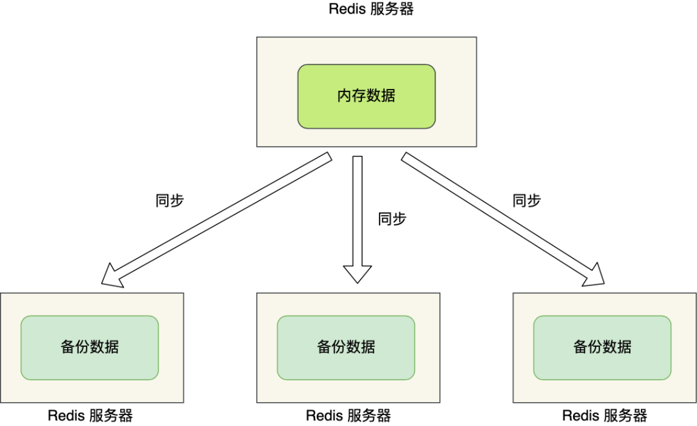
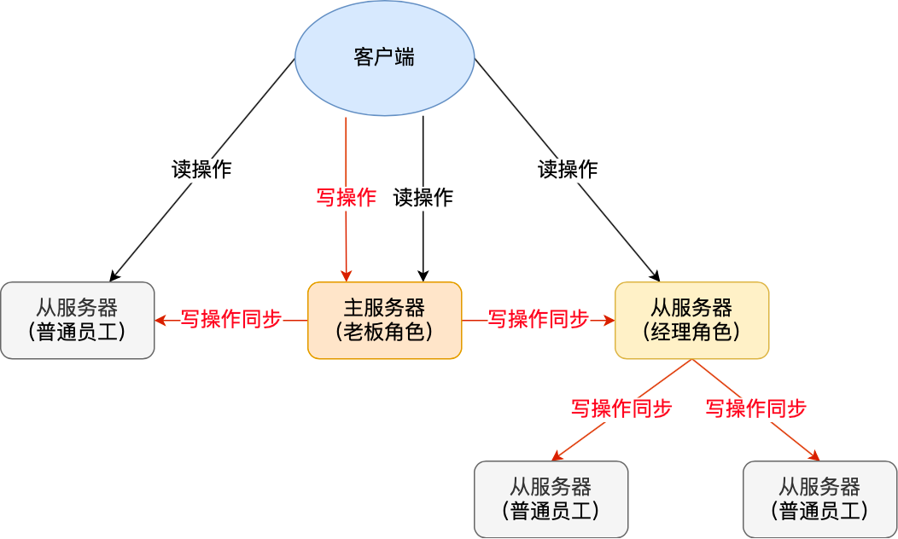

# 主从复制
AOF 和 RDB，这两个持久化技术保证了即使在服务器重启的情况下也不会丢失数据（或少量损失）。

不过，由于数据都是存储在一台服务器上，如果出事就完犊子了，比如：
- 如果服务器发生了宕机，由于数据恢复是需要点时间，那么这个期间是无法服务新的请求的；
- 如果这台服务器的硬盘出现了故障，可能数据就都丢失了。

要避免这种单点故障，最好的办法是将数据备份到其他服务器上，让这些服务器也可以对外提供服务，这样即使有一台服务器出现了故障，其他服务器依然可以继续提供服务。



多台服务器要保存同一份数据，这里问题就来了。
- 这些服务器之间的数据如何保持一致性呢？
- 是否每台服务器都可以处理 读写请求呢？

Redis 提供了**主从复制模式**，来避免上述的问题。
这个模式可以保证**多台服务器的数据一致性，且主从服务器之间采用的是「读写分离」的方式**。
>即： 主服务器可以进行读写操作，当发生写操作时自动将写操作 同步给 其他 从服务器，
> 而 从服务器 一般 只读， 并 接收 主服务器 同步过来的 写操作命令，然后执行。


也就是说， 所有的数据修改 只在主服务器上进行，然后将 最新的数据同步给 从服务器， 这样就
使得 主从服务器 数据是一致的。 

Q: 只有一个 主节点， 那怎么解决 单点问题呢？ 若 同步过程 主节点 宕机， 从节点 没有同步完数据， 会丢失数据 呀？

带着问题 来看看 同步过程。

## 第一次同步

Q: 多台服务器 之间要通过什么方式 来确定谁是 主服务器， 或者 谁是从服务器呢？
A:  我们可以使用 replicaof(redis 5.0 之前 使用 slaveof) 命令 形成 主从关系。

例如：
现在有服务器 A 和 服务器 B，我们在服务器 B 上执行下面这条命令：
```
# 服务器 B 执行这条命令
replicaof <服务器 A 的 IP 地址> <服务器 A 的 Redis 端口号>
```
接着 服务器 B 就会称为 服务器 A的 从服务器。然后 执行 第一次 同步：
主从之间的 第一次同步 分为三个阶段：
1. 建立链接，协商同步
2. 主服务器 同步数据 给 从服务器
3. 主服务器 发送 新的 写操作命令 给 从服务器


### 第一阶段：建立链接，协商同步
执行了 replicaof 命令后， 从服务器 （ 谁执行 命令，谁就是 丛机  ）就会执行 psync 命令， 表示 我要进行 数据同步。
psync 命令 包含两个参数：
- runID， 每个Redis服务器在启动时 都会生成一个 随机的ID来唯一标识自己。
    - 当 从服务器 和 主服务器 去进行 第一次同步时， 由于不知道 主服务 是谁， 就设置为 "？"
- offset， 表示 复制的进度（即：数据复制完成度），第一次同步时， 设为 "-1" 


>主服务器收到 psync 命令时，会 用 FULLRESYNC 作为 响应命令 返回给 对方。
>并且 响应命令 会带上 这两个参数 的值。 主服务的 runID 和 主服务器目前的复制进度，
> 从服务器收到响应后， 会报存 上面两个参数。


FULLRESYNC 命令的意图是  采用全量复制的 方式， 也就是 说 ：主服务器会把所有数据 都同步给 从服务器
所以， 第一阶段的 工作是 为了 全量复制 做准备。

### 第二阶段： 主服务器 同步数据 给从服务器

接着， 主服务器 会 执行 bgsave 命令  来生成 RDB 文件， 然后 把这个文件 传输 给 从服务器。
从服务器 收到 来自主服务器的 RDB文件后  ， 会 先清空当前数据，然后 载入 RDB 文件。

> 注意： 主服务器 生成RDB文件 是用的 bgsave ，用的子进程 生成，不会 阻塞 主服务器 主线程的。
> 但是 在 子进程 生成RDB文件 的这段时间，  主线程 执行的写命令 是没有 记录到 刚刚 生成的 rdb文件中的。
> 这时，主从数据就不一致了

那么 为了  保证 主从服务器 的数据一致性。 主服务器 在下面的 三个间隙 中 会
将 收到的 写操作 命令 写入到 replication buffer 缓冲区 中。
- 主服务器 生成 RDB 文件期间
- 主服务 发送 RDB 文件给 从服务器 期间
- 从服务器 加载 RDB 文件期间

### 第三阶段： 主服务器 发送 新的写操作命令给 从服务器
主服务器 发送 RDB 文件完成后， 从服务器 收到 RDB 文件后， 会 丢弃所有 旧数据.
将 RDB 文件 载入内存后， 会 给 主服务器 一个 ack 确认消息。

主服务 收到 ack 确认后， 将 replication buffer 中的记录的 写操作命令 也发送给 从服务器，
这时候， 从服务器执行来自主服务器 replication buffer 缓冲区里发来的命令，这时主从服务器的数据就一致了。

## 命令传播
主从服务器 完成第一次 同步后， 会维护 一个 TCP 连接


后续主服务器可以通过这个连接继续将写操作命令传播给从服务器，然后从服务器执行该命令，使得与主服务器的数据库状态相同。

而且这个连接是**长连接的，目的是避免频繁的 TCP 连接和断开带来的性能开销**。

上面的这个过程被称为**基于长连接的命令传播，通过这种方式来保证第一次同步后的主从服务器的数据一致性**。

## 分摊主服务器压力
我们知道 主从第一次同步过程中，有两个耗时操作：
- 生成RDB文件。
    - 生成RDB 执行的是 bgsave， 主进程 会 fork 子进程来创建RDB文件
    - fork 子进程是  写时复制， 如果 内存数据 过大，那么 fork 时 是会阻塞 主进程的。从而使得 redis 无法正常处理请求
- 传输RDB文件
    - 传输RDB文件 会占用 主服务器 的网络带宽，会对主服务器响应命令请求产生影响。
    
为了解决这个问题，从服务器可以有自己的从服务器，我们可以把拥有从服务器的从服务器当作经理角色，
它不仅可以接收主服务器的同步数据，自己也可以同时作为主服务器的形式将数据同步给从服务器，组织形式如下图：



通过这种方式，主服务器生成 RDB 和传输 RDB 的压力可以分摊到充当经理角色的从服务器。

此时如果目标服务器本身也是「从服务器」，那么该目标服务器就会成为「经理」的角色，不仅可以接受主服务器同步的数据，也会把数据同步给自己旗下的从服务器，从而减轻主服务器的负担。

#