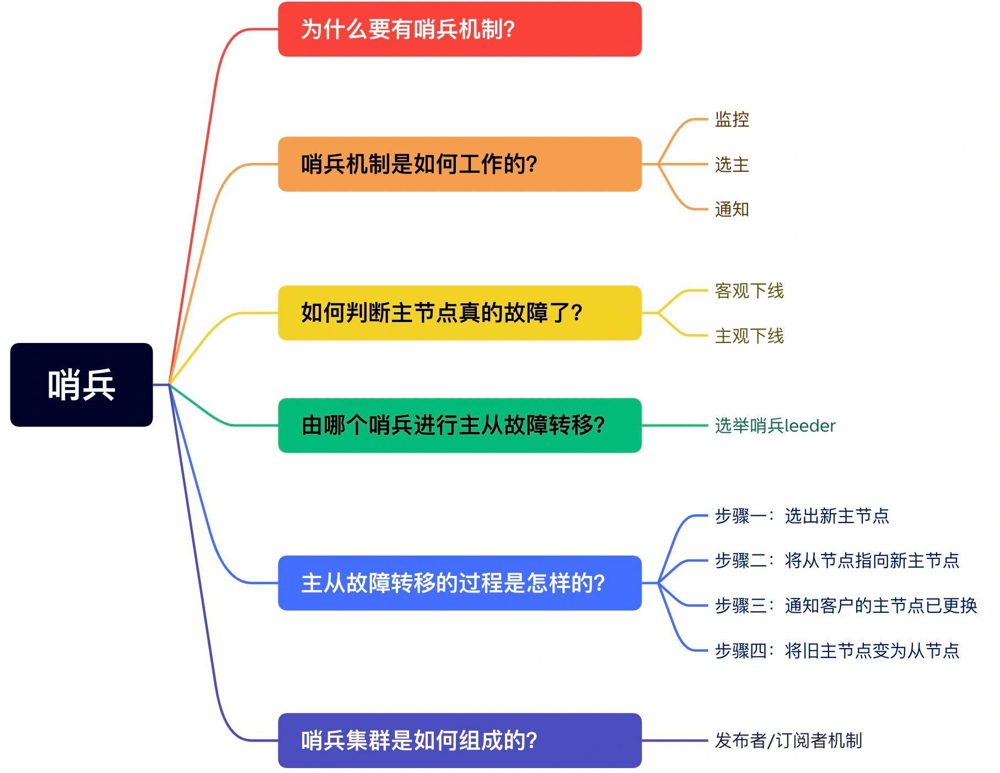
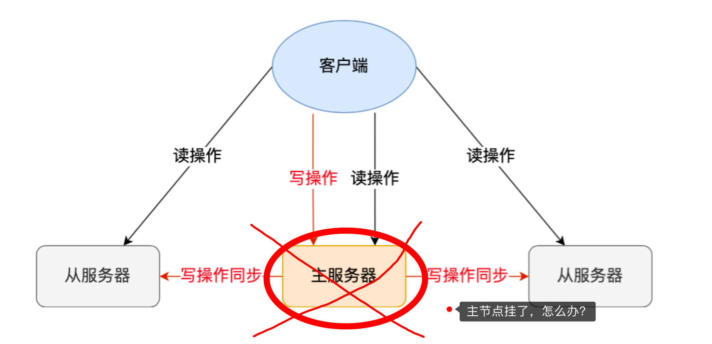
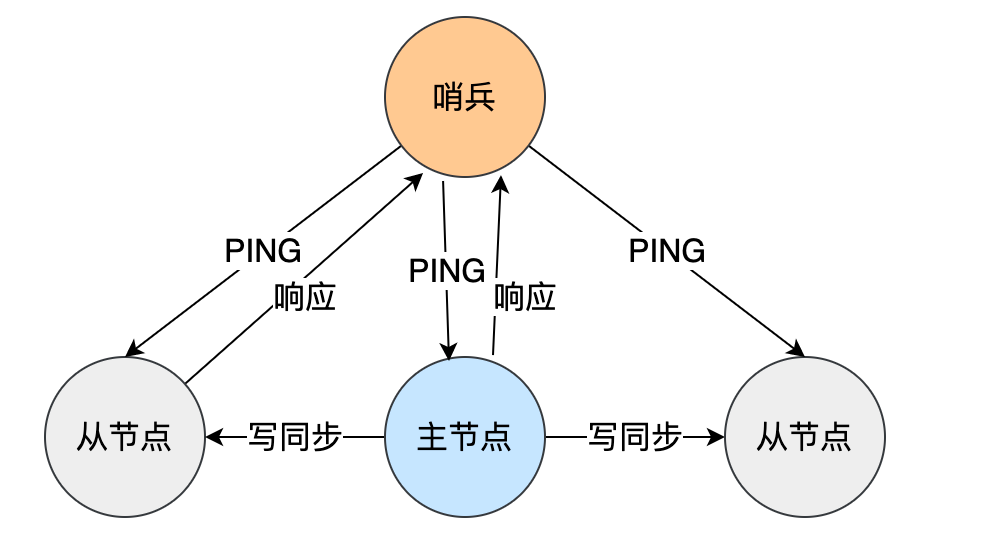
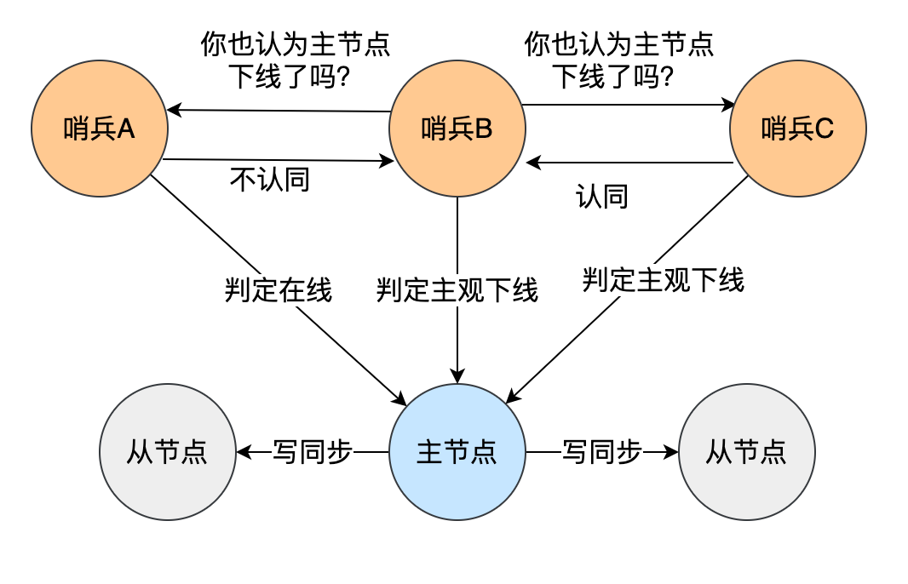

# 为什么要有哨兵机制？
在Redis 的主从架构中，由于 主从模式 是读写分离的， 如果 主节点挂了
，那么将没有主节点来服务客户端的写操作请求，也没有主节点给从节点（slave）进行数据同步了。

如果 需要 恢复服务的话， 则需要 人工接入， 人工选择一个 从节点 变为 主节点。
然后让其他从节点指向新的主节点，同时还需要通知上游那些连接 Redis 主节点的客户端，将其配置中的主节点 IP 地址更新为「新主节点」的 IP 地址。

是不是感觉太low， 竟然没有 故障自动转移 主节点功能。

如果 能监控 主节点变化，当发现主节点挂了，自动将一个 从节点 切换为 主节点 就完美了。

Redis在2.8版本以后 提供的 哨兵（sentinel）机制， 它的作用就是 主从节点故障转移
> 它会检测 主节点 是否存活， 如果发现 主节点 挂了， 它就会  选举一个从节点 切换为 主节点，
> 并且把 新主节点的 相关信息 通知给 客户端

# 哨兵机制是如何工作的？

哨兵其实是一个 运行在 特殊模式的 Redis进程，所以它其实也是 一个 节点。
从“哨兵”这个名字也可以看得出来，它相当于是“观察者节点”，观察的对象是主从节点。

当然，它不仅仅是观察那么简单，在它观察到有异常的状况下，会做出一些“动作”，来修复异常状态。
哨兵节点主要负责三件事情：监控、选主、通知。

# 如何判断主节点真的故障了？

心跳检测机制。
>哨兵 会每隔 1秒 给所有 主从节点 发 ping 命令， 当 节点 收到 ping 命令后，回复 一个响应命令给哨兵。
这样，哨兵 就可以 判断 它们是否 正常运行。 

如果 某个节点 没有在 规定的时间内  返回响应， 哨兵 就会把它 标记为 **主观下线**.
>这个「规定的时间」是配置项 down-after-milliseconds 参数设定的，单位是毫秒。

主观下线？难道还有客观下线？?
是的没错，客观下线只适用于主节点。

之所以针对 主节点 设置两个状态，是因为  主节点可能 并不是 因为故障 导致的 没有及时返回响应，
也可能是 因为主节点的 系统压力较大 或者 网络拥塞。 （因为 redis 只有主节点 能接受 写请求）

所以为了 减少误判， 哨兵 一般也不会 只部署 一个节点，  而是 用多个 哨兵节点 形成 哨兵集群（最少需要三台）
,通过 多个哨兵 一起判断，， 就可以 避免单个 避免 单点问题。
同时，**多个哨兵的网络同时不稳定的概率较小，由它们一起做决策，误判率也能降低**。

具体是怎么判定主节点为「客观下线」的呢？

当一个哨兵判断主节点为「主观下线」后，就会向其他哨兵发起命令，其他哨兵收到这个命令后，就会根据自身和主节点的网络状况，做出赞成投票或者拒绝投票的响应。

当这个哨兵的赞同票数达到哨兵配置文件中的**quorum 配置**项设定的值后，这时主节点就会被该哨兵标记为「客观下线」。

PS：quorum 的值一般设置为**哨兵个数的二分之一加1**，例如 3 个哨兵就设置 2。 过半原则

哨兵判断完主节点客观下线后，哨兵就要开始在多个「从节点」中，选出一个从节点来做新主节点。

#

