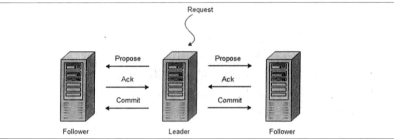

zk是一个 开源的 分布式协调服务， 有 雅虎创建，Google Cubby的开源实现。 
设计目标是 将那些复杂容易出错的分布式一致性服务 封装起来，构成一个高效可靠的 原语集，并 以一系列 简单的接口 提供给用户使用。

zk可以保证如下 分布式一致性：
1. 顺序一致性：  从同一个客户端发起的事务请求，最终将会严格地 按照 其发起顺序 被应用到 zk中
2. 原子性：是有事务的请求处理结果  在整个集群上 所有机器上的应用应该都是一致的，也就是说，要么整个集群机器都成功 应用了某一个事务，要么都没有应用。
3. 单一视图：  无论客户端连接到的 是哪个 zk服务器，它 看到的 服务端 数据模型 都是一致的
4. 可靠性  ：zk **仅仅保证 一定时间 内**，客户端 始终 能够 从服务器上  读取到 最新的数据状态。

# zk设计目标
- zk致力于 提供一个 高性能，高可用，且具有**严格的顺序访问控制能力（主要是 写操作的 严格顺序性）的分布式协调服务**

>高性能使得zk 能够应用于 那些 对系统 吞吐量 有明确要求的 大型分布式系统;
> 高可用 使得 分布式的单点 问题 得到了很好的 解决;
> 严格 的 顺序访问 控制 使得客户端 能够 基于 zk 实现一些 复杂的 同步原语;

## 四个 设计目标：
1. 简单的数据模型
   - zk使得 分布式程序  能够通过一个**共享的树形结构**的 名字空间 来进行相互协调。
2. 可以构建集群
    - 组成zk集群的**每台机器都会 在内存中维护一个 当前的服务器状态**，并且每台机器之间都互相 保持着通信
    - 值得一提的是，只要**集群中超过 一半 的机器能够正常工作**，那么整个集群就能够 正常 对外服务
    - zk客户端 会选择 跟集群的任意一台机器  来参加 tcp连接，
      而 一旦 客户端与  某台 zk服务器 之间的 连接断开之后，客户端 会自动 连接到 集群中的 其他机器。
3. 顺序访问
    - 对于来自 客户端的 每个 更新请求，zk都会 分配 一个全局唯一的 递增编号，这个 编号反映 了所有 事务操作的先后顺序，
    - 应用程序 可以使用 zk的这个 特性来实现 更高层次的 同步原语。
    
4. 高性能
    - 由于 zk 将**全量数据 存储 在内存中**，并 直接服务与客户端 的 所有非 事务请求， 所以 zk 尤其 适用 于**以读操作为 主的应用场景**
    

# zk基本概念

## 集群角色
通常在分布式系统中，构成集群的每一台机器都有自己的角色，最典型的集群模式 就是 master/slave(主备），
在这种模式中，我们把 能够 **处理所有 写操作 的 机器 称为 master**，把 所有 通过 异步 复制方式 获取 最新数据，
并提供 读 服务的 机器 称为  slave机器

but。。。。 但是， zk并没有 沿用。

引入了 Leader，Follower， Observe 三种角色。
-  zk集群中的机器 通过一个 leader 选举过程来 选定 一台 被称为 “Leader" 的机器， Leader服务器  为 客户端 提供 **读和写服务**
-  Follower 和 Observe 都能够 提供 **读服务**，唯一 的 却别 就是 Observe 不参与 Leader 的选举。
-  Observe也不参与 写操作的  “过半写成功”策略。  所以 Observe 可以在 不影响 写 性能 的情况下 提升 集群的 读性能。

## 会话session
Session是  指 客户端会话
>在 zk 中，一个 客户端连接 是 指 客户端 和 服务器 之间的 TCP 长链接
> zk对外的 服务端口默认是 2181 ， 客户端 启动的时候， 首先 会  跟 服务器 建立 一个 TCP连接

从 第一次 连接 建立 开始， 客户端 会话 的 生命周期也开始了，
通过这个 连接，客户端 
- 能够通过 **心跳 检测 与服务器   保持有效的 会话**
- 也能够 向 zk服务器 **发送 请求 并 接受 响应** 
- 同时 也能 通过这个 连接 **接收来自 服务器 的 watch 事件通知**

Session的  sessionTimeout 的值  用来 设置一个 **客户端 会话的超时 时间**。

当 由于 服务器 压力大，网络故障，或者是  客户端 主动断开 连接等  各种原因 导致客户端 断开连接， 
***只要 在 这个 sessionTimeout 时间内 ，重新连接上 集群的  任意一台机器，那么 之前 创建的 会话 仍然 有效***。

## 数据节点（Znode）
zk中有两种节点： 机器节点， 数据节点。
zk的所有 数据 存在 内存中， 数据 模型 是一棵树（Znode Tree),  用斜杠（“/"),  进行分割 的路径，就是  一个 Znode， 
>例如：  /foo/path1 。 每个 Znode 上 都会 保存 自己的 数据 内容，同时 保存 一系列 属性 信息。

Znode 氛围 临时节点 和 持久节点。
- 持久节点： 一旦Znode 被创建， 除非 主动 进行 Znode 的 移除操作，否则这个 Znode将会一直保存
- 临时节点： 它的 **生命周期 跟 客户端会话session 保持一致**，一旦session 失效，那么 这个 客户端创建 的 临时 节点 也会 被 移除。

另外 zk 允许 用户 为 每个节点  添加一个 特殊 的 属性： **sequential（SEQUENTIAL)**，
一旦 节点 被标记 上 这个 属性，那么 这个 节点 被创建的 时候，zk会 自动 在 其节点 后面追加上 一个 整型数字，
这个 整型数字 就是  一个 由**父节点 维护的 自增数字**。

## 版本
对于 Znode ， zk都会 维护一个  Stat的 数据结构， 记录三个数据
1. Version （ 当前 Znode的 版本）
2. Cversion（当前Znode  子节点 的版本）
3. Aversion（ 当前 Znode 的 ACL 版本）

## watcher
Watcher 时间监听器，是 一个 很重要的特性。
- Zk  允许 用户 在 指定 节点 上 注册 一些 Watcher，并且 在 一些特定 事件 触发的时候，  
- zk会 将 事件 通知到 感兴趣 的客户端上去。 
  
***该机制 是 zk 实现 分布式 协调服务 的 重要 特性***。

## ACL
zk采用 ACL (Access  Control Lists) 策略 来进行 权限控制。 
类似 linux 文件系统的权限 控制。zk定义的  以下 5 种 权限：
- CREATE ： 创建 子节点的 权限
- READ ： 获取 节点 数据 和 子节点 列表 ~
- WRITE ： 更新 节点数据 ~
- DELETE ： 删除 子节点数据 ~
- ADMIN ： 设置 ACL 的 权限

注意： CREATE  ，DELETE 都是 针对 子节点 的权限控制

# ZAB
zk并没有完全采用 Paxos， 而是 使用了 一种 称为 **ZAB（zookeeper atomic broadcast）原子消息广播协议**，
来作为  其 数据一致性 的 核心算法。

ZAB协议是 为 分布式 协调服务  zk专门 设计的 的 一种支持 崩溃 恢复的 原子广播协议。**特别为 zk设计**。

基于zab， zk实现了一种 主备模式的 系统架构 来保持 **集群中 各个 副本 之间的 数据一致性**。
- Zk 使用 一个 单一的 主进程  来接收  来自客户端 的 所有事务请求。
- 并 采用 ZAB，  将 服务器 数据状态变更 以**事务 Proposal 的形式 广播 到所有的 副本进程**上去
- ZAB 协议的 这个 主备模型 架构  **保证了 同一时刻 集群中  只能有一个 主进程 来广播服务器的 状态变更**。 
  因此 能够 很好 的 处理 客户端 大量的 并发请求。

另一方面，考虑到 分布式 环境中， **顺序执行** 的 一些状态变更 其前后 会存在一定的 依赖关系  
有些状态 变更 必须 依赖 与  比它  早生成的 那些状态变更。
这样的依赖关系 也对 ZAB提出了 一个 要求：
- ZAB协议 必须能够 保证 一个 全局的 变更 序列被 顺序的应用.
  也就是 说，ZAB协议 需要 保证 如果一个 状态变更 已经被处理了，那么所有的 它依赖的  状态变更  都应该 已经 提前被处理了。

最后考虑到 **主进程任何时候 都有可能  出现崩溃或 重启现象**， 
因此 ZAB 还 需要 做好  当前主进程 异常 情况的 时候，依然 能够正常工作。

AB协议 的 核心 是 定义了 对于 那些 **会改变 zk服务器 状态**的 事务请求 的 **处理方式**，
即：
   所有事务请求必须有一个**全局唯一的服务器**来协调处理，这样的 服务器 被称为**Leader服务器**,而
   余下的服务器则称为 **Follower 服务器**。

1. Leader 服务器 负责 将一个 客户端的 事务请求 转化成 一个 事务 Proposal（提议），并 将 该 Proposal 分发 给 集群中的 所有 Follower服务器
2. 之后Leader 需要 等待 所有的 Follower 反馈
3. 一旦 超过  **半数 的 Follower 进行了 正确的反馈后**， 那么 Leader 就会  再次向 所有的Follower 分发 Commit 消息，要求  其 将 前一个 Proposal 进行提交

ZAB包括两种基本的模式，分别是**崩溃恢复 和 消息广播**。

>崩溃恢复：
> 整个 服务框架 在启动过程中，或 是 当 Leader 服务器 出现 网络中断 、崩溃退出 与 重启 等异常情况时，
  ZAB协议就会 进入 **恢复模式** 并**选举 产生 新的 Leader服务器**
 选举产生了 **新的 leader服务器**，同时 **集群中 已经有过半的机器 与该 Leader 服务 完成了 状态同步之后**，  ZAB协议 就会 退出 恢复模式  

其中，所谓 的 状态同步 是 指 数据同步，用来保证 集群中 过半的 机器 能够 和 Leader 服务器 的 数据状态 保持一致。

>消息广播：
> 当集群中 **已经有过半的 Follower服务器 和 Leader 服务器 的 状态同步**，那么整个 服务框架 就可以 进入 消息广播模式了。

当一台 **同样 遵守 ZAB 协议的 服务器 启动后 加入 到集群中**时，如果 此时 已经存在一个 leader 服务器 在负责 进行 消息广播，
那么 **新加入的 服务器 就会 自觉 进入  数据恢复模式**

- zk设计成 只允许一个 Leader 服务器 来 进行事务请求的 处理。
- Leader 服务器 在 接收 到 客户端的 事务请求后，会 生成 对应的 事务提案（Proposal） 并发起一轮广播协议；
  如果集群中的其他机器 接收 到客户端的 事务请求，那么 这些**非 Leader 服务器 会 首先将 这个 事务 转发 给 Leader服务器**。

当Leader 服务器出现  **崩溃 或者 机器重启，亦或是 集群中 已经 不存在 过半服务器 与 该Leader 服务器 保持 正常通信**时，
那么 在 重新开始 新一轮 的原子广播 事务操作之前，所有 进程 首先 会使用 崩溃恢复 协议 来使 彼此到达一个  一致的状态，
于是 整个 ZAB 流程 就会从消息广播 模式 进入 崩溃恢复模式。

一个  机器 **想要称为 Leader 必须获得 过半进程的 支持**。同时 由于 每个进程 都有可能会崩溃，因此 ZAB协议 运行过程中，
前后  会 出现多个 Leader， 并且 每个进程 也可能 会 多次称为 Leader。 
进入 崩溃恢复 模式后，**只要 集群中 存在过半机器 能够正常 通信，那么 就可以 产生一个 新的 Leader**  并 再次进入 消息广播模式。

>例如：
一个 由 3台机器 组成的 ZAB服务，通常 由 1个Leader  2个Follower机器组成。某个 时刻，加入 其中的 一个 Flower  挂了， 整个ZAB集群不会 中断服务，这是因为 leader 仍然能够获得 过半（包括Leader 自己）的支持。

## 消息广播
ZAB协议的**消息广播过程使用的是一个原子广播协议**， 类似于一个 **二阶段提交**的过程。
针对 客户端的 事务请求，Leader 服务器 会为  这个事务请求 生成 对应的 Proposal（提案），并 将 Proposal 发送给  其他所有 机器，
然后 在 分别 收集 各自的选票，最后进行事务提交。

- 这里 跟 标准的 2PC 流程 略有不同 。 在 zab的 二阶段提交过程中，**移除了 中断的 逻辑**，
所有的Follower  要么正常反馈 leader 提出的 Proposal，要么 就**抛弃 这个 Proposal** （而不是 中断带来的回滚）

-  同时 ZAB 将 2PC中的  中断逻辑 移除 意味着:   
   - 我们可以在 **过半的Follower 都反馈响应Ack之后， 就开始 提交 Proposal事务**，而不需要 等待所有的 Follower 都反馈响应

当然，这种 简化了的 二阶段提交  模型下，是**无法 处理 Leader  服务器 崩溃 退出 带来的  数据不一致问题**
因此  ZAB 协议中 添加了  另一个 模式， 即 **采用 崩溃恢复 模式** 来解决这个 问题

另外 整个 消息广播 协议 是基于  具有 **FIFO 特性的 TCP 来进行 网络通信**的， 因此 能够 保证 消息广播过程中 **消息接收 与 发送的 顺序性**。

- 在广播过程中，Leader 会为 **每个Follower 都 各自分配一个 单独的 队列**， 然后  将 需要广播的事务
  Proposal依次放入  队列中，并且根据 FIFO 策略进行 消息发送
- 每一个 Follower 在收到这个 事务Proposal之后，都会 **首先  以事务日志 的形式 写入到 本地磁盘中去，并且 成功写入之后**  反馈 给 leader 服务器 一个 Ack 响应  
- 当Leader 服务器 接收 到 超过 半数 Follower 的 Ack响应后，就会 广播一个 Commit 消息 发送给 所有的 Follower 通知其 进行事务提交
- 同时 Leader 也会 完成 对事务的提交， 每个 Follower 在接收到 Commit 之后，也会完成 对事务 的提交

## 崩溃恢复
ZAB的 消息广播过程，正常情况下运行非常良好，但是 一旦 Leader 服务器 崩溃，或者 由于网络原因 **导致 Leader 与 过半的Follower 失去联系**，
那么 就会 进入崩溃恢复模式。

在ZAB 中，为了保证程序运行，整个恢复 过程 结束后 需要 选举出 一个 新的 Leader服务器。
因此 ZAB 需要一个 高效且可靠 的Leader 选举 算法， 从而 保证 能够 快速选举出新的 Leader ，
同时 还需要让集群中的 所有 其他机器 也能够 快速 地感知 到 选举产生 的 新的 Leader

## 基本特性
我们知道，ZAB规定了 **一个 事务Proposal 在一台机器上被处理成功，那么 应该在 所有的机器上 都被处理成功**，哪怕 机器出现 故障崩溃。

来看看 崩溃恢复过程中，可能 会 出现 两个数据不一致性 的 隐患 ，以及 针对这些 ZAB 需要 保证的 特性。

特性一：
- ZAB需要保证 ： 那些已经在Leader服务器上 被提交的事务最终被所有服务器提交。
Q: 数据同步的过程 Leader 挂了， 某些 Proposal 只在 原Leader上。 新Leader 由于不知道 那些提交到 旧leader 的Proposal，不就 没有在
所有服务器提交吗？
A: todo  这就是 ZAB 的 第二天特性了。

假设一个事务在Leader服务器上提交了，并且已经得到 过半Follower 服务器Ack反馈，
但是 **它将 Commit 消息发送 给所有的 Follower 之前，Leader挂了**。 如图：

特性二
- ZAB需要确保丢弃那些只在leader服务器上 被提出的 提案（事务） 
  
>理解：原来的 Leader 挂了，只能选举其他 服务器 为 Leader，那 原来Leader 提出来的 Proposal 就是一个 幻影Proposal，，
> 所以确保 丢弃 原来 只有 leader上有的 Proposal 

相反，在崩溃恢复过程中， 出现 一个 需要被丢弃的 提案，那么崩溃恢复后  需要 跳过该事务的 Proposal 。

>Q： 那么 怎么跳过呢？ 怎么知道 这是只在 上一个 leader 提交的 Proposal 呢？
A: 这里 其实 其他follower 根本没有 提交这个 事务Proposal， 所以 新Leader 自然不知道， 只有  旧Leader 恢复之后
才可能 获取这个 幻影Proposal， 只要 这个 旧Leader 恢复之后，把  幻影Proposal 放弃就好。
Q: 那么 旧Leader 怎么 知道 那个 Proposal 是  幻影Proposal 呢？
A : epoch,  新Leader 事务 的 Epoch 是 更大的，去同步 新Leader 数据，自然 就没有 这条 幻影Proposal

>假设 初始Leader 服务器server1 提出一个事务 Proposal 13之后，就崩溃退出了，
> 导致 集群中的 其他 服务器 都没有 收到 这个 Proposal 13。  于是 当  server 1恢复过来 再次加入 集群中的时候， ZAB 需要 确保 丢弃 Proposal 13这个事务。

这些特殊情况，就决定了 ZAB必须设计一个 这样的 选举算法：
1. 能够确保提交 已经 被 leader 提交过得事务 Proposal
2. 同时 丢弃 已经 被跳过的 事务 Proposal

针对这个要求，如果能 让 Leader  选举算法 能够 让选举出来 的Leader  拥有 集群中 所有机器最高编号（即 ZXID最大）的事务 Proposal ，
那么 就可以 保证 这个 新选举 出来的 Leader  一定 具有 所有 已经提交的 提案，  
更为 重要的 是， 如果 让 **具有 最高 编号事务Proposal 的机器 来成为 Leader**， 就可以省去 Leader 服务器 检查  Proposal 的提交 和 丢弃。

## 数据同步
完成Leader 选举之后， 在正式开始 工作（即 接收 客户端的事务请求，然后提出新的提案）之前，
Leader 服务器 会首先 确认 事务日志中的 所有Proposal 是否都已经 被 **集群中 过半的机器提交**，即是否完成 数据同步。

所有的 服务器 要么称为 leader 要么成为 Follower 并 和 leader 保持同步。
选举之后，等到所有的 Follower 将 所有 未同步的 事务 Proposal 都从 Leader  上 同步过来 并 成功应用到 本地数据库（zk的 存储）后，
Leader 才会  将 该 Follower 服务器 加入 到  真正的  可用 Follower列表中。

上面是 正常的数据同步逻辑。那么 ZAB是如何 处理那些 需要 被丢弃的 事务Proposal 的？
- 在ZAB的事务编号 ZXID 的设计中， ZXID 是 一个 64位的 数字， 其中 低32 位 可用看作 是 一个简单的 单调递增的 计数器，
针对 客户端 的每一个 事务请求，Leader 在 产生一个 新事务Proposal的时候，都会 对该计数器 进行 +1 ，

- 而 高 32 位  则代表了 leader 周期的 epoch 编号(标志是在 哪个 leader 时期），每 当选举 产生 一个 新的 Leader 服务器，就会 从这个 leader 服务器上 取出 其本地 日志中 最大事务 Proposal的 ZXID, 
  并 将 ZXID 的 epoch(高 32位）进行 +1，  然后 将 低32位（事务Proposal编号） 置0。 
  
- ZAB协议中  通过 epoch编号 来区分 Leader 周期变化的 策略 ，能够有效 避免不同 的 leader 服务器 错误地 使用 相同的 ZXID编号 提出 不一样的 事务。

因此，当一个 包含 上一个 leader 周中 尚未提交的 事务 的 服务器 启动时，肯定无法 成为 leader，因为 它 的  ZXID 的 高位 epoch 肯定不是 最高的（因为 集群中 肯定有 机器 epoch更大）
当 这台机器加入到集群中， 以 Follower的角色 连接上 leader 服务器之后， Leader 服务器 会根据 自己服务器上 最后被提交的 Proposal 来和     Follower服务器 上的  Proposal  进行比对，
比对的 结果 必然是 leader  更大（epoch大）， 就会 要求 该 Follower 进行一个 **回退操作**-----（回退到 一个 确实 已经被  机器 过半 机器提交的 最新事务 Proposal

在ZAB协议的设计中，每一个进程都有可能处于一下三个状态之一。
- Looking： leader  选举阶段
- Following： Follower 和 Leader 保持同步状态
- Leading ： Leader服务器 作为主进程 领导状态

>组成ZAB协议的所有进程启动的时候，初始化状态 都是 looking 状态，此时 进程中 不存在 Leader。所有 处于 这种状态的  进程，都会试图去 选举出一个 新的 Leader。 随后，如果进程发现已经选举出新的Leader了，那么它就会 马上 切换到 Following 状态，并且 开始 和 Leader 保持同步，这里 将处于 Following 状态的服务器 称为 follower， 处于 leading 状态的 服务器 称为 Leader。  考虑 到 Leader  随时会挂掉，当 检测到 Leader 已经挂掉 或者 放弃 Leader地位时，其余的 Follower 就会 进入  looking 状态，并开始新一轮的 选举。

Leader 进程 与 所有的 Follower 进程之间  都通过  心跳检测 机制来感知 彼此的 情况。  如果 **leader 能够在 超时时间 内 正常收到 Follower 的 心跳检测，那么 follower就会 一直 与 该 Leader 保持连接**，
但是，如果在 超时时间 内，Leader 无法 从 过半的 Follower 进程 那里 接收到 心跳检测，或者是TCP 断开，那么Leader  就会终止 对当前 周期的 领导 ，会 自动转化 到 looking状态，所有的 Follower也会选择 放弃 这个 Leader，也转化 到 looking状态。

# zab 与 paxos 区别与联系
联系：
- 两者都存在于一个 类似 Leader 进程的角色，由 其 负责协调 多个Follower之间的运行。
- leader进程都会 等待 超过半数 的Follower 做出正确的 反馈后，才会 将 一个 提案进行 提交
- 在 ZAB 中，每个 Proposal 都有一个 epoch值，用来代表当前的 Leader周期，在Paxos中 也存在这样一个标识，只是名字 变成了 ballot

在Paxos中  一个选举产生的 主进程（leader）会进行两个阶段的工作。 
- 第一阶段是  读阶段，在 这个 阶段 会 通过和 所有 其他 进程 通信的方式  来 收集上一个 主进程（上一个Leader）的提案，并将它们提交。
- 第二 阶段 称为 写 阶段，在这个 阶段，当前 主进程 开始  提出 自己的 提案。

在Paxos的基础上，ZAB提出一个 额外的 同步阶段。 
- 在同步 阶段 之前，也有 跟 Paxos的 读阶段 非常类似的阶段，称为 **发现阶段**。  
- 在同步 阶段， 新的 的 Leader 会确保 半数以上的 Follower  已经提交了 之前 Leader 周期中的 所有事务Proposal（ 选举成功之后，会通信 让所有 Follower 同步跟自己一直）。
- 一旦 同步完成之后，就会执行跟 Paxos类似的 写阶段

# zk的典型应用场景

## 数据发布订阅
数据发布/订阅系统，即所谓的 **配置中心**，顾名思义 就是 发布者 将数据 发布到 zk的一个 或 多个 节点上，
供 订阅者 进行数据订阅，进而达到 动态获取数据的目的。实现 配置信息的集中式管理 和 数据的 动态更新。

发布订阅系统一般有两种设计模式：推磨式（push）和 拉模式（pull)
- 在推模式中，服务端 主动将 数据更新 发送给 订阅者；
- 而 拉模式 则是客户端 主动发起请求 获取 最新数据，通常客户端 都采用 定时 进行 轮询拉取的方式。

zk采用的是 推拉结合的方式： 
- 客户端 向  服务端 注册 自己 需要订阅的 节点，一旦 该 节点的 数据 发生变更，那么 服务端 就会向 对应的 客户端 发送 **Watch时间通知**， 
- 客户端你接收到 这个通知 之后， 就需要  主动 到 服务器 获取 最新数据。

配置管理。 将配置放在一个或多个 Znode 上，并注册 watcher 监听，变更配置之后，客户端会收到更新。

## 负载均衡
DNS 动态域名服务。把  域名 存放到 ZNOde

## 命名服务 
zk实现一套分布式全局唯一Id的分配机制。

在单库单表系统中，可以使用 数据库 自带的 auto_incrment来自动 生成 自增id。但是 随着 规模变大，分库分表 随之出现，而 auto_increment 仅仅能 针对 单一表中的 记录 。因此 这种情况下，就无法 在依靠数据库来生成 唯一 标识。于是 必须 寻求 一种 能够在 分布式 环境 下 生成 全局唯一的 Id 的方法。

全局唯一，很容易想起 UUID（Universally  Unique Identifier 通用唯一识别码），一个 标准的UUID  包含 32为 字符 和 4个短线 的 字符串。
但是 也有缺点：
- 长度过长。这是 它 最大的问题，存储需要 耗费 更多的空间。
- 含义不明。 根据这个 看不出任何含义

利用 zk 创建的 Znode的完整名字。
1. 所有客户端都会根据自己的任务类型，在指定类型的 任务下面通过 调用create()来创建一个顺序节点。例如 创建  “job-" 节点。
2. 节点创建完成之后，create()会返回一个 完整的节点名，例如 “job-000000000003"
3. 客户端 拿到这个 返回值后，拼接上type类型，例如：”type2-job-00000000003"就可以作为全局唯一id

在zk中，**每一个数据节点 都能够 维护一份 子节点的  顺序顺列**，当客户端 为其创建一个子节点的时候，zk会自动以后缀的形式  对其子节点上 加一个 序号。

## Master 选举
选举需求：
在所有的 集群机器中 选举出一台 作为 Master。

针对这个 需求，通常情况下，我们可以选择常见的 主键特性 来完成： 集群中的所有机器 都向数据中插入一条 相同 主键的记录，数据库 会帮助我们 自动进行 主键冲突检查，也就是说  所有进行 插入请求操作的客户端 中，只有一台能够成功，
那么 我们 就认为  向 数据库中 成功 插入 数据的  客户端 称为 Master（ 完全 看 哪台 先插入？）

但是 需要 考虑的问题是，如果 当前选出  Master挂了，那么 该如何处理呢？ 
谁来 告诉我 Master 挂了呢？ 显然 关系 型 数据库 无法 通知我们 这个事件

## 分布式锁

分布式锁 是控制 分布式系统之间 同步 访问 共享资源 的一种方式。
如果 不同的系统   或 同一个 系统 不同 主机之间 共享了 一个 或 一组 资源。那么 访问 这这些 共享资源的 时候， 
往往 需要 通过一些 互斥 手段，来防止 彼此之间的 干扰，以 保证 一致性，在 这种情况下 ，就需要 使用 分布式锁了。

平时，依赖 **数据库固有的 排他 性  来实现 不同进程 之间的互斥**， 
这确实 是 一种广泛使用的 分布式锁 实现方式，然而 有一个 不争的事实，**目前 绝大多数  大型分布式 系统 的性能 瓶颈 都集中 在 数据库操作上**。  
因此 ，如果 上层 业务 再给数据库 添加一些额外的锁，例如 行锁，表锁 甚至是 繁重 的事务 处理，就会 让数据库 不堪重负。

### 排他锁
排他锁 简称 X锁， 又 称为 写锁 或 独占锁，是一种 基本的 锁类型。
排他锁的核心 是  **如何保证 当前有且仅有  一个事务 获取到锁，并且锁 被释放后，所有 正在等待的 事务 都能够 被通知到**。

zk中通过 数据节点 来表示 一个锁。 例如  /exclusive_lock/lock 节点 就可以 被定义为 一个锁。

获取锁：
在获取 排他锁时，所有的 客户端 都会尝试 调用 create（）接口， 在 /exclusive_lock 节点下 **创建  临时  子节点  /exclusive_lock/lock**.   

- zk会保证 在所有的 客户端中，最终 只有一个 能 客户端 能创建成功，那么 就可以 认为  该客户端 获取 到了锁。 
  同时，那些 没有获取 到 锁的 客户端 就需要 到  /exclusive_lock 节点上 **注册 一个Watcher监听**，  以便于  实时 监听 到 lock 节点 的变更情况。

释放锁：  前面定义了 /exclusive_lock  是一个 临时节点， 因此 有两种情况 ，可能释放锁
- 当前 获得 锁的 客户端 宕机，那么 zk 上 这个 临时 节点 就会被 移除
- 正常 执行完 业务逻辑之后，客户端 主动 将自己 创建的  临时 接地那 删除。
无论什么情况下  移除了 lock 节点， zk 都会 通知所有 在 /exclusive_lock 上 注册watcher 监听 的客户端。  这些 客户端 在收到  通知后，可以 再次 重新 发起 分布式获取锁
  

### 共享锁
共享锁 简称 S 锁，又 称为 读锁。 
如果 T1 对数据 对象 O1  加了S锁，那么 T1只能对 O1 进行 读取操作， 其他事务 也能 对 O1 加 S锁。 -----直到  O1 上 所有的 S锁 都被释放。

>共享锁 和 排他锁的 区别就是，  共享锁 对多个事务可见，  但是 排他锁 只有 一个事务可见。

获取锁：  
在需要 获取 S锁，所有客户端 都会 去 **/share_lock 这个 节点 下面 创建一个 临时顺序节点**，
- 如果 当前 是 读请求，那么 就会 创建 例如 /share_lock/192.168.0.1 - R -0000000001的 节点，
- 如果 是 写 请求，那么久创建 例如 /share_lock/192.168.0.1 - W -0000000001 的节点。

判断读写顺序
根据 S锁定义，不同的事务 都可以 对 同一个 数据对象 进行读取 操作，而 **更新 操作 必须在 当前 没有 任何事务 进行 读写 的情况下进行**。
1. 创建完 节点 之后，获取 /share_lock 下的所有 子节点，并对 该节点   注册 子节点 变更的 watcher  监听
2. 确定 自己 的 节点序号 在 所有 子节点 中 的  顺序
3. 对于读请求：
   a. 如果没有比自己 序号 小的 子节点， 或 是 所有 比自己小的节点都是 读请求，那么 表面自己 已经 成功获取到了 S锁，同时 开始  执行 读取 逻辑
   b. 如果 比自己 序号小的节点中 有  写的请求，那么 就需要 进入 等待
   对应 写请求：
   如果自己 不是 序号 最小的 子节点，那么 就需要 进入等待。
   接收到  Watcher 通知后， 重复 1，。
   

#### 羊群效应

上述 S锁的实现，大体上 能满足 一般的 分布式 集群 竞争锁 的需求，
并且 性能 都还可以。 

这里说的 一般 场景  是指 **集群 规模不大，一般 10台以内**，但是  机器 规模 扩大 之后，会有 问题 在 判断读写顺序 上面。

在整个过程中，大量的 **Watcher 通知** 和 **子节点列表 获取**  两个 操作 重复运行。
并且 绝大多数 运行结果 都是 判断 出 自己 并非是 序号 最小的 节点从而 继续等待。
>客户端 无端 收到过多 和自己 不想关的 通知，如果在规模比较大 的情况下，不仅  会对 zk服务器 造成 巨大的 性能影响 和网络冲击，
> 更为 严重的 是，如果 同一 时间 多个节点 对应的 客户端 完成事务 或是 事务中断 引起 的  节点消失， 
> zk服务器 就会在短时间内 向 其余客户端 发送 大量 的 watcher 通知======这就是  所谓的羊群效应

羊群效应 根源 在于： 没有找 准 客户端 真正的 关注点。
核心逻辑在于：判断自己是否 是 所有 子节点 中 序号 最小的。于是，很容易  
可以联想 到，每个 节点 的客户端 只需要 关注 比自己 序号 小的那个 相关节点 的 变更情况就可以了，
而不需要 关注 全局的 子列表 变更情况。
   

