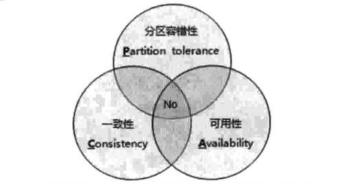
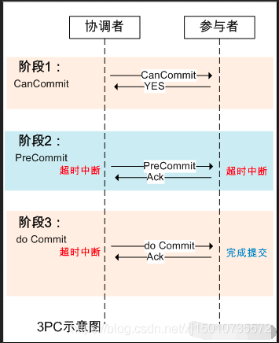
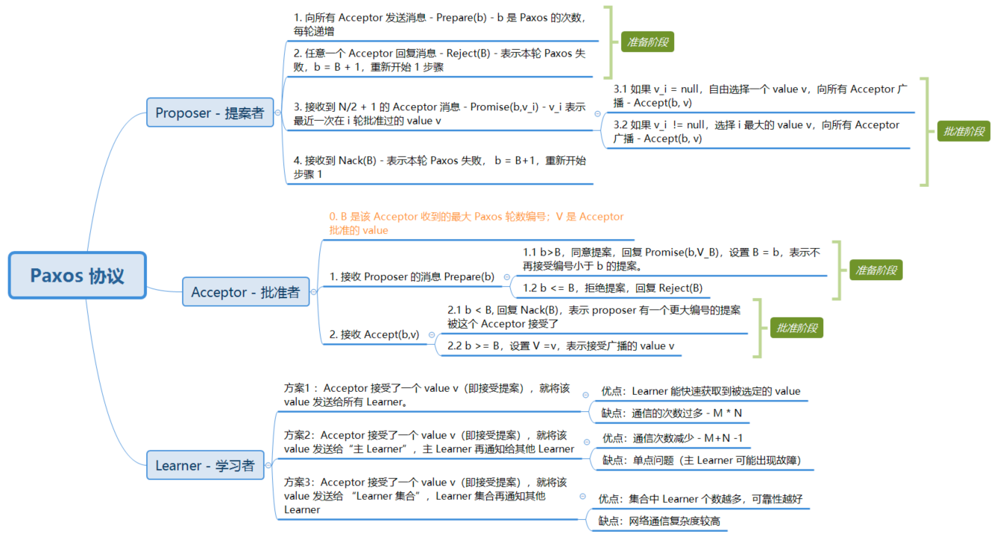

# 分布式环境的各种问题

## 通信异常
从集中式 -> 分布式 演变过程中， 必然 引入 网络因素， 由于网络本身的 不可靠性，
因此 也会引入 额外的问题。

>分布式系统 需要在各个节点之间通信，每次网络通信， 都有 网络不可用的风险。
> 所以， 网络光纤、路由器、 DNS等硬件设备 或是 系统不可用 都会导致一次网络通信无法顺利完成。

另外，即使 网络通信正常完成， 其延时 也会 大于 单机操作。
>通常 认为 在现代计算机体系结构中，单机内存访问的 延时在 纳秒数量级（通常是 10ns左右 )，
> 而 正常的 一次网络 通信的延迟 在 0.1~1 ms 左右（相当于 内存访问 的 105~106 倍）。

巨大的 延时差别， 也会影响 消息的收发过程。 因此  消息丢失 和 消息延迟 变得非常普遍。
>内存处理较快，网络传输较慢。  发送太快，网络传输不过来，会丢弃部分数据。 发送太快，网路中会堆积消息，网络拥塞，导致延迟。

## 网络分区
当网络由于发生异常情况， 导致分布式系统中 部分节点 之间的网络延时 不断增大， 最终导致
整个 分布式系统中， 只有部分节点 能够正常通信（延时太大 会被分布式系统认为 无法通信）。

这个现象 就是 网络产生了分区， 也就是 俗称 的 "脑裂"。
>当网络分区出现， 分布式系统 会出现 小集群， 甚至地， 如果 这些 小集群还能 正常独立完成 原来
> 整个分布式系统的 任务。（包括 数据的事务处理， 这就 对 **分布式一致性** 提出了 挑战）

## 三态
由于分布式 环境下， 网络可能 产生各种问题， 因此
分布式系统的 **每一次请求与响应 都存在 特有的三态： 成功、失败、超时**。

> 在单机系统中， 每次函数调用 都会有一个明确的响应： 成功 或者 失败。
> 而在 分布式系统 由于 网络不可靠， 网络异常时， 就会出现 超时现象。

超时 通常有两种异常情况：
- 由于网络原因， 该请求（消息）并没有 成功地 发送到 接收方， 而是 在 发送过程中 发生了 消息丢失
- 该请求（消息）成功地被 接收方接收了，并进行了处理，  发回响应消息时， 由于网络异常， 消息丢失。

当出现 这样的 超时现象时，  网络通信的 发起方 是无法确定 当前请求是否被成功处理的。

## 节点故障
组成分布式 系统的 服务器节点 出现 宕机 或者 "僵死" 现象。 通常根据经验来说，
每个节点都可能出现故障，并且每天都在发生

# 从ACID 到CAP/BASE

## ACID
事务是由一些列 对系统中数据 进行访问与更新的操作 组成的一个程序执行逻辑单元(unit)
狭义上的事务 特指 数据库事务。

>一方面，数据库 在 并发访问时，提供 隔离方法，避免 彼此互相干扰。
> 另一方面， 事务 为数据库操作 序列 提供了一个从失败中 恢复到正常 状态的 方法。
> 同时 提供了 数据库 即使在 异常情况下 仍能保持 数据一致性的方法。

事务具有4个特征。
### 原子性
原子性（Atomicity): 
事务的原子性 是指 事务必须是一个原子的操作序列单元，事务中包含的操作在一次执行过程中只有两个结果
- 要么全部成功执行
- 要么全部 不执行

任何一项操作失败 都导致 整个事务失败， 已经被执行的 操作 都将回滚。
只有 事务中的 所有操作 全部成功， 整个事务 才算成功完成。

### 一致性
一致性（Consistency)
事务的一致性 是指  事务的执行不能破坏数据库 数据的完成性 和一致性，
一个事务 在 执行前 和 执行后 ， 数据库 都必须 处于 一致性状态。

> 也就是说， 事务执行的结果 必须是 从一个 一致性 状态 转变到 另一个一致性状态。
> 所以，  如果 数据库 只存在  成功事务提交  的结果时，  那就是  一致性的。
> 相应的， 不能 把 没有成功提交的 事务 ，对数据库 修改 写入 物理数据库。 这样 就处于  不一致 的状态。

### 隔离性
事务的隔离性 是指 在并发环境 中， 并发的 事务 是相互隔离的， 一个事务执行 不能干扰 其他事务。
可参考， 数据库 的 隔离级别。

### 持久性
事务的 持久性 称为 永久性。 是 指一个 事务 一旦提交， 它对 数据库 的变更，应该是永久的。
即： 不能因为 系统崩溃  或 宕机 就 丢失 这部分 变更。

# 分布式事务

分布式事务 是指 事务的参与者、支持事务的机器、资源服务器以及 事务管理器
分布 位于 不同的 节点上。

## CAP定理
一个分布式系统不可能同时满足一致性C( Consistency)、可用性 A（Availablity） 和 分区容错 性P (Partition tolerence) 。
这三个基本需求， 最多 只能同时满足其中的 两项。

**一致性**
在分布式环境中，一致性是指 数据在多个副本之间是否能保持一致的特性。
在一致性的需求下，当一个系统在数据一致性 执行状态更新操作后，应该保证系统的数据仍然保持 处于一致的状态。

在分布式系统中，如果能够做到 对一个 数据项的 更新操作执行成功后，所有的用户都可以读取到 其最新的值。这样的 系统 就认为 具有 **强一致性（或者  严格一致性）**

**可用性**
指 系统提供的 服务必须 **一直处于 可用的状态**，对于用户的每一个操作请求**总是能在 有限的时间内返回结果**。

**分区容错性**
其约束了一个分布式系统需要具有如下特性：
在分布式系统遇到任何网络分区故障的时候，仍然需要能够保证 对外提供满足  一致性 和 可用性的服务。
除非是 整个网络都发生了  故障

放弃CAP定理	说明
放弃P	如果希望避免出现分区容错性问题，一种较为简单的做法是将所有的数据（或者 是仅仅与事务有关的数据）都放在一个分布式节点上。这样的做法虽然无法 100% 保证系统不会出错，但至少不会碰到由于 网络分区带来的负面影响，单同时需要注意的是，放弃P的同时也就意味着放弃了 系统的可拓展性
放弃 A	放弃了可用性，一旦遇见网络分区 或其他故障时，那么受到影响的服务需要一定等待时间，因为 这段期间 系统无法对外提供正常的服务，即 不可用
放弃 C	这里说的放弃一致性，并不是完全放弃 数据一致性，真放弃，系统就毫无意义。   事实上，放弃一致性 指的是 放弃数据的 强一致性，而保留数据的 最终一致性，这样的系统无法保证数据保持实时的一致性，但是能够承诺的是，数据最终会达到一个一致的状态。这就引入了一个 时间窗口的概念，具体多久 能够 达到数据一致性 取决于 系统的设计，主要包括数据在 不同节点 之间 复制时间长短

需要明确的是，对于一个分布式 系统而言，**分区容错性 是一个 最基本的要求**。
为什么呢？因为  既然是一个分布式 系统，那么 分布式系统的 组件 必然需要 部署到不同的节点，否则 也就不叫 分布式系统了 。
所以 就必然 会出现  子网络。对于分布式 系统而言，**网络问题 又是一个必定会 出现的 异常情况，因此 分区容错性 也就称为 分布式系统必然 需要 面对 和解决的 问题**。

## BASE理论
BASE是 Basically Available(基本可用），Soft state（软状态） 和 Eventually Consistency(最终一致性） 三个短语的 简写。 来自 eBay.

BASE是基于 CAP演化而来， 是 对 CAP中  一致性 和 可用性权衡的结果，来源于 对大规模 互联网系统分布式架构 实践的 总结。

核心思想是： 无法做到强一致性（strong consistency）， 但 每个应用可以根据自身的 业务特点，采用适当的方式 使系统 达到  最终一致性。

### 基本可用
基本可用指 分布式系统在出现不可知故障的时候，允许损失部分可用性（但 这绝对不是 系统不可用）
- 响应时间上的损失： 正常情况下，某个请求可以 0.5s返回结果。但是 由于出现故障，查询结果 的响应时间 增加到了 1-2秒。
- 功能上的损失：正常情况下，在一个电子商务网站上进行购物，消费者几乎能够顺利完成每一笔订单，但是在一些 节日促销的时候，为了 保护购物系统的 稳定性，部分消费者 可能会被引导到一个 降级页面。

### 弱状态
若状态也称为软状态。和 硬状态相比， 它 允许 系统中的 数据存在 中间状态，
并认为 该中间状态不会 影响系统 的整体可用性，
即 允许 系统在 不同的 节点的 数据副本之间 进行数据同步的过程**存在延时**。

### 最终一致性
最终一致性 强调的是 系统中的 所有数据副本，在 经过一段时间的同步后，最终能够 达到一个 一致的状态。
因此，最终一致性的 本质 是**需要系统保证 最终数据能够到达一致，而不需要 实时保证系统的数据 的 强一致性**。

### 总结base

总的来说， BASE理论 面向的是 大型高可用 可扩展的 分布式系统，
和 传统的 事务 ACID 特性是相反的， 完全 不同于 ACID 的 强一致性 模型，
而是 提出 通过 牺牲强一致性 来获得 可用性， 并 允许 数据在 短时间内不一致，单 最终是一致的。

# 一致性协议
我们知道 分布式架构设计中  往往会在 系统的可用性（若最终一致性 一般为 AP架构） 和 数据一致性 (若 强一致性 一般为CP架构)进行反复权衡。

## 2PC 与 3PC

在分布式系统中，每一个机器节点虽然都能够明确自己在进行事务过程中的结果是  成功还是失败，
但却 无法直接获得 其他分布式 节点的 操作结果。

因此 当一个 事务操作需要跨越 多个分布式节点的时候，为了 保持事务 处理的 ACID 特性。
就需要 引入 一个 **协调者**的组件 来统一调度 所有分布式节点的 执行逻辑。  

- 这些 被调度的 分布式节点 则被称为“ 参与者”。
- 协调者 负责 调度 参与者 的行为，并最终 决定这些参与者 **是否要把事务 真正地 进行提交**

### 2PC
2PC 是 Two phase Commit 的简写。即： 二阶段提交。
>是计算机网络尤其是在数据库领域内，为了使 基于分布式 系统架构下的所有节点在进行事务处理过程中能够保持原子性和一致性 而设计的算法

- 通常，2PC也被 认为 是一种  一致性 协议，用来保证 分布式 系统 数据的一致性
- 目前，绝大 部分 关系型数据库 都是采用 2PC 来完成 分布式 事务处理。
  - MySQL的双日志（binlog 和 redo log）记录采用二阶段提交保证数据的强一致性。

>利用 该协议 能够很方便的 完成所有 分布式 事务参与者 的协调，
> 统一 决定 事务的提交 或回滚，  从而能够 有效保证 分布式 数据库一致性，因此 2PC 被广泛地 应用在 许多分布式 系统中。

顾名思义，二阶段提交 是将事务的 提交过程 分成了 两个阶段。

**阶段一： 提交事务请求**
1. 事务询问
    - 协调者 向所有 参与者 发送 事务内容，询问是否可以 执行事务提交操作，并开始等待参与者 的 响应
2. 执行事务
    - 各个 参与者 执行事务 操作，并 将 undo 和 redo 信息记入事务日志中。
3. 各个 参与者 向 协调者 反馈事务 询问的响应
    - 如果 参与者 成功 执行事务操作，就反馈给协调者 Yes响应，表示事务可以执行
    - 如果 参与者 没有 成功 执行事务，就反馈给 协调者 No响应，表示 事务 不可以执行。
 
>由于上述过程  近似是  协调者 在 组织各个 参与者对一次 事务操作的 投票表态 过程。
> 因此  2PC的 第一 阶段  也被称为  “投票阶段” ，  即  各个参与者  投票 表明  是否 要继续执行接下去的 事务提交操作。

**阶段二： 执行事务提交**
在阶段2 中 ，协调者 会根据参与者 的 反馈情况来 决定 最终是否可以进行事务提交操作，正常情况下 包含 两种可能。

- 执行事务提交：假如 协调者 收到 的 反馈都是  yes， 那么就会 执行事务 提交。
    1. 发送提交请求： **协调者** 向所有参与者 **发出 Commit 请求**
    2. 事务提交： **参与者** 接收 到 Commit 请求后，会正式执行 **事务提交**操作，并在完成之后 **释放 整个事务 执行 期间 所占用的 资源**。
    3. 反馈事务提交结果： 参与者在 完成事务 提交之后，向  协调者 发送 Ack 确认信息。
    4. 完成事务 ：协调者想 所有 参与者 发送 Ack消息后， 完成事务
- 中断事务： 假如 **任意 一个 参与者 反馈了 NO，或者 等待 超时 之后**， 协调者 还没有 接收到 所有 参与者的反馈响应， 那么就会 中断事务。
    1. 发送回滚请求：**协调者** 向所有参与者 发送 **Rollback请求**（因为 投票阶段，都在本地 执行了事务）
    2. 事务回滚： **参与者*** 接收到 Rollback后，利用 在 **阶段一 记录的 undo 信息来回滚事务**，并在 回滚完成 之后， 释放在整个事务 执行 期间 占用的 资源
    3. 反馈 事务回滚结果： 参与者在完成事务回滚之后，向协调者 发送 Ack 消息
    4. 中断事务： 协调者在接收到 所有参与者 反馈的 Ack 消息后，完成事务中断。

以上就是  二阶段提交 过程中，前后 两个阶段 分别 进行的 处理逻辑。
简单来讲， 二阶段提交 **将一个 事务的 处理 过程 分为了  投票 和执行 两个 阶段**， 
其 核心是 对每个 事务都采用 **先尝试后提交的 处理方式**，因此  可以 把 2PC 看为 一个 **强一致性** 的算法。

**2PC优点**: 原理简单，实现方便
**2PC缺点**: 同步阻塞，协调者单点问题， 脑裂， 太过保守

- 同步阻塞： 2PC执行过程（也就是第二阶段）中， 所有参与节点 **都需要等待其他参与者响应**，无法进行其他操作
- 单点问题
    - 以 发现，协调者 在整个 2PC 流程中，起了 非常重要的作用，**一旦这个 协调者 出现问题，那么整个 2PC 流程将 无法 运作**
    - 更为严重的是，如果 在 第二阶段（提交阶段）协调者出现问题，那么 其他参与者 将处于 锁定事务 资源的 状态中，而 无法继续完成 事务操作。
- 脑裂：导致 数据不一致
>在二阶段提交协议的 阶段二 中，即 执行事务提交的 时候，当协调者 向所有的参与者 发送 commit请求之后，
> 发生了 局部网络异常 或者 协调者 尚未 发送 comit请求 之前 自身发生了 崩溃。
> 导致 最终只有 部分参与者 收到了 comit请求，执行了事务提交， 而 其他没有收到 commit 请求的 参与者 则无法进行 事务提交。
- 太过保守
> >如果协调者 指示 参与者 进行 事务提交询问的 过程中，参与者 出现故障 而 导致协调者 始终无法 获得 所有参与者的  响应信息，
> 这时，协调者 就只能 依靠 自身的 超时 机制 来判断是否 需要  中止事务。 这样的 策略 显得 比较保守。
> 换句话 说，二阶段提交协议 没有设计 较为完善的容错机制，任意 一个节点的 失败 都会导致 整个事务的 失败

### 3PC
类似的，3PC(Three Phase Commit)，三阶段提交。  是基于2PC 并改进了 2PC 的 单点、脑裂、同步阻塞、保守等
缺点。

3PC 把 2PC 的 第二阶段的-提交事务请求 部分 一分为二：
形成了： CanCommit、 PreCommit， do commit 三阶段

阶段一： CanCommit
1. 事务询问
    - 协调者 向所有的参与者 发送一个 **包含事务内容**的 can commit 请求。
    - 目的是为了，询问 参与者 是否可以 执行  事务提交操作，并开始 等待 参与者 响应。（
      参与者 需要判断是否能执行，肯定需要 把事务内容也发过去）
2. 各参与者向协调者反馈事务询问的响应
    - 参与者 接收到协调者的 事务询问（can commit 请求）后：
    - 如果 其认为 自身可以顺利执行，反馈 YES，并进入 预备状态，否则 反馈 No
    
阶段二： PreCommit
这里主要是 处理 协调者 接收到 各个参与者 对 事务询问 的反馈情况，包含两种可能：
- 执行事务 预提交： 所有的参与者 反馈 YES （对 事务询问 的反馈）
    1. 发送 预提交 请求。
        - 协调者 向所有 参与者 发送 预提交（PreCommit)请求， 并进入 Prepared 状态
    2. 事务预提交
        - 各个参与者 接收到  PreCommit 请求后，会执行事务操作，并记录 undo 和 redo 日志
    3. 各个参与者 向 协调者 发送 PreCommit的响应
        - 参与者 成功执行事务操作， 则反馈 Ack。（成功 Yes， 失败 No）. 
        - 发送响应后， 会等待  协调者 的下一个指令（ 提交Commit 或者 中断abort）
    
- 中断事务： 存在 任意一个 参与者 反馈了 No
    1. 协调者 向所有发送者 发送 中断请求
    2. 中断事务
        - 参与者 无论是 收到了 协调者的 中断请求（abort) 或者 等待协调者请求 过程中 超时 ，参与者 都会 中断事务

阶段三： do Commit

这里主要是 处理 协调者 对 PreCommit的 响应，这个阶段 会进行 真正的 事务提交，也有两种可能。
- 执行提交：所有参与者 反馈了 Ack（yes 的 ack)
    1. 协调者：发送事务提交请求
        - 如协调者正常状态，并接收到了 所有参与者的yes ack.
        - 协调者 会将 状态 由 预提交 -> 提交 状态， **并向所有 参与者 发送 doCommit**
    2. 参与者：事务提交
        - 参与者 收到 doCommit 请求后，会 正式 执行事务提交
        - 并在完成提交之后， **释放 整个事务期间 占用的资源**
    3. 参与者： 反馈事务提交结果
        - 参与者 完成 事务提交后， 向 协调者 发送 ack
    4. 协调者： 完成事务
        - 协调者 接收到 **所有参与者** 的 ack 消息后， 完成事务
- 中断事务： 有 任意一个 参与者 反馈了  NO 响应， 或者 等待 超时后 协调者仍未 收齐 所有参与者响应 ，那么就会 中断事务
    1. 协调者： 发送中断请求
        - 协调者 向所有 参与者 发送 abort 请求
    2. 参与者： 执行中断abort, 通过 事务回滚的方式
        - 参与者 接收到 abort请求后， 会利用 PreCommit 阶段记录的 undo 日志 进行 回滚。
        - 回滚后 也会 释放 整个事务执行期间 暂用资源
    3. 参与者：反馈事务回滚结果
        - 参与者在事务回滚后， 向 协调者 进行 ack 响应
    4. 协调者： 中断事务
        - 协调者 接收到 **所有参与者ack** 之后， 中断事务
    
注意： 阶段三种 ，可能会存在 两种故障：
- 协调者出现问题
- 协调者和 参与者 网络故障

无论哪种情况，都会 到这 参与者 跟 协调者 无法及时接收 来自 协调者的 doCommit 或是 abort 。
而 参与者 都会在 等待超时 之后， 继续进行事务提交

优缺点
优点：
- 相较于 2PC， 最大优点 就是 降低了参与者阻塞范围 。
  - 因为 流程分得更细致， 
- 能在 出现单点故障后，继续达成一致

缺点：
如： 参与者 接收到 PreCommit 请求后， 如果 网络故障 导致 网络分区， 协调者 节点 无法和 参与者 正常通信。
这种情况下， 由于 参与者 反馈PreCommit 的 ack 没有 及时等来协调者的 指令（commit or abort)， 等待超时后
这个  参与者 仍然会 进行 事务提交， 这就会 导致 数据不一致的情况。

**总的来说**
对比2PC， 3PC 给 协调者 和 参与者 都设置了 超时机制， 而 2PC 只有 协调者 有超时机制。这解决了什么问题呢？
这主要避免了 参与者 在长时间 无法和 协调者通信（协调者挂了，网络分区情形）情况下， 无法释放资源的问题（锁），因为 参与者也会在 超时
之后， 自动进行 本地 commit 从而 释放资源。  这种机制也 侧面降低了 整个事务的阻塞时间和范围。

另外，通过 CanCommit,PreCommit,doCommit 三个阶段, 对比 2PC 多了一个 缓冲阶段 （询问 CanCommit)， 保证了
最后 doCommit 阶段之前， 各个参与者 节点状态是一致的，  减少了 由于网络原因导致的阻塞， 提升了性能。

但是 3PC 没有完全解决 单点故障 和 数据不一致问题。

## Paxos
在常见的分布式系统中，总会发生 诸如机器宕机 或者网络异常的情况。
Paxos算法需要解决的问题就是 在可能发生 上述异常 的分布式系统中，快速且正确的 在集群内 对某个数据 的值 达成一致。
并且保证 不论发生  任何以上异常，都不会 破坏 整个系统的 一致性。

Paxos 协议的流程较为复杂，但其基本思想却不难理解，类似于人类社会的投票过程。
Paxos 协议中，有一组完全对等的参与节点，这组节点各自就某一事件做出决议，如果某个决议获得了超过半数节点的同意则生效。
Paxos 协议中只要有超过一半的节点正常，就可以工作，能很好对抗宕机、网络分化等异常情况。

### 协议角色
- Proposer： 提案者
    - Proposer 可以有多个，Proposer 提出议案（value）
    - 所谓 value，在工程中可以是任何操作，例如“修改某个变量的值为某个值”、“设置当前 primary 为某个节点”等等
    -  Paxos协议中统一将这些操作抽象为 value，**同一轮 Paxos过程，最多只有一个 value 被批准**。
- Acceptor： 批准者
    - Acceptor 有 N 个，Proposer 提出的 value 必须获得超过半数（N/2+1）的 Acceptor 批准后才能通过。
    - Acceptor 之间完全对等独立。
- Learner: 学习者
    - 不参与决策，学习被批准的 value（即获得 N/2 + 1 的 Acceptor 批准）
    - 所谓**学习就是通过读取各个 Proposer/Acceptor 对 value 的选择结果**，如果某个 value 被超过半数 Proposer 通过，则 Learner 学习到了这个 value。

上述三类角色只是逻辑上的划分，**实践中一个节点可以同时充当这三类角色**。

### 协议流程
Paxos 算法解决的核心问题正是**分布式一致性问题，即一个分布式系统中的各个进程如何就某个值（决议）达成一致**。

- Paxos 协议一轮一轮的进行，每轮都有一个编号
- 每轮 Paxos 协议可能会批准一个 value，也可能无法批准一个 value
- 如果某一轮 Paxos 协议批准了某个 value，则以后各轮 Paxos 只能批准这个 value （这是整个协议正确性的基础）。

>里解释下为什么被批准的 value 无法改变，因为 v1 目前已经被超半数的 Acceptor 通过，
> 即使再发起下一轮选举，也必须有过半 Promise（b，v1）才有可能通过，即被批准的 v1 无法改变。如果 Learner学习 value，学到的只能是 v1。

上述**各轮协议流程组成了一个 Paxos 协议实例，即一次 Paxos 协议实例只能批准一个 value，这也是 Paxos 协议强一致性的重要体现**。

**每轮 Paxos 协议（不包括学习阶段）**分为准备阶段和批准阶段，在这两个阶段 Proposer 和 Acceptor 有各自的处理流程：

Paxos算法通过一个决议分为两个阶段（Learn阶段之前决议已经形成）：
第一阶段：Prepare阶段。Proposer向Acceptors发出Prepare请求，Acceptors针对收到的Prepare请求进行Promise承诺。
第二阶段：Accept阶段。Proposer收到多数Acceptors承诺的Promise后，向Acceptors发出Propose请求，Acceptors针对收到的Propose请求进行Accept处理。
第三阶段：Learn阶段。Proposer在收到多数Acceptors的Accept之后，标志着本次Accept成功，决议形成，将形成的决议发送给所有Learners。

Paxos算法流程中的每条消息描述如下：
- Prepare: **Proposer生成全局唯一且递增的Proposal ID (可使用时间戳加Server ID)，向所有Acceptors发送Prepare请求**，这里无需携带提案内容，只携带Proposal ID即可。
- Promise: Acceptors收到Prepare请求后，做出“两个承诺，一个应答”。

两个承诺：
1. 不再接受Proposal ID小于等于（注意：这里是<= ）当前请求的Prepare请求。
2.不再接受Proposal ID小于（注意：这里是< ）当前请求的Propose请求。

一个应答：
不违背以前作出的承诺下，回复**已经Accept过的提案中Proposal ID最大的那个提案的Value和Proposal ID**，没有则返回空值。

- Propose
  - Proposer 收到多数Acceptors的Promise应答后，从应答中选择Proposal ID最大的提案的Value，作为本次要发起的提案。
  - 如果所有应答的提案Value均为空值，则可以自己随意决定提案Value。然后携带当前Proposal ID，向所有Acceptors发送Propose请求。
- Accept
  - Acceptor收到Propose请求后，在不违背自己之前作出的承诺下，接受并持久化当前Proposal ID和提案Value。
- Learn:
  - Proposer收到多数Acceptors的Accept后，决议形成，将形成的决议发送给所有Learners。
    

