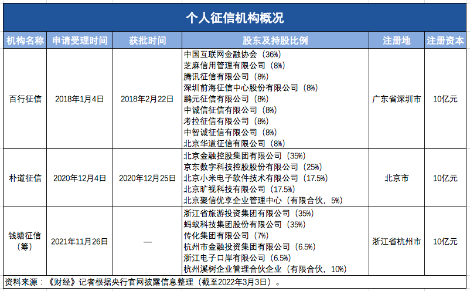

# 金融牌照

# 个人征信牌照

真正让机构进一步发力，认为必须拿下个人征信牌照的动因，则是2021年7月**央行征信管理局**向部分网络平台下发的一则个人信息全面**断直连**的通知。
>>上述通知明确指出，按照个人征信业务整改工作要求，平台机构在与金融机构开展引流、助贷、联合贷等业务合作中，
> 不得将个人主动提交的信息、平台内产生的信息等直接向金融机构提供，须实现个人信息与金融机构的全面“断直连”。

未来网络平台若想开展引流、助贷、联合贷等业务，必须通过个人征信公司。也就是说，需要实现**平台-征信机构-金融机构**的业务合作流程。
这里就体现了 _个人征信牌照 对于企业的 含金量_。

这不是一块普通的金融牌照，目前获批机构数量少，叠加‘断直连’要求，‘含金量’非常高。即便不做助贷相关业务，从长远看，这块牌照也有不小的投资价值.

对于申请经营个人征信业务的征信机构，**其申请受理机构、审核机构为央行征信管理局，决定机构为央行**。

## 现状
目前只有两家机构获得。 百行征信， 朴道征信。

百行征信股东背景构成多元且有历史原因，相较而言，朴道征信更具参考意义。

朴道征信作为国内第二家市场化个人征信机构在北京注册成立，
公司由**地方国资北京金融控股集团有限公司牵头，京东科技控股股份有限公司、北京小米电子软件技术有限公司、北京旷视科技有限公司**等参股。

这也就意味着 ： **地方国有资本与具有数据、产业优势的市场主体“组局”成为探索市场化个人征信机构的一条新思路**。

