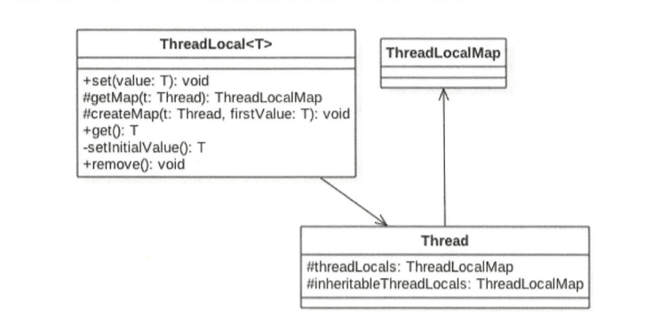
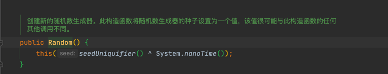
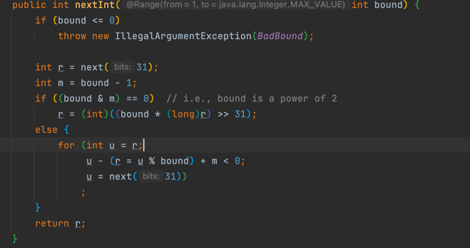
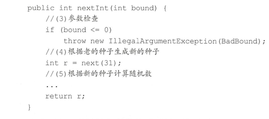
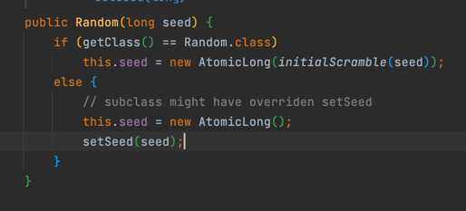
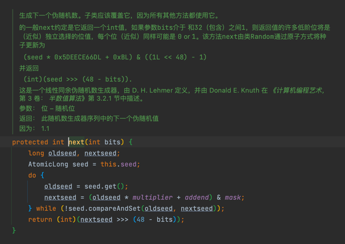
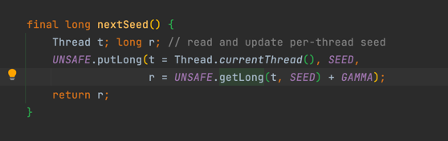

# ThreadLocal
多线程访问同一个共享变量时特别容易出现 并发问题，，特别是 多个线程需要对一个 共享变量 进行写入时。
为了 保证线程安全，一般使用者 都 在访问共享变量时 需要进行适当的同步。

ThreadLocal 是 jdk提供的，它 提供了 线程本地变量，也就是说：如果你创建了一个ThreadLocal变量，那么
访问这个变量的每个线程都会 有这个 变量的 副本。 多线程 操作时，实际是 操作的 自己线程的副本。

#ThreadLocal实现原理

可见Thread 类中，有一个 ThreadLocals 和 inheritableThreadLocals 它们都是 ThreadLocalMap类型变量。

ThreadLocalMap 是一个 定制化的 HashMap，默认情况下，每个线程  这两个变量都为null，只有 当前线程第一次
调用 ThreadLocal 的 set 或者 get 方法 才会创建它们。 （用时创建）。

每个线程的 本地变量副本  并不是放在 ThreadLocal 实例（堆） 中的， 而是放在 调用线程 的 threadLocals变量。
所以： ThreadLocal 类型的 本地变量 存放在 具体的线程 内存空间中。 

ThreadLocal 就是一个 工具壳。 它通过set 方法 把value 放入 调用线程 的 threadLocals 变量中， 当前线程调用get方法
时 再 从 threadLocals 里面拿出来。

tips： 如果调用线程 一直不终止， 那么这个 本地变量 会一直存放在  调用线程的 threadLocals变量中，
所以， 如果当不需要 使用 这个本地变量时， 记得 调用ThreadLocal 的 remove 方法，从当前线程 的threadLocals 里删除该变量。
否则，可能 导致 内存溢出。

另外，可以知道 threadLocals 被设计为 Map 的原因 就是：  一个线程 可能有多个 本地线程变量。

## ThreadLocal 不支持继承性（父子线程数据不共享）

同一个ThreadLocal变量 在父线程 设置值后， 在 子线程是 获取不到的。很明显，因为 子线程调用get 时，当前线程为 thread 线程，
而 调用set 方法 的却是 main 线程。 

有办法让 子线程 访问 父线程数据的。

## InheritableThreadLocal类

这个 ThreadLocal 的一个子类。 提供了 一个 特性，就是可以 让 子线程 访问 父线程 设置的本地变量。

实现方法就是：当父 线程创建子线程时，构造函数会把父线程中 inheritableThreadLocals变量里面的本地变量 复制一份保存到子线程的 inheritableThreadLocals 变量里面。

#ThreadLocalRandom原理
ThreadLocalRandom 是 jdk1.7  在 JUC 下 新增的 随机数生成器，弥补了 Random在多线程下的缺陷。

## Random 的缺陷

public static void main(String[] args) {
    //创建一个 默认随机数生成器，使用 默认种子
    Random random = new Random();
    for (int i = 0; i < 5; i++) {
        //生成 在 【0-5）直接的 随机数
        int r = random.nextInt(5);
        System.out.println(r);
    }
}

随机数生成需要一个 默认的 种子，这个 种子 其实是 一个long类型的 数字。
可以 在创建 Random对象时 通过构造函数指定，不指定 则会在构造函数内部默认生成一个。

可见 新的随机数 生成需要两步：
- 根据老的种子生成 新的种子
- 然后根据 新的种子 生成随机数

问题：
多线程下： 多个线程 都可能拿到 同一个 老的种子 去计算新的种子，这就导致 多个线程产生的新种子都是一样的
导致 多个线程 产生 同一个随机值。  所以 【根据老种子 生成 新种子 需要是原子的】。

在 创建Random对象 时，初始化的 种子  就保存到了 该原子变量中。

采用原子类的 CAS 保证只有一个线程能更新 老的种子，失败的线程 则会通过 新种子去计算。
保证了 随机数的 随机性。

总结：
每个Random实例 都会有一个 原子性的 种子变量用来记录当前种子值。 多线程下，使用单个Random实例生成
随机数时， 多线程同时计算随机数来计算新的种子时，多线程 会 竞争 同一个原子变量的更新操作， 由于原子变量
是 CAS 操作，同时只有一个线程会成功， 所以 造成大量 自旋重试， 这会 降低并发性能。
于是 ThreadLocalRandom 应运而生。

Random的缺点是， 所有线程会共享一个 种子， 从而导致 对原子变量的更新竞争。

那么 如果每个线程 都维护一个 种子变量， 每个线程 都根据自己老的种子 计算新的种子，并生成新的随机数。
就不会存在 竞争问题。
