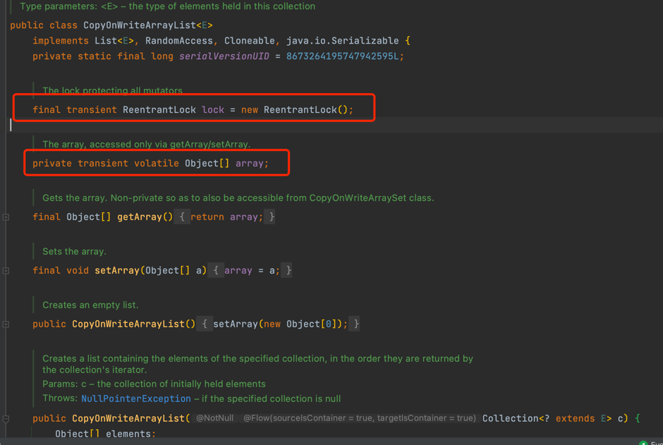
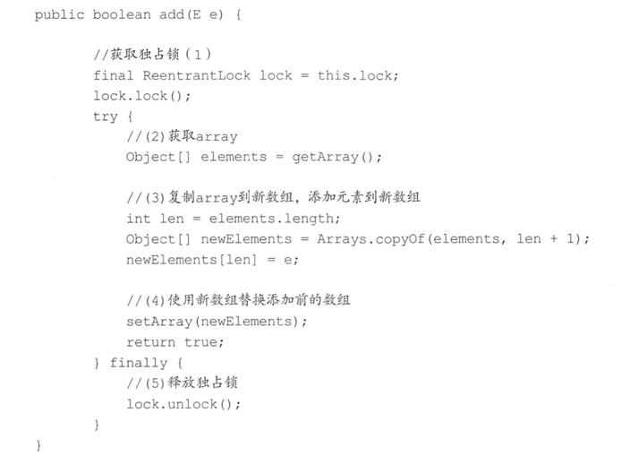
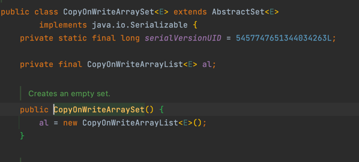

#CopyOnWriteArrayList
这是一个 线程安全的 ArrayList，  因为 它 进行的 修改操作都是在 底层的一个 复制的数组（快照）上进行的。
也就是 ， 写时复制 策略。

- 存在一个array数组存放具体元素
- ReentrantLock 独占锁来控制 同时只有一个线程 对array 进行修改。

如果让我们自己做一个写时复制的线程安全的 list我们会怎么做，有哪些点需要考虑?
- 何时 初始化list ？ 大小是多少？ list 是有限大小吗？
- 如何保证 线程安全 ？ 
- 如何 保证 使用 迭代器 遍历list 时，数据 一致性。

带着 疑问 来看看  CopyOnWriteArrayList 是怎么设计的。

## add方法源码：

在如上代码中，调用 add 方法的线程 会首先 执行代码( 1) 去获取独占锁，
如果 多个 线程都调用 add方法则只有一个线程会获取到该锁，其他线程会被阻塞挂起直到锁被释放。
所以 一 个线程获取到锁后，就保证了在 该线程添加元素的过程中其他线程不会对 array 进行修改。
线程获取锁后执行代码（2)获取 array， 

然后执行代码( 3)复制 array 到一个新数组 (从这里可以知道新数组的大小是原来数组大小增加 1，所以 CopyOnWriteArrayList是无 界 list)，并把新增的元素添加到新数组。
然后执行代码( 4)使用新数组替换原数组，并在返回前释放锁。由于加了锁，所以 整个 add 过程是个原子性操作。需要注意的是，在添加元素时，首先复制了 一个快照，然 后在快照上进行添加，而不是直接在原来数组上进行。

## set方法：
1. 获取独占锁，阻止其他线程进行修改
2. 通过get方法获取指定位置元素， 跟 新set 的值比较。
   - 不一样则，创建新数组，直接set 新值；
   - 一样的话，由于保证 volatile语义，也要重新set array。 （？？？）
3. 释放锁    
    

## remove方法：
1. 获取独占锁
2. 找到 需要被删除的 元素
3. 把剩余的元素 copy 到新数组，然后 set array
4. 释放锁

## 弱一致性的 迭代器

弱一致性指的是： 返回迭代器后，其他线程对 list 的 增删改 对迭代器是不可见的。

原因就是因为： 修改期间 会 copy 新数组，重新set ， 其他线程 迭代器 获取的则 是 旧数组。

## 总结

- 使用 写时复制 保证 list 一致性。
- 由于 获取，修改，写入 并不是原子的， 所以 用到  独占锁
- 提供了 弱一致性的迭代器。

CopyOnWriteArraySet 利用了  CopyOnWriteArrayList 实现。
  

#HashMap

#ConcurrentHashMap

