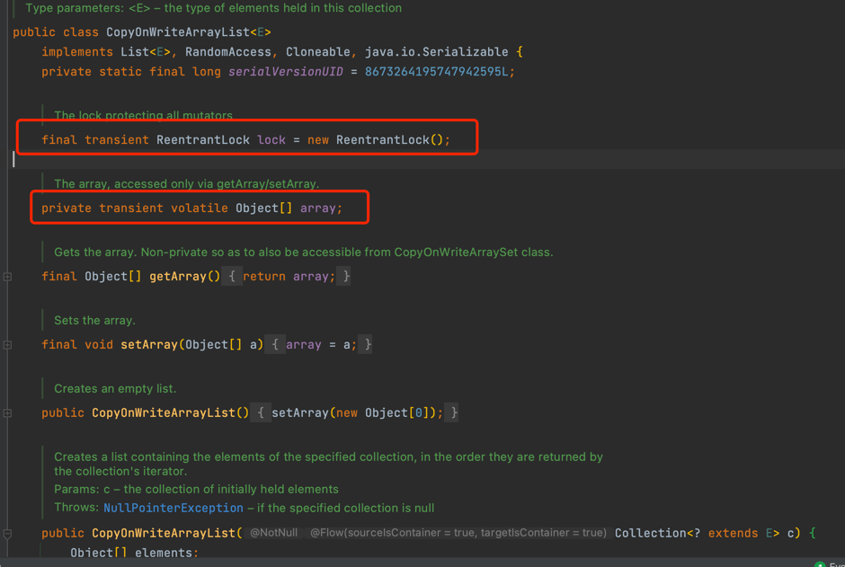
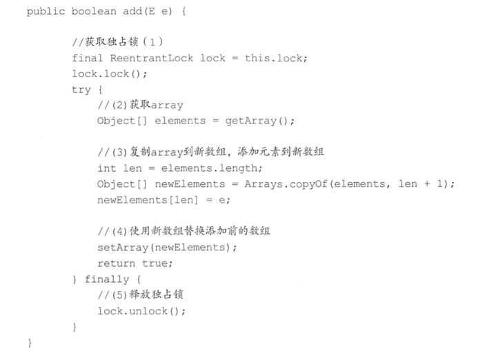
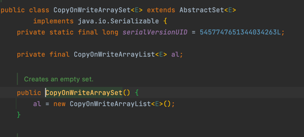
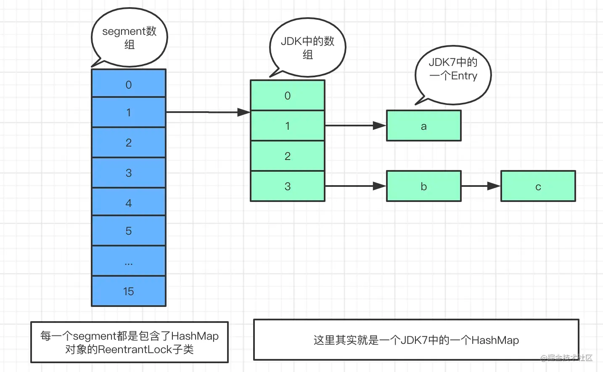

#CopyOnWriteArrayList
这是一个 线程安全的 ArrayList，  因为 它 进行的 修改操作都是在 底层的一个 复制的数组（快照）上进行的。
也就是 ， 写时复制 策略。

- 存在一个array数组存放具体元素
- ReentrantLock 独占锁来控制 同时只有一个线程 对array 进行修改。

如果让我们自己做一个写时复制的线程安全的 list我们会怎么做，有哪些点需要考虑?
- 何时 初始化list ？ 大小是多少？ list 是有限大小吗？
- 如何保证 线程安全 ？ 
- 如何 保证 使用 迭代器 遍历list 时，数据 一致性。

带着 疑问 来看看  CopyOnWriteArrayList 是怎么设计的。

## add方法源码：

在如上代码中，调用 add 方法的线程 会首先 执行代码( 1) 去获取独占锁，
如果 多个 线程都调用 add方法则只有一个线程会获取到该锁，其他线程会被阻塞挂起直到锁被释放。
所以 一 个线程获取到锁后，就保证了在 该线程添加元素的过程中其他线程不会对 array 进行修改。
线程获取锁后执行代码（2)获取 array， 

然后执行代码( 3)复制 array 到一个新数组 (从这里可以知道新数组的大小是原来数组大小增加 1，所以 CopyOnWriteArrayList是无 界 list)，并把新增的元素添加到新数组。
然后执行代码( 4)使用新数组替换原数组，并在返回前释放锁。由于加了锁，所以 整个 add 过程是个原子性操作。需要注意的是，在添加元素时，首先复制了 一个快照，然 后在快照上进行添加，而不是直接在原来数组上进行。

## set方法：
1. 获取独占锁，阻止其他线程进行修改
2. 通过get方法获取指定位置元素， 跟 新set 的值比较。
   - 不一样则，创建新数组，直接set 新值；
   - 一样的话，由于保证 volatile语义，也要重新set array。 （？？？）
3. 释放锁    
    
Q： 新值跟 旧值一样，为什么也要 新建数组 set？
因为 前面加锁，并没有 给 array 加锁， 所以 多线程下 这个 array 可能会被 其他线程修改。
从而破坏 了  线程安全。因此，即使set方法中的值没有发生改变，也应该创建新数组以保证volatile语义和线程安全性。 

tips:
Volatile语义是Java中的一种语义，用于保证一个变量在多线程环境下的可见性。

当一个变量被声明为volatile时，编译器和处理器都会注意到这个变量是共享的，并且可能被不同的线程同时访问。因此，在进行读写操作时，需要采用适当的同步措施来保证数据的一致性。

换句话说，volatile语义主要是为了确保：
- 对一个volatile变量的修改，对于所有线程都是可见的。
- 当一个线程修改了一个volatile变量时，其他线程可以正确读取到该变量的值。
因此，volatile语义是用来保证线程间数据同步的一种重要手段。

## remove方法：
1. 获取独占锁
2. 找到 需要被删除的 元素
3. 把剩余的元素 copy 到新数组，然后 set array
4. 释放锁

## 弱一致性的 迭代器

弱一致性指的是： 返回迭代器后，其他线程对 list 的 增删改 对迭代器是不可见的。

原因就是因为： 修改期间 会 copy 新数组，重新set ， 其他线程 迭代器 获取的则 是 旧数组。

## 总结

- 使用 写时复制 保证 list 一致性。
- 由于 获取，修改，写入 并不是原子的， 所以 用到  独占锁
- 提供了 弱一致性的迭代器。

CopyOnWriteArraySet 利用了  CopyOnWriteArrayList 实现。
  

#HashMap

#ConcurrentHashMap

- HashTable 的 put,  get,   remove等方法是通过 synchronized 来保证线程安全
- hashTable 不允许 key 为null，也不允许 value 为null
-  由于 Synchronized 是 重量级锁，在 get的时候  其他数据 不能写入。性能不好，所以主要 是用 ConcurrentHashMap

JDK1.7

由 Segment数组 结构和  HashEntry数组 组成。 可重入锁。一个 Segment中包含 一个 hashEntry数组。每个 hashEntry又是一个 连表。
通过 Segment 分段锁，  实现了 高效并发，缺点是 并发程度 是由  Segment数组决定的，并发度一旦初始化 无法扩容。

Segment是  可重入锁 ReetrentLock的子类。 在 concurrentHashMap 里面扮演锁的角色。 HashEntry用于存储 键值对 数据。

当对  一个 HashEntry数组里面的数据 进行修改是，需要 先 获取 这个 Segment锁。
static final class Segment<K,V> extends ReentrantLock implements Serializable {     
transient volatile HashEntry<K,V>[] table; //包含一个HashMap 可以理解为}
}

JDK1.8

跟1.8相比，区别如下：
1. 取消了 Segment 数组，直接用 table保存数据。锁的粒度更小，减少 并发冲突的概率。采用table数组元素作为 锁， 从而 实现了 对每一行 数据进行加锁，进一步 减少并发冲突的概率，并发 控制  使用 Sychronized  和 CAS 来操作。
2. 存储 是 采用了  数组 + 链表 +红黑树。

重要参数
private static final int MAXIMUM_CAPACITY = 1 << 30; // 数组的最大值
private static final int DEFAULT_CAPACITY = 16; // 默认数组长度
static final int TREEIFY_THRESHOLD = 8; // 链表转红黑树的一个条件
static final int UNTREEIFY_THRESHOLD = 6; // 红黑树转链表的一个条件
static final int MIN_TREEIFY_CAPACITY = 64; // 链表转红黑树的另一个条件

static final int MOVED = -1; // 表示正在扩容转移
static final int TREEBIN = -2; // 表示已经转换成树
static final int RESERVED = -3; // hash for transient reservations static final int HASH_BITS = 0x7fffffff; // 获得hash值的辅助参数

transient volatile Node<K,V>[] table;// 默认没初始化的数组，用来保存元素 private transient

volatile Node<K,V>[] nextTable; // 转移的时候用的数组

static final int NCPU = Runtime.getRuntime().availableProcessors();// 获取可用的CPU个数

private transient volatile Node<K,V>[] nextTable; // 连接表，用于哈希表扩容，扩容完成后会被重置为 null private transient volatile long baseCount;保存着整个哈希表中存储的所有的结点的个数总和，有点类似于 HashMap 的 size 属性。

private transient volatile int sizeCtl; 负数：表示进行初始化或者扩容，-1：表示正在初始化，-N：表示有 N-1 个线程正在进行扩容 正数：0 表示还没有被初始化，> 0的数：初始化或者是下一次进行扩容的阈值，有点类似HashMap中的threshold，不过功能更强大。

Put方法

假设 table已经 初始化，put操作 采用 CAS + Sychronized实现 并发插入 或更新操作。具体实现：
1. 做一些 边界 处理，然后  获得 hash值。（就是 看 key ，value是否为 null）
2. 如果没初始化（即tab ==null),就 先 初始化table，初始化后 查看对应的 hash桶是否为空，为空就 原子性 CAS 插入。
3. 如果当前 节点 正在 扩容（ 静态 参数 MOVED),去帮助 扩容
4. 如果不在扩容，即 hash冲突了，用 Sychronized来 加锁 当前节点。然后 进行 尾 插入（链表，or红黑树）

// Node 节点的 hash值在HashMap中存储的就是hash值，在currenthashmap中可能有多种情况哦！final V putVal(K key, V value, boolean onlyIfAbsent) {    if (key == null || value == null) throw new NullPointerException(); //边界处理    int hash = spread(key.hashCode());// 最终hash值计算    int binCount = 0;    for (Node<K,V>[] tab = table;;) { //循环表        Node<K,V> f; int n, i, fh;        if (tab == null || (n = tab.length) == 0)            tab = initTable(); // 初始化表 如果为空,懒汉式        else if ((f = tabAt(tab, i = (n - 1) & hash)) == null) {        // 如果对应桶位置为空            if (casTabAt(tab, i, null, new Node<K,V>(hash, key, value, null)))                          // CAS 原子性的尝试插入                break;        }         else if ((fh = f.hash) == MOVED)         // 如果当前节点正在扩容。还要帮着去扩容。            tab = helpTransfer(tab, f);        else {            V oldVal = null;            synchronized (f) { //  桶存在数据 加锁操作进行处理                if (tabAt(tab, i) == f) {                    if (fh >= 0) { // 如果存储的是链表 存储的是节点的hash值                        binCount = 1;                        for (Node<K,V> e = f;; ++binCount) {                            K ek;                            // 遍历链表去查找，如果找到key一样则选择性                            if (e.hash == hash &&                                ((ek = e.key) == key ||                                 (ek != null && key.equals(ek)))) {                                oldVal = e.val;                                if (!onlyIfAbsent)                                    e.val = value;                                break;                            }                            Node<K,V> pred = e;                            if ((e = e.next) == null) {// 找到尾部插入                                pred.next = new Node<K,V>(hash, key,                                                          value, null);                                break;                            }                        }                    }                    else if (f instanceof TreeBin) {// 如果桶节点类型为TreeBin                        Node<K,V> p;                        binCount = 2;                        if ((p = ((TreeBin<K,V>)f).putTreeVal(hash, key,                                                       value)) != null) {                              // 尝试红黑树插入，同时也要防止节点本来就有，选择性覆盖                            oldVal = p.val;                            if (!onlyIfAbsent)                                p.val = value;                        }                    }                }            }            if (binCount != 0) { // 如果链表数量                if (binCount >= TREEIFY_THRESHOLD)                    treeifyBin(tab, i); //  链表转红黑树哦！                if (oldVal != null)                    return oldVal;                break;            }        }    }    addCount(1L, binCount); // 统计大小 并且检查是否要扩容。    return null;}

init

