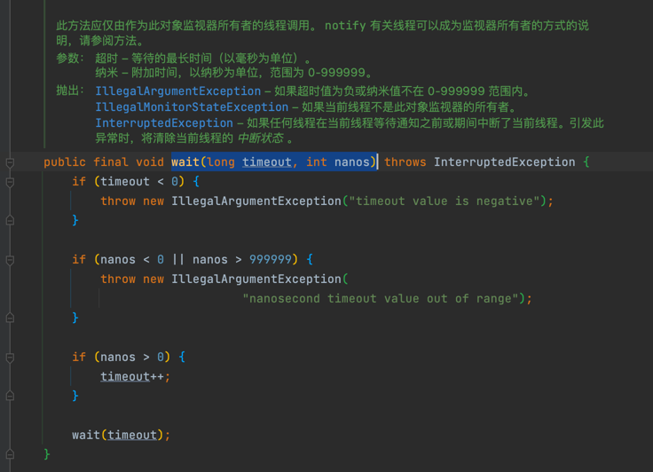

# 1.线程
**进程是系统进行资源分配和调度的基本单位**，
一个进程中至少有一个线程，进程中的多个线程共享进程的资源。

操作系统在分配资源时是把资源分配给进程的， 但是 CPU 资源比较特殊， 它是被分 配到线程的 ， 因为真正要占用 CPU 运行的是线程 ， 
**所以也说线程是 CPU 分配的基本单位**。

一 个进程中有 多 个线程，多个线程共 享 进程的堆和方法区资源，
但是每个线程有自己的程序计数器和栈区域 。

另外每个线程都有自 己的栈资源，用于**存储该线程的局部变量**，这些局部变量是该线 程私有的，其他线程是访问不了的，除此之外栈还用来存放线程的调用栈帧 。

堆是一个进程中最大的 一块内存，堆是被进程中的所有线程共享的，是进程创建时分 配的，堆里面主要存放使用 new操作创建的对象实例。

方法区则用来存放 NM 加载的类、常量及静态变量等信息，也是线程共享的。

# 2.线程的创建与运行
三种创建方式：
1. 实现Runnable接口
2. 继承 Thread 类并 重写 run 方法
3. 实现Callable 接口 call方法。

小 结 : 使用继承方式的好处是方便传参，你可以在子类里面添加成员变 量 ，通过 set 方法设置参数或者通过构造函数进行传递，而如果使用 Runnable 方式，则只能使用主线 程里面被声明为 final 的变量。不好的地方是 Java不支持多继承，如果继承了 Thread类， 那么子类不能再继承其他类，而 Runable 则没有这个限制 。前两种方式都没办法拿到任务 的返回结果，但是 Futuretask 方式可以 。

# 3.线程的通知与等待
1. wait()函数
- 当一个线程调用 一个共享变量的 wait 方法时，该线程 会被  阻塞挂起。直到其他线程 notify 或 notifyAll； 或者 其他 线程 调用了 该线程 的 interrupt 方法，抛出 InterruptedException
- 调用 wai() 前 必须 获取  该对象 的  监视器 锁。 也就是 Sychronized
  那么 如何获取 一个 共享变量 的 监视器锁呢？ （Monitor）
    - 执行 sychronized 同步代码块， 使用 该变量 作为参数。  sychronized(共享变量){}
    - 调用 共享变量的  方法。 使用 sychronized 修饰 该方法。
    
- 另外， 一个 线程 可以 从 挂起状态 变为 可运行 状态（也就是被唤醒）， 即使 该线程 没有被 其他线程 调用 notify ，notifyAll，或者 interrupt，或者等待超时。  这就是  虚假唤醒。

虽然 虚假唤醒 很少发生。 但 要 防患于未然， 解决办法 就是 不停的 测试  被唤醒 的条件 是否满足。不满足 则 继续 等待、

当 线程 调用 wait()方法 时， 当前线程只会 释放 当前 共享对象 的 锁。当 前 线程 持有的  其他 共享对象 的 监视器锁 并不会释放。

2. wait(long timeout)函数
    其实 wait() 函数就是 调用了 wait(0) 。多了一个 超时 参数，  如果 一个 线程 调用共享对象 的 挂起方法后， 
   没有 在指定的 timeout ms 时间内 被 其他线程 notify 或 notifyAll ，那么 该方法 会 因为 超时而 返回。 注意： 如果 timeout < 0 。 会 抛异常 。
   
3. wait(long timeout, int nanos)

   

4. notify()
    一个 线程 调用 该 共享对象 的 notify 方法后， 会 唤醒 一个 在 该共享变量 调用 wait() 后被挂起的 线程。 一个 共享变量上可能有多个 线程在等待，具体唤醒 哪个 是随机的。
    此外， 被 唤醒 的线程 不能 马上 从 wait 返回，  它 必须  获取  到了 共享变量 的 锁 之后 才可以 返回。 
   - 因为， 唤醒 它的线程（调用 notify） 释放了  共享变量 上的锁之后，  被 唤醒 的线程 不一定 会 获取到 该 共享变量 的 锁， 因为 被 唤醒的 线程 仍然 要 跟 其他 线程 一起竞争 锁。 只要 该线程  竞争 到了 共享变量的 锁 之后，才能 wait() 返回 后继续执行。
   - 类似的，  只有 获取到 共享 变量 的 锁 的线程， 才能 调用 共享 变量的 notify  

5. notifyAll()

跟 notify 只  随机 唤醒 共享变量 上的一个 挂起线程 不同， notifyAll 会 唤醒 所有 在 该共享变量上 调用 wait 而被挂起的 线程。

注意：  notifyAll 只会 唤醒 调用 这个 方法前，  调用 wait 挂起的 线程们。  在 notifyAll 之后，调用 wait 的线程 是不会 被唤醒的。

# 4.等待线程 执行终止的 join
在 项目中，经常 有这个场景，  需要等待  某几件事情 完成后 才能继续往下执行。 （类似 CountDownLatch）
Thread.join() 就可以 完成 该需求。

