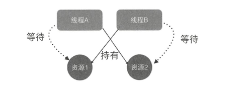
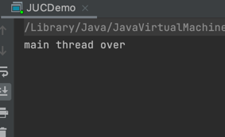

# 1.线程
**进程是系统进行资源分配和调度的基本单位**，
一个进程中至少有一个线程，进程中的多个线程共享进程的资源。

操作系统在分配资源时是把资源分配给进程的， 但是 CPU 资源比较特殊， 它是被分 配到线程的 ， 因为真正要占用 CPU 运行的是线程 ， 
**所以也说线程是 CPU 分配的基本单位**。

一 个进程中有 多 个线程，多个线程共 享 进程的堆和方法区资源，
但是每个线程有自己的程序计数器和栈区域 。

另外每个线程都有自 己的栈资源，用于**存储该线程的局部变量**，这些局部变量是该线 程私有的，其他线程是访问不了的，除此之外栈还用来存放线程的调用栈帧 。

堆是一个进程中最大的 一块内存，堆是被进程中的所有线程共享的，是进程创建时分 配的，堆里面主要存放使用 new操作创建的对象实例。

方法区则用来存放 NM 加载的类、常量及静态变量等信息，也是线程共享的。

# 2.线程的创建与运行
三种创建方式：
1. 实现Runnable接口
2. 继承 Thread 类并 重写 run 方法
3. 实现Callable 接口 call方法。

小 结 : 使用继承方式的好处是方便传参，你可以在子类里面添加成员变 量 ，通过 set 方法设置参数或者通过构造函数进行传递，而如果使用 Runnable 方式，则只能使用主线 程里面被声明为 final 的变量。不好的地方是 Java不支持多继承，如果继承了 Thread类， 那么子类不能再继承其他类，而 Runable 则没有这个限制 。前两种方式都没办法拿到任务 的返回结果，但是 Futuretask 方式可以 。

# 3.线程的通知与等待
1. wait()函数
- 当一个线程调用 一个共享变量的 wait 方法时，该线程 会被  阻塞挂起。直到其他线程 notify 或 notifyAll； 或者 其他 线程 调用了 该线程 的 interrupt 方法，抛出 InterruptedException
- 调用 wai() 前 必须 获取  该对象 的  监视器 锁。 也就是 Sychronized
  那么 如何获取 一个 共享变量 的 监视器锁呢？ （Monitor）
    - 执行 sychronized 同步代码块， 使用 该变量 作为参数。  sychronized(共享变量){}
    - 调用 共享变量的  方法。 使用 sychronized 修饰 该方法。
    
- 另外， 一个 线程 可以 从 挂起状态 变为 可运行 状态（也就是被唤醒）， 即使 该线程 没有被 其他线程 调用 notify ，notifyAll，或者 interrupt，或者等待超时。  这就是  虚假唤醒。

虽然 虚假唤醒 很少发生。 但 要 防患于未然， 解决办法 就是 不停的 测试  被唤醒 的条件 是否满足。不满足 则 继续 等待、

当 线程 调用 wait()方法 时， 当前线程只会 释放 当前 共享对象 的 锁。当 前 线程 持有的  其他 共享对象 的 监视器锁 并不会释放。

2. wait(long timeout)函数
    其实 wait() 函数就是 调用了 wait(0) 。多了一个 超时 参数，  如果 一个 线程 调用共享对象 的 挂起方法后， 
   没有 在指定的 timeout ms 时间内 被 其他线程 notify 或 notifyAll ，那么 该方法 会 因为 超时而 返回。 注意： 如果 timeout < 0 。 会 抛异常 。
   
3. wait(long timeout, int nanos)

   

4. notify()
    一个 线程 调用 该 共享对象 的 notify 方法后， 会 唤醒 一个 在 该共享变量 调用 wait() 后被挂起的 线程。 一个 共享变量上可能有多个 线程在等待，具体唤醒 哪个 是随机的。
    此外， 被 唤醒 的线程 不能 马上 从 wait 返回，  它 必须  获取  到了 共享变量 的 锁 之后 才可以 返回。 
   - 因为， 唤醒 它的线程（调用 notify） 释放了  共享变量 上的锁之后，  被 唤醒 的线程 不一定 会 获取到 该 共享变量 的 锁， 因为 被 唤醒的 线程 仍然 要 跟 其他 线程 一起竞争 锁。 只要 该线程  竞争 到了 共享变量的 锁 之后，才能 wait() 返回 后继续执行。
   - 类似的，  只有 获取到 共享 变量 的 锁 的线程， 才能 调用 共享 变量的 notify  

5. notifyAll()

跟 notify 只  随机 唤醒 共享变量 上的一个 挂起线程 不同， notifyAll 会 唤醒 所有 在 该共享变量上 调用 wait 而被挂起的 线程。

注意：  notifyAll 只会 唤醒 调用 这个 方法前，  调用 wait 挂起的 线程们。  在 notifyAll 之后，调用 wait 的线程 是不会 被唤醒的。

# 4.等待线程 执行终止的 join
在 项目中，经常 有这个场景，  需要等待  某几件事情 完成后 才能继续往下执行。 （类似 CountDownLatch）
Thread.join() 就可以 完成 该需求。

该方法 会阻塞 调用方 线程。

# 5.让线程睡眠的 sleep 方法。

当一个执行线程 调用了 sleep方法后， 调用线程 会暂时 让出 指定的时间 的执行权。也就是 这期间
不参与 cpu 的调度，  但是   该线程 拥有的  监视器锁monitor 是不会 让出的。 指定的 休眠时间 到了 之后 该函数正常返回。
让线程 处于 就绪 状态。

# 6。让出CPU执行权的 yield 方法。

当一个线程 调用 yield 时，就 暗示 线程调度器 当前线程 让出自己 cpu 使用， 处于 就绪态。  但是 线程调度器 是可以 忽略这个暗示的。

正常情况下， 操作系统 为 每个线程  分配时间片 来 占有 CPU ， 一般 当  一个线程 自己的 时间片 使用完后， 线程 调度器
才会 进行 下一轮 的调度。   当 一个 线程 调用  yield 方法 就 是  告诉 线程调度器 我还有 时间片没用完，但是 我不想用了，
 现在 就可以 进行 下一轮 调度-----（当然 也是可能 调度到 刚刚 yield 的线程）

sleep 跟 yield 的区别就是。 当线程调用sleep 时， 线程 会被 阻塞挂起 至 指定时间，在 这 期间 线程调度器 不会调度该线程。
但是  当线程调用  yield 时， 该线程 只是 让出 剩下的 cpu 时间片， 并没有 阻塞挂起，而是 处于 就绪态，， 线程调度器 下一次调度
是可能 调度到  该线程 去执行的。

# 7. 理解上下文切换

在多线程 编程中， 一般 线程个数 是 多于 cpu个数的，  而 每个 cpu 同一时刻 又只能被 一个线程 使用，
为了 让用户 感觉 多个线程 是 同时执行的，  cpu 内部 采用了 时间片轮转的 策略， 也就是 给 每个线程 分配时间片，
线程 在 时间片内 执行任务。 当前 线程 时间片 执行完成后， 就会  处于 就绪态，让出 cpu 执行权。 

那么就产生 一个问题， 当 一个 线程 任务执行一半，但是  时间片用完 必须 让出 cpu 执行权时，  下一次 调度是，怎么 接着
上次 的任务 继续执行呢？  所以 切换 线程 上下文 时，需要 保存 当前线程 的执行现场 ，快照。 当 再次 执行时，根据 保存的快照 恢复现场。

线程上下文切换的时机： 当前线程的 cpu时间片 使用完，处于 就绪态时； 当前 线程 被 其他线程 中断时。

# 8.线程死锁
死锁指： 两个或两个以上的线程 在执行过程中，因 争夺资源 造成的互相等待的现象，在 无 外力作用下，这些线程会
一直 相互等待 而无法 执行下去。

操作系统中，产生死锁的 四个必要条件：
- 互斥条件: 指 线程 对 已经获取到 的资源进行 排他使用，即 该资源同时 只由 一个线程 拥有。如果 同时，还有 其他线程请求
  获取该资源，只能等待， 直到 占有者 释放资源。
- 请求并持有条件： 指 一个线程 已经 持有了 至少一个资源，但 又 提出来 新的资源请求，这个 新的资源 却被其他线程 持有，所以当前线程
  会阻塞，单 阻塞 并不会 释放 已有资源。
- 不可剥夺条件： 指 线程 获取到的 资源 在 自己使用完 释放之前，不能 被其他线程抢夺，只能  自己使用完 释放。
- 环路等待条件：  指发生死锁时，必然 存在一个线程-资源 的环形链。

## 8.1 如何避免死锁
要避免死锁，就 需要 破坏 至少一个 死锁必要条件即可。但是 操作系统中，只有  请求并持有 和 环路等待 是可以被破坏的。

造成死锁 的原因  其实 和 申请 资源的顺序 有很大关系， 使用资源 申请 的 有序性原则 就可以 避免死锁。

资源分配有序性就是：  假如线程A，B 都需要 资源 1，2，3，，，，n 时， 对资源 进行排序， 
线程 A 和 线程B 都只能  在 获取了  资源 n-1 时，才能 获取 n。

资源有序性 就破坏了  请求并持有 和  环路等待条件，也就破坏 了死锁。

# 10守护线程&用户线程
Java中的线程分两类：  守护线程（daemon线程） 和 用户线程（user 线程）

在JVM 启动时 会调用 main 函数， main 函数 所在的线程 就是一个用户线程。
其实 在 JVM 内部还 同时 启动了 好多 daemon线程， 例如： 垃圾回收线程。

daemon 线程 和 user 线程 区别：
- 当 最后一个 用户线程 结束时，jvm会正常退出。不管 是否有 daemon 线程。
- daemon 线程 并不影响 jvm 的退出。

Thread.setDaemon(true);
把 Thread 设为 守护线程。

如果 在 main 函数中，创建一个 子线程，进行无限循环。 

运行结果：

虽然 主线程 已经运行结束， 但是 jvm 并没有退出。 因为 子线程也是用户线程。

执行jps 也发现 子线程 继续存在的 也就是 子线程的 生命周期 不受 父线程 影响。

如果 我们把  子线程 设置为 守护线程， jvm 则会 退出。 ps ，jps 命令也 看不到 jvm 进程。
但是，由于 守护线程 执行死循坏，并没有结束。。。。 这是很危险的。

main线程 结束后， jvm 会启动一个 DestroyJavaVM 线程（daemon） ， 改线程 会等待 所有的 用户线程 结束后终止jvm进程。

" Tomcat 中, 采用 NIO 实现的  NioEndpoint 中会开启 一组接收  线程 ，来接受 用户的 连接请求，  还有
一组 处理线程 来 处理用户请求你。  默认情况下，  这两组 线程 都是  守护线程。

这 意味着  当 tomcat 收到 shutdown 命令后  并且 没有其他用户线程 存在时， tomcat 进程 会马上 退出 不会等待 处理线程  处理完当前请求。

